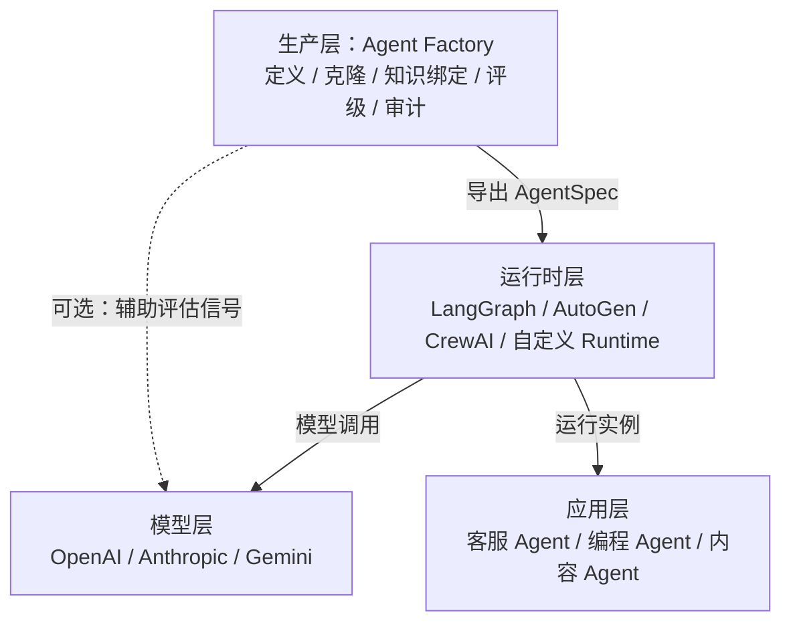
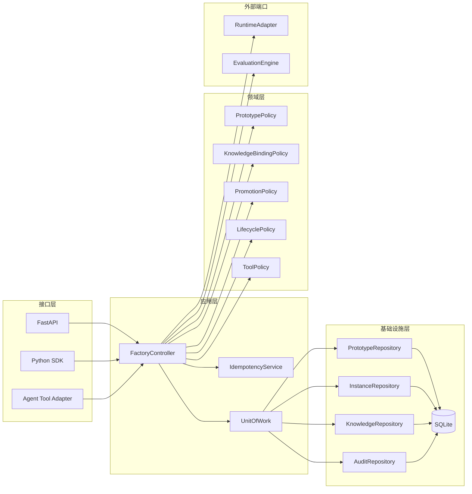
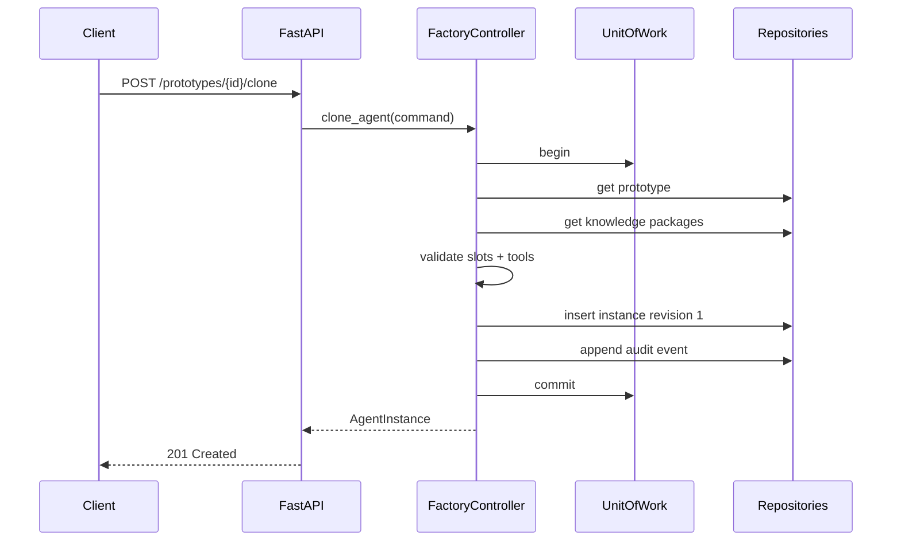

# Agent工厂（Agent Factory）架构设计文档 V1.0

**项目名称**：Agent工厂 —— Agent 工程化生产与治理框架<br>
**核心定位**：向运行时交付标准化 `AgentSpec`，负责 Agent 的定义、复制、知识绑定、能力评级与审计追溯<br>
**核心组件**：`FactoryController`，一个不依赖 LLM 做内部决策的确定性应用服务<br>
**当前阶段**：Alpha / M5.4 评分与分析流水线实现中，M5.4.3 任务级统计分析已完成；尚未执行真实模型调用

本文是编码规格，不是概念说明。字段、方法、状态、错误码和路由均作为 Alpha 实现基线；实现发生偏离时，应先修改本文再修改代码。

配套工程文档：[项目路线图](project/PROJECT_ROADMAP.md)、[M0 阶段文档](milestones/m0-foundation.md)、[M1 阶段文档](milestones/m1-core-production-chain.md)、[M2 阶段文档](milestones/m2-skill-governance.md)、[M3 阶段文档](milestones/m3-interfaces-runtime-demo.md)、[M4 阶段文档](milestones/m4-quality-security.md)、[M5 阶段文档](milestones/m5-validation-experiment.md)、[领域契约设计说明](design/domain-contracts.md)、[SQLite 持久化设计说明](design/sqlite-persistence.md)、[应用服务设计说明](design/application-services.md)、[REST API 设计说明](design/rest-api.md)、[Authentication 设计说明](design/authentication.md)、[M2 技能治理设计说明](design/skill-governance.md)、[生命周期与 Runtime 契约设计说明](design/lifecycle-runtime-contracts.md)、[Python SDK 设计说明](design/python-sdk.md)、[Factory Tool Adapter 设计说明](design/factory-tool-adapter.md)、[Runtime 与安全工具执行设计说明](design/runtime-tool-execution.md)、[Gradio 演示设计说明](design/gradio-demo.md)、[Alpha 安全、回归与发布门禁设计说明](design/security-regression-gates.md)、[M4.4 事务与并发故障证据](design/transaction-fault-evidence.md)、[M5 实验协议设计说明](design/experiment-protocol.md)、[本地 Alpha 部署说明](deployment/local-alpha.md)、[学习日志](../LEARNING_LOG.md)、[设计纠偏记录](../DECISION_CORRECTIONS.md)。

---

## 目录

- [第一章 项目概述与生态定位](#第一章-项目概述与生态定位)
  - [1.1 交付目标](#11-交付目标)
  - [1.2 技术栈位置](#12-技术栈位置)
  - [1.3 术语与身份规则](#13-术语与身份规则)
  - [1.4 强制业务不变量](#14-强制业务不变量)
- [第二章 核心设计理念与范围边界](#第二章-核心设计理念与范围边界)
  - [2.1 确定性控制边界](#21-确定性控制边界)
  - [2.2 约束等级](#22-约束等级)
  - [2.3 不可变快照](#23-不可变快照)
  - [2.4 版本与兼容性](#24-版本与兼容性)
  - [2.5 非功能约束](#25-非功能约束)
  - [2.6 风险边界](#26-风险边界)
- [第三章 系统总体架构](#第三章-系统总体架构)
  - [3.1 组件关系](#31-组件关系)
  - [3.2 推荐目录](#32-推荐目录)
  - [3.3 核心生产序列](#33-核心生产序列)
  - [3.4 应用服务签名](#34-应用服务签名)
  - [3.5 端口与工作单元](#35-端口与工作单元)
  - [3.6 配置](#36-配置)
- [第四章 Agent 定义模型：类、协议与规格](#第四章-agent-定义模型类协议与规格)
  - [4.1 公共类型](#41-公共类型)
  - [4.2 Agent 定义](#42-agent-定义)
  - [4.3 BaseAgent 与运行对象](#43-baseagent-与运行对象)
  - [4.4 原型与规格](#44-原型与规格)
  - [4.5 能力协议注册](#45-能力协议注册)
  - [4.6 YAML/JSON DSL](#46-yamljson-dsl)
- [第五章 知识包与知识槽](#第五章-知识包与知识槽)
  - [5.1 数据模型](#51-数据模型)
  - [5.2 命令模型](#52-命令模型)
  - [5.3 绑定策略](#53-绑定策略)
  - [5.4 注入物化](#54-注入物化)
- [第六章 原型注册表](#第六章-原型注册表)
  - [6.1 命令与实例模型](#61-命令与实例模型)
  - [6.2 查询与分页](#62-查询与分页)
  - [6.3 仓储接口](#63-仓储接口)
  - [6.4 注册与克隆实现](#64-注册与克隆实现)
  - [6.5 SQLite 表结构](#65-sqlite-表结构)
  - [6.6 乐观并发](#66-乐观并发)
  - [6.7 AgentSpec 构建与持久化](#67-agentspec-构建与持久化)
- [第七章 技能树引擎](#第七章-技能树引擎)
  - [7.1 技能、评估与观察模型](#71-技能评估与观察模型)
  - [7.2 技能树模型与 DAG 校验](#72-技能树模型与-dag-校验)
  - [7.3 晋升命令与决策](#73-晋升命令与决策)
  - [7.4 纯函数式配置重建](#74-纯函数式配置重建)
  - [7.5 观察期与降级](#75-观察期与降级)
- [第八章 工具绑定与安全执行](#第八章-工具绑定与安全执行)
  - [8.1 工具模型](#81-工具模型)
  - [8.2 元数据目录与权限解析](#82-元数据目录与权限解析)
  - [8.3 安全执行器](#83-安全执行器)
  - [8.4 工具安全规则](#84-工具安全规则)
  - [8.5 工具表](#85-工具表)
- [第九章 Agent 生命周期管理](#第九章-agent-生命周期管理)
  - [9.1 状态迁移表](#91-状态迁移表)
  - [9.2 状态命令](#92-状态命令)
  - [9.3 上下文边界](#93-上下文边界)
  - [9.4 Runtime 实现](#94-runtime-实现)
  - [9.5 并发规则](#95-并发规则)
  - [9.6 事件钩子](#96-事件钩子)
- [第十章 双模接口](#第十章-双模接口)
  - [10.1 API DTO](#101-api-dto)
  - [10.2 FastAPI 应用与依赖](#102-fastapi-应用与依赖)
  - [10.3 原型、实例和知识路由](#103-原型实例和知识路由)
  - [10.4 评估、晋升与状态路由](#104-评估晋升与状态路由)
  - [10.5 异常模型与稳定错误码](#105-异常模型与稳定错误码)
  - [10.6 FastAPI 异常处理](#106-fastapi-异常处理)
  - [10.7 路由装配](#107-路由装配)
  - [10.8 Python SDK](#108-python-sdk)
  - [10.9 面向 Agent 的工具映射](#109-面向-agent-的工具映射)
- [第十一章 可观测性、审计与追溯](#第十一章-可观测性审计与追溯)
  - [11.1 审计事件模型](#111-审计事件模型)
  - [11.2 审计仓储与路由](#112-审计仓储与路由)
  - [11.3 事件载荷](#113-事件载荷)
  - [11.4 请求关联](#114-请求关联)
  - [11.5 指标](#115-指标)
  - [11.6 结构化日志](#116-结构化日志)
- [第十二章 工程测试与质量保障](#第十二章-工程测试与质量保障)
  - [12.1 测试分层与门槛](#121-测试分层与门槛)
  - [12.2 固定 fixture](#122-固定-fixture)
  - [12.3 单元测试](#123-单元测试)
  - [12.4 SQLite 集成 fixture](#124-sqlite-集成-fixture)
  - [12.5 完整生产链集成测试](#125-完整生产链集成测试)
  - [12.6 并发与事务测试](#126-并发与事务测试)
  - [12.7 API 与错误契约测试](#127-api-与错误契约测试)
  - [12.8 安全测试清单](#128-安全测试清单)
  - [12.9 测试命令](#129-测试命令)
- [第十三章 验证实验设计](#第十三章-验证实验设计)
  - [13.1 待验证假设](#131-待验证假设)
  - [13.2 实验模型](#132-实验模型)
  - [13.3 实验规模与分组](#133-实验规模与分组)
  - [13.4 随机化](#134-随机化)
  - [13.5 指标计算](#135-指标计算)
  - [13.6 构建时间](#136-构建时间)
  - [13.7 统计分析](#137-统计分析)
- [第十四章 开发路线图与未来展望](#第十四章-开发路线图与未来展望)
  - [14.1 里程碑与退出条件](#141-里程碑与退出条件)
  - [14.2 M0 规格](#142-m0-规格)
  - [14.3 M1 规格](#143-m1-规格)
  - [14.4 M2 规格](#144-m2-规格)
  - [14.5 M3 规格](#145-m3-规格)
  - [14.6 Alpha 演示脚本](#146-alpha-演示脚本)
  - [14.7 M4-M6 规格](#147-m4-m6-规格)
  - [14.8 Alpha Definition of Done](#148-alpha-definition-of-done)
  - [14.9 未来方向的进入条件](#149-未来方向的进入条件)
- [附录](#附录)
  - [A. 项目目录结构](#a-项目目录结构)
  - [B. 相关框架边界](#b-相关框架边界)
  - [C. 实现依赖与参考规范](#c-实现依赖与参考规范)
  - [D. 术语索引](#d-术语索引)

---

## 第一章 项目概述与生态定位

### 1.1 交付目标

Alpha 必须交付以下可执行能力：

| 编号 | 能力 | 输入 | 输出 | 完成条件 |
| --- | --- | --- | --- | --- |
| AF-01 | 注册原型 | `AgentPrototypeCreate` | `AgentPrototype` | 同一 `prototype_id + version` 不可重复 |
| AF-02 | 克隆实例 | `CloneAgentCommand` | `AgentInstance` | 实例保留不可变的原型来源 |
| AF-03 | 绑定知识 | `BindKnowledgeCommand` | 新 `AgentInstance` 快照 | 必填槽、类型、版本全部校验 |
| AF-04 | 导出规格 | `instance_id` | `AgentSpec` | 缺知识或越权工具时拒绝导出 |
| AF-05 | 技能晋升 | `PromoteAgentCommand` | 新配置快照 | 依赖满足且硬规则通过 |
| AF-06 | 技能降级 | 运行评估窗口 | 新配置快照 | 达到降级阈值后回退并审计 |
| AF-07 | 审计追溯 | 实体 ID 与筛选条件 | `AuditEvent` 列表 | 每次写操作至少产生一条事件 |
| AF-08 | 多入口调用 | REST / Python SDK / Tool | 同构结果 | 三种入口复用同一应用服务 |

Alpha 明确不交付：多 Agent 编排、模型路由、长期记忆、任务市场、分布式调度、自动修改原型、任意代码执行。

### 1.2 技术栈位置



工厂不直接承诺 Agent 任务执行质量。工厂承诺的是：交付的 `AgentSpec` 结构合法、来源可追溯、知识版本明确、工具权限不越界、技能变更有证据。

### 1.3 术语与身份规则

| 术语 | 代码类型 | 身份格式 | 可变性 |
| --- | --- | --- | --- |
| Agent 定义 | `AgentDefinition` | 无独立 ID | 冻结值对象 |
| Agent 原型 | `AgentPrototype` | `prototype_id@semver` | 发布后不可变 |
| Agent 实例 | `AgentInstance` | UUID v4 | 通过新快照演进 |
| 知识包 | `DomainKnowledge` | `knowledge_id@semver` | 发布后不可变 |
| 技能节点 | `SkillNode` | slug | 节点定义不可变 |
| 运行规格 | `AgentSpec` | 与 instance ID 一致 | 每个 revision 不可变 |
| 工厂控制器 | `FactoryController` | 单应用服务 | 无业务状态 |

`FactoryController` 不是 Agent，不实现 `think()` 或 `act()`，也不调用 LLM 决定是否注册、绑定、晋升或授权。LLM 只允许通过未来 JudgeSignal adapter 产生非阻断性辅助评分；默认 `EvaluationEngine` 完全确定且离线。

### 1.4 强制业务不变量

1. 原型键 `(prototype_id, version)` 全局唯一，发布后不得原地修改。
2. 实例必须记录 `prototype_id`、`prototype_version` 与原型内容校验和。
3. 导出 `AgentSpec` 前，所有必填知识槽必须完成合法绑定。
4. 实例有效工具集必须是全局工具白名单的子集。
5. 技能图必须是 DAG，晋升目标的全部前置节点必须已激活。
6. 每次实例变更必须生成新 `revision`，旧快照不可覆盖。
7. 业务写入与对应审计事件必须处于同一数据库事务。
8. 所有时间使用 UTC，序列化格式为 RFC 3339。


---

## 第二章 核心设计理念与范围边界

### 2.1 确定性控制边界

下列决策只能由代码规则产生：

| 决策 | 决策函数 | 禁止的替代方式 |
| --- | --- | --- |
| 能否注册原型 | `PrototypePolicy.validate_definition` | 让 LLM 阅读定义后判断 |
| 能否绑定知识 | `KnowledgeBindingPolicy.validate_and_build` | 按语义相似度自动绑定 |
| 能否授权工具 | `ToolPolicy.resolve` | 运行时动态请求未知工具 |
| 能否晋升 | `PromotionPolicy.decide` | 仅凭 LLM-as-Judge 分数 |
| 是否降级 | `DegradationPolicy.evaluate` | 模型自行声明能力下降 |
| 状态能否迁移 | `LifecyclePolicy.transition` | 直接修改 status 字段 |

### 2.2 约束等级

```python
from enum import StrEnum


class ConstraintLevel(StrEnum):
    HARD = "hard"      # 不满足即拒绝操作
    SOFT = "soft"      # 记录警告，不阻断
    SIGNAL = "signal"  # 仅作为观测或人工参考
```

- HARD：Pydantic 字段、知识槽、工具白名单、DAG、版本唯一性、状态迁移、评估硬规则。
- SOFT：建议的 Prompt 长度、非必填知识槽、延迟预算。
- SIGNAL：LLM 评分、语义风格分、用户满意度。
- `PromotionPolicy` 只可使用 HARD 结果和明确的人工复核结果做最终判决；SIGNAL 不得单独触发晋升。

### 2.3 不可变快照

领域模型统一使用：

```python
from pydantic import BaseModel, ConfigDict


class FrozenModel(BaseModel):
    model_config = ConfigDict(
        frozen=True,
        extra="forbid",
        str_strip_whitespace=True,
        validate_default=True,
    )
```

`frozen=True` 只禁止字段重新赋值，不会递归冻结嵌套 `dict` 和 `list`。因此领域字段不得直接保存可变 JSON 容器；`JsonObject` 使用 `FrozenJsonObject`，在校验时将 object 递归转为只读 mapping、将 array 转为 tuple，并在 Pydantic 序列化时还原为标准 JSON object/array。非有限浮点数和非 JSON 类型必须在边界处拒绝。

更新操作必须使用 `model_copy(update={...})` 生成新对象，并由仓储执行乐观并发写入。禁止在 controller 内修改 Pydantic 对象内部容器。

### 2.4 版本与兼容性

- 原型和知识包使用严格语义化版本 `MAJOR.MINOR.PATCH`。
- `AgentSpec.schema_version` 独立版本化；M1 历史规格为 `1.0`，M2 增加可选技能树来源后使用 `1.1`。
- MAJOR：删除字段、改变字段语义或收紧已有输入。
- MINOR：新增可选字段或新增兼容能力。
- PATCH：文档、默认值或不改变契约的实现修复。
- REST API 固定前缀 `/api/v1`；Alpha 内允许新增端点，不允许无迁移说明地改变已有响应字段。

### 2.5 非功能约束

| 项目 | Alpha 目标 |
| --- | --- |
| 单请求体 | 默认不超过 1 MiB |
| 列表分页 | `1 <= page_size <= 100`，默认 20 |
| 写请求幂等 | 接受 `Idempotency-Key`，保留 24 小时 |
| 并发一致性 | 实例 revision 乐观锁 |
| 本地性能 | 不含 LLM 的 P95 API 延迟低于 200 ms |
| 数据库 | SQLite WAL 模式，外键开启 |
| 审计保留 | Alpha 不自动删除 |
| 密钥 | 只从环境变量读取，不进入模型和日志 |

### 2.6 风险边界

- “知识已绑定”不等于“模型正确使用了知识”。
- “技能已晋升”只代表指定评估套件、模型版本与时间点下通过。
- 跨运行时可复用的是 `AgentSpec`，不是运行时内部状态或记忆。
- 一次性 Prompt 或单工具脚本不需要引入本框架。
- Alpha 不允许控制器根据运行反馈自动改写原型；只能生成待人工确认的建议。


---

## 第三章 系统总体架构

### 3.1 组件关系



接口层不得直接访问仓储。领域策略不得导入 FastAPI、SQLite 或任何模型 SDK。

### 3.2 推荐目录

```text
src/agent_factory/
├── domain/
│   ├── models.py
│   ├── enums.py
│   ├── errors.py
│   ├── policies/
│   │   ├── knowledge.py
│   │   ├── lifecycle.py
│   │   ├── promotion.py
│   │   ├── prototype.py
│   │   └── tools.py
│   └── services/
│       └── spec_builder.py
├── application/
│   ├── commands.py
│   ├── controller.py
│   ├── dto.py
│   ├── ports.py
│   └── unit_of_work.py
├── infrastructure/
│   ├── sqlite/
│   │   ├── repositories.py
│   │   └── unit_of_work.py
│   ├── evaluators/
│   └── runtime_adapters/
├── interfaces/
│   ├── api/
│   │   ├── contracts.py
│   │   ├── dependencies.py
│   │   ├── errors.py
│   │   ├── middleware.py
│   │   ├── main.py
│   │   └── routers/
│   ├── sdk/
│   └── tools/
└── settings.py
tests/
├── unit/
├── integration/
├── contract/
├── security/
└── fixtures/
```

### 3.3 核心生产序列



任何验证或仓储失败都必须发生在事务提交前；`UnitOfWork.__aexit__()` 回滚未提交事务，不得留下没有审计记录的实例。

### 3.4 应用服务签名

```python
from collections.abc import Sequence
from uuid import UUID


class FactoryController:
    def __init__(
        self,
        *,
        uow_factory: "UnitOfWorkFactory",
        clock: "Clock",
        id_generator: "IdGenerator",
        correlation_context: "CorrelationContext",
        prototype_policy: "PrototypePolicy",
        knowledge_policy: "KnowledgeBindingPolicy",
        tool_policy: "ToolPolicy",
        spec_builder: "AgentSpecBuilder",
        idempotency: "IdempotencyService",
        audit_factory: "AuditEventFactory",
        max_inline_knowledge_bytes: int,
    ) -> None: ...

    async def register_prototype(
        self, command: "RegisterPrototypeCommand"
    ) -> "AgentPrototype": ...

    async def list_prototypes(
        self, query: "PrototypeListQuery"
    ) -> "Page[AgentPrototype]": ...

    async def publish_prototype(
        self, command: "PublishPrototypeCommand"
    ) -> "AgentPrototype": ...

    async def deprecate_prototype(
        self, command: "DeprecatePrototypeCommand"
    ) -> "AgentPrototype": ...

    async def register_knowledge(
        self, command: "RegisterKnowledgeCommand"
    ) -> "DomainKnowledge": ...

    async def clone_agent(
        self, command: "CloneAgentCommand"
    ) -> "AgentInstance": ...

    async def bind_knowledge(
        self, command: "BindKnowledgeCommand"
    ) -> "AgentInstance": ...

    async def export_spec(
        self,
        instance_id: UUID,
        *,
        revision: int | None = None,
        actor: str,
    ) -> "AgentSpec": ...

    async def query_audit(
        self, query: "AuditQuery"
    ) -> "Page[AuditEvent]": ...

    # 以下操作在 M2 扩展，不属于 M1 Controller。
    async def transition_instance(
        self, command: "TransitionInstanceCommand"
    ) -> "AgentInstance": ...

    async def evaluate_instance(
        self, command: "EvaluateInstanceCommand"
    ) -> "EvaluationReport": ...

    async def promote_agent(
        self, command: "PromoteAgentCommand"
    ) -> "AgentInstance": ...

    async def record_task_outcome(
        self, command: "RecordTaskOutcomeCommand"
    ) -> "DegradationCheckResult": ...

```

M1 Controller 只注入当前生产闭环实际使用的端口和策略。`EvaluationEngine`、技能树仓储和任务结果仓储在 M2 引入；它们不得作为未使用参数提前进入构造函数。

### 3.5 端口与工作单元

```python
from types import TracebackType
from typing import Protocol, Self


class RuntimeAdapter(Protocol):
    async def run(self, request: "RunRequest") -> "RunResult": ...


class EvaluationEngine(Protocol):
    def evaluate(
        self,
        *,
        suite: "EvaluationSuite",
        submission: "EvaluationSubmission",
    ) -> "EvaluationOutcome": ...


class UnitOfWork(Protocol):
    prototypes: "PrototypeRepository"
    instances: "InstanceRepository"
    specs: "AgentSpecRepository"
    knowledge: "KnowledgeRepository"
    audit: "AuditRepository"
    idempotency: "IdempotencyRepository"
    skill_trees: "SkillTreeRepository"
    evaluation_suites: "EvaluationSuiteRepository"
    evaluation_reports: "EvaluationReportRepository"
    evaluation_reviews: "EvaluationReviewRepository"
    task_outcomes: "TaskOutcomeRepository"

    async def __aenter__(self) -> Self: ...

    async def __aexit__(
        self,
        exc_type: type[BaseException] | None,
        exc: BaseException | None,
        traceback: TracebackType | None,
    ) -> None: ...

    async def commit(self) -> None: ...

    async def rollback(self) -> None: ...


class UnitOfWorkFactory(Protocol):
    def __call__(
        self,
        *,
        read_only: bool = False,
    ) -> UnitOfWork: ...
```

M1 的 UoW 只暴露核心生产链需要的六类仓储；M2 按已确认的[技能治理设计说明](design/skill-governance.md)增加技能树、评估套件、评估报告、复核和任务结果仓储。默认 `EvaluationEngine` 实现只对外部提交的 case result 做确定性纯计算并返回 `EvaluationOutcome`，不执行 Agent，也不调用真实模型；M2.3 application service 已负责补充报告 ID、Spec 来源和时间。评估采用只读准备、事务外纯计算、最终写事务提交三段式，避免规则计算占用 SQLite 写锁。每次调用 factory 创建独立连接和事务：写事务使用 `BEGIN IMMEDIATE`，只读事务使用 `BEGIN` 与 `PRAGMA query_only = ON`。Repository、审计与幂等记录共享同一连接；未显式 `commit()` 或上下文抛出异常时统一回滚。

### 3.6 配置

需要额外依赖 `pydantic-settings>=2`。

```python
from pathlib import Path
from pydantic import Field, SecretStr
from pydantic_settings import BaseSettings, SettingsConfigDict

from agent_factory.application.security import FactoryRole
from agent_factory.domain.common import Actor


class Settings(BaseSettings):
    model_config = SettingsConfigDict(
        env_prefix="AGENT_FACTORY_",
        env_file=".env",
        extra="ignore",
    )

    environment: str = "development"
    database_url: str = "sqlite+aiosqlite:///./agent_factory.db"
    api_prefix: str = "/api/v1"
    max_request_bytes: int = 1_048_576
    max_inline_knowledge_bytes: int = 262_144
    default_page_size: int = 20
    max_page_size: int = 100
    idempotency_ttl_seconds: int = 86_400
    sqlite_busy_timeout_ms: int = 5_000
    audit_log_level: str = "INFO"
    auth_token: SecretStr | None = Field(
        default=None,
        min_length=32,
        max_length=4_096,
    )
    auth_subject: Actor = "local-owner"
    auth_roles: frozenset[FactoryRole] = Field(
        default=frozenset({FactoryRole.ADMIN}),
        min_length=1,
    )
    openai_api_key: SecretStr | None = None
    anthropic_api_key: SecretStr | None = None
    data_dir: Path = Field(default=Path("./data"))
    migrations_dir: Path = Field(
        default=Path(__file__).resolve().parent
        / "infrastructure"
        / "sqlite"
        / "sql"
    )
```


---

## 第四章 Agent 定义模型：类、协议与规格

### 4.1 公共类型

```python
from __future__ import annotations

from collections.abc import Mapping
from datetime import datetime
from typing import Annotated, Literal
from uuid import UUID

from pydantic import AfterValidator, Field, PlainSerializer


Slug = Annotated[
    str,
    Field(
        min_length=3,
        max_length=64,
        pattern=r"^[a-z][a-z0-9]*(?:-[a-z0-9]+)*$",
    ),
]
SemVer = Annotated[
    str,
    Field(pattern=r"^(0|[1-9]\d*)\.(0|[1-9]\d*)\.(0|[1-9]\d*)$"),
]
JsonObject = Annotated[
    Mapping[str, object],
    AfterValidator(freeze_json_object),
    PlainSerializer(serialize_json_object, when_used="always"),
]
```

`JsonObject` 的对外静态类型是只读 `Mapping[str, object]`，validator 的运行时结果是 `FrozenJsonObject`。这样 Python 调用方可传入普通字典，而消费方的类型契约不暴露可变操作。`model_dump(mode="json")` 必须输出普通 `dict`/`list`，canonical JSON 必须固定使用 UTF-8、字典键排序和紧凑分隔符。

Alpha 不接受 `v1.2.3`、预发布版本或构建元数据。版本比较必须先拆成三个整数，禁止按字符串比较。

```python
def semver_tuple(version: str) -> tuple[int, int, int]:
    major, minor, patch = version.split(".")
    return int(major), int(minor), int(patch)
```

### 4.2 Agent 定义

```python
from enum import StrEnum
from pydantic import Field, field_validator, model_validator


class Capability(StrEnum):
    CODE = "can-code"
    WRITE = "can-write"


class AgentDefinition(FrozenModel):
    agent_type: Slug
    role: str = Field(min_length=1, max_length=128)
    system_prompt: str = Field(min_length=1, max_length=32_000)
    tools: tuple[Slug, ...] = ()
    capabilities: frozenset[Capability] = frozenset()
    output_schema: JsonObject = Field(default_factory=dict)
    knowledge_slots: tuple["KnowledgeSlot", ...] = ()
    metadata: dict[str, str] = Field(default_factory=dict)

    @field_validator("tools")
    @classmethod
    def tools_must_be_unique(cls, value: tuple[str, ...]) -> tuple[str, ...]:
        if len(value) != len(set(value)):
            raise ValueError("tools contains duplicate names")
        return value

    @model_validator(mode="after")
    def slot_names_must_be_unique(self) -> "AgentDefinition":
        names = [slot.name for slot in self.knowledge_slots]
        if len(names) != len(set(names)):
            raise ValueError("knowledge slot names must be unique")
        return self
```

`output_schema` 必须通过 JSON Schema Draft 2020-12 校验。注册原型时执行：

```python
from jsonschema import Draft202012Validator
from jsonschema.exceptions import SchemaError


def validate_output_schema(schema: JsonObject) -> None:
    try:
        Draft202012Validator.check_schema(schema)
    except SchemaError as exc:
        raise InvalidOutputSchemaError(
            details={"path": list(exc.path), "reason": exc.message}
        ) from exc
```

### 4.3 BaseAgent 与运行对象

`BaseAgent` 只存在于运行时适配层。数据库持久化 `AgentInstance`，跨运行时交付 `AgentSpec`，不序列化具体 Python Agent 对象。

```python
from abc import ABC, abstractmethod


class ThinkRequest(FrozenModel):
    task_id: UUID
    user_input: str = Field(min_length=1, max_length=64_000)
    context: tuple[dict[str, Any], ...] = ()


class Thought(FrozenModel):
    summary: str = Field(min_length=1, max_length=8_000)
    proposed_tool: Slug | None = None
    proposed_arguments: JsonObject = Field(default_factory=dict)


class ActionResult(FrozenModel):
    task_id: UUID
    content: str
    structured_output: JsonObject | None = None
    tool_calls: tuple["ToolCallRecord", ...] = ()


class BaseAgent(FrozenModel, ABC):
    id: UUID
    role: str
    system_prompt: str
    tools: tuple["ResolvedToolSpec", ...]
    output_schema: JsonObject
    knowledge_slots: tuple["KnowledgeSlot", ...]

    @abstractmethod
    async def think(
        self,
        request: ThinkRequest,
        runtime: "RuntimeAdapter",
    ) -> Thought:
        raise NotImplementedError

    @abstractmethod
    async def act(
        self,
        thought: Thought,
        runtime: "RuntimeAdapter",
    ) -> ActionResult:
        raise NotImplementedError
```

`WriterAgent` 和 `EngineerAgent` 只负责把 `AgentSpec` 适配为运行对象。它们不得自行扩充工具或绕过 `ToolExecutor`。

### 4.4 原型与规格

```python
from enum import StrEnum
from pydantic import PositiveInt


class PrototypeStatus(StrEnum):
    DRAFT = "draft"
    PUBLISHED = "published"
    DEPRECATED = "deprecated"


class PrototypeRef(FrozenModel):
    prototype_id: Slug
    version: SemVer
    checksum: Annotated[str, Field(pattern=r"^[a-f0-9]{64}$")]


class SkillTreeRef(FrozenModel):
    tree_id: Slug
    version: SemVer
    checksum: Annotated[str, Field(pattern=r"^[a-f0-9]{64}$")]


class AgentPrototype(FrozenModel):
    prototype_id: Slug
    version: SemVer
    status: PrototypeStatus = PrototypeStatus.DRAFT
    definition: AgentDefinition
    checksum: Annotated[str, Field(pattern=r"^[a-f0-9]{64}$")]
    skill_tree: SkillTreeRef | None = None
    created_at: datetime
    created_by: str = Field(min_length=1, max_length=128)
    published_at: datetime | None = None
    deprecation_reason: str | None = Field(default=None, max_length=1_000)


class KnowledgeRef(FrozenModel):
    slot_name: Slug
    knowledge_id: Slug
    version: SemVer
    checksum: Annotated[str, Field(pattern=r"^[a-f0-9]{64}$")]
    injection_mode: "InjectionMode"


class AgentSpec(FrozenModel):
    schema_version: Literal["1.0", "1.1"] = "1.0"
    instance_id: UUID
    revision: PositiveInt
    prototype: PrototypeRef
    agent_type: Slug
    role: str
    system_prompt: str
    tools: tuple["ResolvedToolSpec", ...]
    knowledge: tuple[KnowledgeRef, ...]
    output_schema: JsonObject
    skill_tree: SkillTreeRef | None = None
    active_skill_nodes: frozenset[Slug] = frozenset()
    runtime_target: Slug | None = None
    generated_at: datetime
    spec_checksum: Annotated[str, Field(pattern=r"^[a-f0-9]{64}$")]
    metadata: dict[str, str] = Field(default_factory=dict)
```

校验和统一使用 canonical JSON：

```python
import hashlib
import json
from pydantic import BaseModel


def sha256_model(model: BaseModel, *, exclude: set[str] | None = None) -> str:
    payload = model.model_dump(
        mode="json",
        exclude=exclude or set(),
        exclude_none=False,
    )
    encoded = json.dumps(
        payload,
        ensure_ascii=False,
        sort_keys=True,
        separators=(",", ":"),
    ).encode("utf-8")
    return hashlib.sha256(encoded).hexdigest()


def checksum_agent_spec(spec: AgentSpec) -> str:
    excluded = {"spec_checksum"}
    if spec.schema_version == "1.0":
        excluded.add("skill_tree")
    return sha256_model(spec, exclude=excluded)
```

生成 `AgentSpec` 时，`spec_checksum` 的计算排除自身字段，但不排除 `generated_at`；同一 revision 的规格必须从持久化快照返回，禁止每次请求重新生成时间戳。M1 历史规格保持 `schema_version="1.0"` 并允许缺失 `skill_tree`；绑定技能树的新规格使用 `1.1`。为保持已发布 1.0 checksum 语义，`checksum_agent_spec()` 对 1.0 额外排除新增的空 `skill_tree`，对 1.1 则包含完整 SkillTreeRef；Builder 与 Repository 必须复用该函数。原型 `checksum` 继续表示 definition checksum，技能树来源由独立 ref checksum 追溯。

### 4.5 能力协议注册

Python `Protocol` 只用于静态检查，运行时注册使用显式 capability registry：

```python
from typing import Protocol, runtime_checkable


@runtime_checkable
class CanWrite(Protocol):
    async def draft(self, brief: str) -> str: ...


@runtime_checkable
class CanCode(Protocol):
    async def generate_patch(self, request: str) -> str: ...


CAPABILITY_METHODS: dict[Capability, frozenset[str]] = {
    Capability.WRITE: frozenset({"draft"}),
    Capability.CODE: frozenset({"generate_patch"}),
}


def validate_capability_class(
    implementation: type[BaseAgent],
    capabilities: frozenset[Capability],
) -> None:
    missing: dict[str, list[str]] = {}
    for capability in capabilities:
        methods = CAPABILITY_METHODS[capability]
        absent = sorted(name for name in methods if not hasattr(implementation, name))
        if absent:
            missing[capability.value] = absent
    if missing:
        raise CapabilityContractError(details={"missing_methods": missing})
```

### 4.6 YAML/JSON DSL

```yaml
agent_type: writer-agent
role: Technical Writer
system_prompt: |
  Produce concise technical documentation using bound domain knowledge.
tools:
  - document-search
capabilities:
  - can-write
output_schema:
  type: object
  required: [title, body]
  properties:
    title: {type: string}
    body: {type: string}
knowledge_slots:
  - name: product-docs
    required: true
    accepted_kinds: [document]
    min_version: 1.0.0
    injection_mode: retrieval
metadata:
  owner: demo
```

```python
from pathlib import Path
import json
import yaml


def load_agent_definition(path: Path) -> AgentDefinition:
    if path.suffix not in {".yaml", ".yml", ".json"}:
        raise DefinitionParseError(
            details={"path": str(path), "reason": "unsupported file extension"}
        )
    try:
        raw = (
            yaml.safe_load(path.read_text(encoding="utf-8"))
            if path.suffix in {".yaml", ".yml"}
            else json.loads(path.read_text(encoding="utf-8"))
        )
        if not isinstance(raw, dict):
            raise TypeError("document root must be an object")
        return AgentDefinition.model_validate(raw)
    except (OSError, ValueError, TypeError) as exc:
        raise DefinitionParseError(
            details={"path": str(path), "reason": str(exc)}
        ) from exc
```

DSL 中禁止出现 Python 模块路径、回调函数、模板表达式和任意可执行代码。`agent_type` 必须映射到启动时注册的实现类。


---

## 第五章 知识包与知识槽

### 5.1 数据模型

```python
from enum import StrEnum
from typing import Any
from pydantic import AnyHttpUrl, Field, model_validator


class KnowledgeKind(StrEnum):
    DOCUMENT = "document"
    POLICY = "policy"
    DATASET = "dataset"
    GLOSSARY = "glossary"


class InjectionMode(StrEnum):
    INLINE = "inline"
    RETRIEVAL = "retrieval"


class KnowledgeSlot(FrozenModel):
    name: Slug
    required: bool = True
    accepted_kinds: Annotated[
        frozenset[KnowledgeKind],
        Field(min_length=1),
    ]
    min_version: SemVer = "0.0.0"
    max_version_exclusive: SemVer | None = None
    injection_mode: InjectionMode
    multiple: bool = False
    max_items: int = Field(default=1, ge=1, le=32)

    @model_validator(mode="after")
    def validate_cardinality_and_version(self) -> "KnowledgeSlot":
        if not self.multiple and self.max_items != 1:
            raise ValueError("max_items must be 1 when multiple is false")
        if (
            self.max_version_exclusive is not None
            and semver_tuple(self.min_version)
            >= semver_tuple(self.max_version_exclusive)
        ):
            raise ValueError("min_version must be lower than max_version_exclusive")
        return self


class DomainKnowledgeDraft(FrozenModel):
    knowledge_id: Slug
    version: SemVer
    name: str = Field(min_length=1, max_length=256)
    kind: KnowledgeKind
    content: str | dict[str, Any] | None = None
    source_uri: AnyHttpUrl | None = None
    mime_type: str = Field(default="text/plain", max_length=128)
    checksum: Annotated[str, Field(pattern=r"^[a-f0-9]{64}$")]
    tags: frozenset[Slug] = frozenset()

    @model_validator(mode="after")
    def require_exactly_one_source(self) -> "DomainKnowledgeDraft":
        if (self.content is None) == (self.source_uri is None):
            raise ValueError("exactly one of content or source_uri is required")
        return self


class DomainKnowledge(DomainKnowledgeDraft):
    created_at: datetime
    created_by: str = Field(min_length=1, max_length=128)


class KnowledgeBinding(FrozenModel):
    slot_name: Slug
    knowledge_id: Slug
    knowledge_version: SemVer
    knowledge_checksum: Annotated[str, Field(pattern=r"^[a-f0-9]{64}$")]
    injection_mode: InjectionMode
    bound_at: datetime
    bound_by: str = Field(min_length=1, max_length=128)
```

`source_uri` 只保存引用；抓取、鉴权和内容同步不属于 Alpha。调用方提交 `checksum`，controller 对 INLINE 内容重新计算并比对。字符串按 UTF-8 原字节计算，JSON 对象按 canonical JSON 计算；不一致返回 `KNOWLEDGE_CHECKSUM_MISMATCH`。INLINE 内容序列化后默认不得超过 256 KiB，超过时返回 `KNOWLEDGE_PAYLOAD_TOO_LARGE`。

```python
def checksum_knowledge_content(content: str | dict[str, Any]) -> str:
    if isinstance(content, str):
        encoded = content.encode("utf-8")
    else:
        encoded = json.dumps(
            content,
            ensure_ascii=False,
            sort_keys=True,
            separators=(",", ":"),
        ).encode("utf-8")
    return hashlib.sha256(encoded).hexdigest()
```

### 5.2 命令模型

```python
class RegisterKnowledgeCommand(FrozenModel):
    knowledge: DomainKnowledgeDraft
    idempotency_key: str | None = Field(default=None, min_length=8, max_length=128)
    actor: str = Field(min_length=1, max_length=128)


class KnowledgeSelection(FrozenModel):
    slot_name: Slug
    knowledge_id: Slug
    version: SemVer


class BindKnowledgeCommand(FrozenModel):
    instance_id: UUID
    expected_revision: int = Field(ge=1)
    selections: tuple[KnowledgeSelection, ...]
    replace_existing: bool = False
    actor: str = Field(min_length=1, max_length=128)
    idempotency_key: str | None = Field(default=None, min_length=8, max_length=128)
```

`FactoryController.register_knowledge` 负责注入时间与 actor：

```python
async def register_knowledge(
    self,
    command: RegisterKnowledgeCommand,
) -> DomainKnowledge:
    draft = command.knowledge
    if draft.content is not None:
        actual_checksum = checksum_knowledge_content(draft.content)
        if actual_checksum != draft.checksum:
            raise KnowledgeChecksumMismatchError(
                details={
                    "expected": draft.checksum,
                    "actual": actual_checksum,
                }
            )
    knowledge = DomainKnowledge(
        **draft.model_dump(),
        created_at=self.clock.now(),
        created_by=command.actor,
    )
    async with self.uow_factory() as uow:
        if await uow.knowledge.get(
            knowledge.knowledge_id,
            knowledge.version,
        ):
            raise KnowledgeAlreadyExistsError(
                details={
                    "knowledge_id": knowledge.knowledge_id,
                    "version": knowledge.version,
                }
            )
        await uow.knowledge.add(knowledge)
        await uow.audit.append(
            AuditEvent.for_knowledge_registered(knowledge, command.actor)
        )
        await uow.commit()
    return knowledge
```

### 5.3 绑定策略

绑定只允许实例处于 `CREATED`、`WAITING` 或 `DEGRADED`。`RUNNING` 返回 `INSTANCE_BUSY`，`FAILED`、`COMPLETED` 或 `TERMINATED` 返回 `INVALID_STATE_TRANSITION`；HTTP status 由 M1.4 接口层映射。

```python
class KnowledgeBindingPolicy:
    def validate_and_build(
        self,
        *,
        definition: AgentDefinition,
        selections: Iterable[KnowledgeSelectionLike],
        packages: Iterable[DomainKnowledge],
        bound_at: datetime,
        bound_by: str,
    ) -> tuple[KnowledgeBinding, ...]:
        slots = definition.knowledge_slots
        slot_map = {slot.name: slot for slot in slots}
        package_map = {
            (item.knowledge_id, item.version): item for item in packages
        }
        grouped: dict[str, list[DomainKnowledge]] = {}

        for selection in selections:
            slot = slot_map.get(selection.slot_name)
            if slot is None:
                raise UnknownKnowledgeSlotError(
                    details={"slot_name": selection.slot_name}
                )
            package = package_map.get(
                (selection.knowledge_id, selection.version)
            )
            if package is None:
                raise KnowledgeNotFoundError(
                    details={
                        "knowledge_id": selection.knowledge_id,
                        "version": selection.version,
                    }
                )
            if package.kind not in slot.accepted_kinds:
                raise KnowledgeKindMismatchError(
                    details={
                        "slot_name": slot.name,
                        "actual": package.kind,
                        "accepted": sorted(slot.accepted_kinds),
                    }
                )
            if not version_in_slot_range(package.version, slot):
                raise KnowledgeVersionMismatchError(
                    details={
                        "slot_name": slot.name,
                        "actual": package.version,
                        "min": slot.min_version,
                        "max_exclusive": slot.max_version_exclusive,
                    }
                )
            grouped.setdefault(slot.name, []).append(package)

        missing = [
            slot.name
            for slot in slots
            if slot.required and not grouped.get(slot.name)
        ]
        if missing:
            raise MissingKnowledgeBindingError(details={"slots": sorted(missing)})

        for slot in slots:
            count = len(grouped.get(slot.name, []))
            if count > slot.max_items:
                raise KnowledgeCardinalityError(
                    details={
                        "slot_name": slot.name,
                        "count": count,
                        "max_items": slot.max_items,
                    }
                )

        return tuple(
            KnowledgeBinding(
                slot_name=selection.slot_name,
                knowledge_id=package.knowledge_id,
                knowledge_version=package.version,
                knowledge_checksum=package.checksum,
                injection_mode=slot_map[selection.slot_name].injection_mode,
                bound_at=bound_at,
                bound_by=bound_by,
            )
            for selection in selections
            for package in [package_map[(selection.knowledge_id, selection.version)]]
        )
```

版本边界为 `min_version <= version < max_version_exclusive`。controller 先把现有绑定转换为 `KnowledgeSelection`，再与本次 selections 合并，将“最终选择集合”传入 policy。`replace_existing=False` 时，对已绑定槽再次绑定返回 `KNOWLEDGE_ALREADY_BOUND`；为 true 时先移除本次涉及槽的旧选择，再加入新选择。最终集合必须满足全部 required slot 与 cardinality 约束。变更成功后生成 `revision + 1` 完整快照；未触碰槽位复用原 binding，保留原始 `bound_at/bound_by`，本次触碰槽位才生成新 binding 和审计事件。

### 5.4 注入物化

```python
class KnowledgeAttachment(FrozenModel):
    ref: KnowledgeRef
    inline_content: str | dict[str, Any] | None = None
    retrieval_namespace: str | None = None


class KnowledgeMaterializer:
    async def materialize(
        self,
        bindings: tuple[KnowledgeBinding, ...],
        repository: "KnowledgeRepository",
    ) -> tuple[KnowledgeAttachment, ...]:
        ...
```

- INLINE：将内容放入 `inline_content`，并在 Runtime Adapter 中以固定分隔符追加到系统上下文。
- RETRIEVAL：只输出 `retrieval_namespace = "{knowledge_id}:{version}"`，运行时负责检索。
- Runtime Adapter 必须校验读取到的内容校验和等于 `KnowledgeRef.checksum`；不一致时返回 `KNOWLEDGE_CHECKSUM_MISMATCH`。
- 审计日志只记录 ID、版本、校验和和命中片段 ID，不记录完整知识内容。


---

## 第六章 原型注册表

### 6.1 命令与实例模型

```python
from enum import StrEnum
from pydantic import Field, PositiveInt


class InstanceStatus(StrEnum):
    CREATED = "created"
    RUNNING = "running"
    WAITING = "waiting"
    COMPLETED = "completed"
    FAILED = "failed"
    DEGRADED = "degraded"
    TERMINATED = "terminated"


class RegisterPrototypeCommand(FrozenModel):
    prototype_id: Slug
    version: SemVer
    definition: AgentDefinition
    skill_tree: SkillTreeRef | None = None
    publish: bool = False
    actor: str = Field(min_length=1, max_length=128)
    idempotency_key: str | None = Field(default=None, min_length=8, max_length=128)


class PublishPrototypeCommand(FrozenModel):
    prototype_id: Slug
    version: SemVer
    actor: str = Field(min_length=1, max_length=128)
    idempotency_key: str | None = Field(default=None, min_length=8, max_length=128)


class DeprecatePrototypeCommand(FrozenModel):
    prototype_id: Slug
    version: SemVer
    reason: str = Field(min_length=1, max_length=1_000)
    actor: str = Field(min_length=1, max_length=128)
    idempotency_key: str | None = Field(default=None, min_length=8, max_length=128)


class CloneAgentCommand(FrozenModel):
    prototype_id: Slug
    prototype_version: SemVer
    runtime_target: Slug | None = None
    actor: str = Field(min_length=1, max_length=128)
    idempotency_key: str | None = Field(default=None, min_length=8, max_length=128)


class AgentInstance(FrozenModel):
    instance_id: UUID
    prototype: PrototypeRef
    revision: PositiveInt
    status: InstanceStatus
    configuration: AgentDefinition
    skill_tree: SkillTreeRef | None = None
    knowledge_bindings: tuple[KnowledgeBinding, ...] = ()
    active_skill_nodes: frozenset[Slug] = frozenset()
    runtime_target: Slug | None = None
    created_at: datetime
    updated_at: datetime
    created_by: str = Field(min_length=1, max_length=128)
```

实例表存储完整 `configuration` 快照，而不是只存差异。这样降级、审计和历史重放不依赖旧代码中的 patch 算法。`skill_tree` 也随 revision 保存；只有 `active_skill_nodes` 而没有 tree ID、version 和 checksum 不构成完整来源链。

原型状态只允许 `DRAFT -> PUBLISHED -> DEPRECATED`。发布和废弃只修改状态元数据，不修改 `definition` 或 checksum；其他迁移返回 `INVALID_PROTOTYPE_STATUS`。已废弃原型不能创建新实例，但历史实例仍可读取和导出旧 revision 的 Spec。

### 6.2 查询与分页

```python
from typing import Generic, TypeVar

T = TypeVar("T")


class Page(FrozenModel, Generic[T]):
    items: tuple[T, ...]
    page: int = Field(ge=1)
    page_size: int = Field(ge=1, le=100)
    total: int = Field(ge=0)


class PrototypeListQuery(FrozenModel):
    status: PrototypeStatus | None = None
    agent_type: Slug | None = None
    page: int = Field(default=1, ge=1)
    page_size: int = Field(default=20, ge=1, le=100)
```

列表排序固定为 `created_at DESC, prototype_id ASC, version DESC`，避免分页结果随机漂移。

### 6.3 仓储接口

```python
from typing import Protocol


class PrototypeRepository(Protocol):
    async def add(self, prototype: AgentPrototype) -> None: ...

    async def get(
        self, prototype_id: str, version: str
    ) -> AgentPrototype | None: ...

    async def list(
        self, query: PrototypeListQuery
    ) -> Page[AgentPrototype]: ...

    async def replace(
        self,
        prototype: AgentPrototype,
        expected_status: PrototypeStatus,
    ) -> bool: ...


class InstanceRepository(Protocol):
    async def add(self, instance: AgentInstance) -> None: ...

    async def get(
        self, instance_id: UUID, revision: int | None = None
    ) -> AgentInstance | None: ...

    async def save_snapshot(
        self,
        instance: AgentInstance,
        expected_revision: int,
    ) -> None: ...


class AgentSpecRepository(Protocol):
    async def get(
        self,
        instance_id: UUID,
        revision: int,
    ) -> AgentSpec | None: ...

    async def add_if_absent(self, spec: AgentSpec) -> bool: ...


class KnowledgeRepository(Protocol):
    async def add(self, knowledge: DomainKnowledge) -> None: ...

    async def get(
        self, knowledge_id: str, version: str
    ) -> DomainKnowledge | None: ...

    async def get_many(
        self, refs: tuple[tuple[str, str], ...]
    ) -> tuple[DomainKnowledge, ...]: ...
```

仓储的 `get` 不存在时返回 `None`；由 controller 转换为领域异常。原型状态转换由应用层构造新的完整 `AgentPrototype` 快照，`replace()` 只按 `expected_status` 执行 compare-and-swap，避免仓储层猜测 `published_at` 或 `deprecation_reason`。仓储不抛 HTTP 异常。

### 6.4 注册与克隆实现

```python
async def register_prototype(
    self,
    command: RegisterPrototypeCommand,
) -> AgentPrototype:
    validate_output_schema(command.definition.output_schema)
    self.prototype_policy.validate_registration(command.definition)
    self.tool_policy.validate_declared_tools(command.definition.tools)

    now = self.clock.now()
    status = (
        PrototypeStatus.PUBLISHED
        if command.publish
        else PrototypeStatus.DRAFT
    )
        prototype = AgentPrototype(
        prototype_id=command.prototype_id,
        version=command.version,
        status=status,
        definition=command.definition,
        checksum=sha256_model(command.definition),
        skill_tree=command.skill_tree,
        created_at=now,
        created_by=command.actor,
        published_at=now if command.publish else None,
    )

    async with self.uow_factory() as uow:
        if await uow.prototypes.get(command.prototype_id, command.version):
            raise PrototypeAlreadyExistsError(
                details={
                    "prototype_id": command.prototype_id,
                    "version": command.version,
                }
            )
        await uow.prototypes.add(prototype)
        await uow.audit.append(
            AuditEvent.for_prototype_registered(prototype, command.actor)
        )
        await uow.commit()
    return prototype
```

```python
async def clone_agent(self, command: CloneAgentCommand) -> AgentInstance:
    async with self.uow_factory() as uow:
        prototype = await uow.prototypes.get(
            command.prototype_id,
            command.prototype_version,
        )
        if prototype is None:
            raise PrototypeNotFoundError(
                details={
                    "prototype_id": command.prototype_id,
                    "version": command.prototype_version,
                }
            )
        if prototype.status is not PrototypeStatus.PUBLISHED:
            raise PrototypeNotPublishedError(
                details={"status": prototype.status}
            )

        now = self.clock.now()
        instance = AgentInstance(
            instance_id=self.id_generator.uuid4(),
            prototype=PrototypeRef(
                prototype_id=prototype.prototype_id,
                version=prototype.version,
                checksum=prototype.checksum,
            ),
            revision=1,
            status=InstanceStatus.CREATED,
            configuration=prototype.definition,
            skill_tree=prototype.skill_tree,
            runtime_target=command.runtime_target,
            created_at=now,
            updated_at=now,
            created_by=command.actor,
        )
        await uow.instances.add(instance)
        await uow.audit.append(
            AuditEvent.for_instance_cloned(instance, command.actor)
        )
        await uow.commit()
        return instance
```

若写请求带 `Idempotency-Key`，controller 必须先查询 `idempotency_records`。记录保存 application operation、请求哈希和结构化响应，不保存 HTTP status。相同 key、相同 operation 与请求哈希返回首次响应；相同 key 对应不同 operation 或请求哈希时返回 `IDEMPOTENCY_KEY_REUSED`。HTTP status 由 M1.4 接口层根据端点和结果决定。

注册前查询只用于提供清晰错误；数据库唯一键才是并发下的最终裁决。基础设施层捕获 prototype/knowledge 主键的 `IntegrityError`，分别转换为 `PrototypeAlreadyExistsError` 或 `KnowledgeAlreadyExistsError`。

### 6.5 SQLite 表结构

```sql
PRAGMA journal_mode = WAL;
PRAGMA foreign_keys = ON;

CREATE TABLE prototypes (
    prototype_id TEXT NOT NULL,
    version TEXT NOT NULL,
    status TEXT NOT NULL,
    payload_json TEXT NOT NULL,
    checksum TEXT NOT NULL,
    created_at TEXT NOT NULL,
    PRIMARY KEY (prototype_id, version)
);

CREATE TABLE knowledge_packages (
    knowledge_id TEXT NOT NULL,
    version TEXT NOT NULL,
    kind TEXT NOT NULL,
    payload_json TEXT NOT NULL,
    checksum TEXT NOT NULL,
    created_at TEXT NOT NULL,
    PRIMARY KEY (knowledge_id, version)
);

CREATE TABLE instance_snapshots (
    instance_id TEXT NOT NULL,
    revision INTEGER NOT NULL CHECK (revision >= 1),
    status TEXT NOT NULL,
    prototype_id TEXT NOT NULL,
    prototype_version TEXT NOT NULL,
    payload_json TEXT NOT NULL,
    created_at TEXT NOT NULL,
    PRIMARY KEY (instance_id, revision),
    FOREIGN KEY (prototype_id, prototype_version)
        REFERENCES prototypes(prototype_id, version)
);

CREATE TABLE instance_heads (
    instance_id TEXT PRIMARY KEY,
    current_revision INTEGER NOT NULL,
    updated_at TEXT NOT NULL,
    FOREIGN KEY (instance_id, current_revision)
        REFERENCES instance_snapshots(instance_id, revision)
);

CREATE TABLE agent_specs (
    instance_id TEXT NOT NULL,
    revision INTEGER NOT NULL,
    payload_json TEXT NOT NULL,
    checksum TEXT NOT NULL,
    created_at TEXT NOT NULL,
    PRIMARY KEY (instance_id, revision),
    FOREIGN KEY (instance_id, revision)
        REFERENCES instance_snapshots(instance_id, revision)
);

CREATE TABLE audit_events (
    event_id TEXT PRIMARY KEY,
    event_type TEXT NOT NULL,
    entity_type TEXT NOT NULL,
    entity_id TEXT NOT NULL,
    entity_revision INTEGER,
    actor TEXT NOT NULL,
    correlation_id TEXT NOT NULL,
    causation_id TEXT,
    payload_json TEXT NOT NULL,
    created_at TEXT NOT NULL
);

CREATE INDEX idx_audit_entity
    ON audit_events(entity_type, entity_id, created_at);

CREATE TABLE idempotency_records (
    idempotency_key TEXT PRIMARY KEY,
    operation TEXT NOT NULL,
    request_hash TEXT NOT NULL,
    response_json TEXT NOT NULL,
    created_at TEXT NOT NULL,
    expires_at TEXT NOT NULL
);

CREATE INDEX idx_idempotency_expires_at
    ON idempotency_records(expires_at);
```

上表表示应用 `001_initial.sql` 与 `002_persistence_contracts.sql` 后的最终结构。已执行 migration 不允许修改；`002` 在重建旧幂等表前断言其为空，若检测到未知旧记录则中止并回滚，不静默丢数据。

技能树、评估报告和工具定义使用独立表，结构在对应章节定义。模型入库前先执行 `model_dump(mode="json")`，再使用项目 canonical JSON 编码；读取后调用对应模型的 `model_validate_json()`，并校验结构化投影列与 payload 中的 ID、版本、状态和 checksum 一致。解析失败或投影不一致统一转换为 `REPOSITORY_UNAVAILABLE`，对外不暴露 SQL、驱动错误和本地路径。

### 6.6 乐观并发

保存 revision `N+1` 的事务顺序：

```sql
INSERT INTO instance_snapshots (
    instance_id, revision, status, prototype_id,
    prototype_version, payload_json, created_at
) VALUES (?, ?, ?, ?, ?, ?, ?);

UPDATE instance_heads
SET current_revision = ?, updated_at = ?
WHERE instance_id = ? AND current_revision = ?;
```

第二条语句 `rowcount != 1` 时抛出 `RevisionConflictError` 并回滚整个事务，因此第一条 INSERT 不会残留。两个并发写入生成相同 `N+1` 快照时，后执行者也可能先命中快照主键冲突；基础设施层同样转换为 `RevisionConflictError`。客户端收到冲突后重新读取并决定是否重试；服务端不自动合并两个技能或知识变更。

### 6.7 AgentSpec 构建与持久化

```python
class AgentSpecBuilder:
    def build(
        self,
        *,
        instance: AgentInstance,
        tools: tuple[ResolvedToolSpec, ...],
        generated_at: datetime,
    ) -> AgentSpec:
        slot_map = {
            slot.name: slot
            for slot in instance.configuration.knowledge_slots
        }
        bound_names = {
            binding.slot_name
            for binding in instance.knowledge_bindings
        }
        unknown = sorted(bound_names - set(slot_map))
        if unknown:
            raise UnknownKnowledgeSlotError(details={"slots": unknown})
        missing = sorted(
            slot.name
            for slot in slot_map.values()
            if slot.required and slot.name not in bound_names
        )
        if missing:
            raise MissingKnowledgeBindingError(details={"slots": missing})

        knowledge_refs = tuple(
            KnowledgeRef(
                slot_name=binding.slot_name,
                knowledge_id=binding.knowledge_id,
                version=binding.knowledge_version,
                checksum=binding.knowledge_checksum,
                injection_mode=binding.injection_mode,
            )
            for binding in sorted(
                instance.knowledge_bindings,
                key=lambda item: (
                    item.slot_name,
                    item.knowledge_id,
                    semver_tuple(item.knowledge_version),
                ),
            )
        )
        unsigned = AgentSpec(
            schema_version=(
                "1.1" if instance.skill_tree is not None else "1.0"
            ),
            instance_id=instance.instance_id,
            revision=instance.revision,
            prototype=instance.prototype,
            agent_type=instance.configuration.agent_type,
            role=instance.configuration.role,
            system_prompt=instance.configuration.system_prompt,
            tools=tools,
            knowledge=knowledge_refs,
            output_schema=instance.configuration.output_schema,
            skill_tree=instance.skill_tree,
            active_skill_nodes=instance.active_skill_nodes,
            runtime_target=instance.runtime_target,
            generated_at=generated_at,
            spec_checksum="0" * 64,
            metadata=instance.configuration.metadata,
        )
        return AgentSpec.model_validate(
            {
                **unsigned.model_dump(mode="python"),
                "spec_checksum": checksum_agent_spec(unsigned),
            }
        )
```

`FactoryController.export_spec` 先在只读 UoW 按 `instance_id + revision` 查询 `agent_specs`。存在则原样返回；不存在则进入写 UoW 后二次检查，重新校验知识绑定和工具权限，调用 builder，并通过 `add_if_absent()` 持久化 spec。只有当前事务首次插入成功时才追加 `spec.exported` 审计并提交；若发现已有记录则返回已保存规格并让当前事务退出回滚。这样同一 revision 的 `generated_at` 和 `spec_checksum` 稳定，重复导出不重复写审计。


---

## 第七章 技能树引擎

### 7.1 技能、评估与观察模型

```python
from enum import StrEnum
from pydantic import Field, model_validator


class RuleKind(StrEnum):
    JSON_SCHEMA = "json-schema"
    REQUIRED_TERMS = "required-terms"
    FORBIDDEN_TERMS = "forbidden-terms"
    REGEX = "regex"
    MAX_LENGTH = "max-length"
    TOOL_CALLED = "tool-called"


class EvaluationRule(FrozenModel):
    rule_id: Slug
    kind: RuleKind
    hard: bool = True
    parameters: JsonObject
    weight: float = Field(default=1.0, gt=0, le=100)


class EvaluationCase(FrozenModel):
    case_id: Slug
    input: str = Field(min_length=1, max_length=64_000)
    metadata: JsonObject = Field(default_factory=FrozenJsonObject)


class SubmittedCaseResult(FrozenModel):
    case_id: Slug
    output_text: str = Field(max_length=64_000)
    structured_output: JsonObject | None = None
    called_tools: tuple[Slug, ...] = ()
    artifact_uri: AnyHttpUrl | None = None


class EvaluationSuiteRef(FrozenModel):
    suite_id: Slug
    version: SemVer
    checksum: Sha256


class EvaluationSuiteDraft(FrozenModel):
    suite_id: Slug
    version: SemVer
    rules: Annotated[tuple[EvaluationRule, ...], Field(min_length=1)]
    cases: Annotated[tuple[EvaluationCase, ...], Field(min_length=1)]
    minimum_soft_score: float = Field(default=0.8, ge=0, le=1)
    require_manual_review: bool = False

    @model_validator(mode="after")
    def require_unique_ids(self) -> "EvaluationSuiteDraft":
        rule_ids = [item.rule_id for item in self.rules]
        case_ids = [item.case_id for item in self.cases]
        if len(rule_ids) != len(set(rule_ids)):
            raise ValueError("evaluation rule ids must be unique")
        if len(case_ids) != len(set(case_ids)):
            raise ValueError("evaluation case ids must be unique")
        return self


class EvaluationSuite(EvaluationSuiteDraft):
    checksum: Sha256
    created_at: AwareDatetime
    created_by: Actor


class EvaluationSubmission(FrozenModel):
    instance_id: UUID
    instance_revision: PositiveInt
    suite: EvaluationSuiteRef
    runtime_model: str = Field(min_length=1, max_length=128)
    case_results: Annotated[
        tuple[SubmittedCaseResult, ...],
        Field(min_length=1),
    ]


class CaseResultRef(FrozenModel):
    case_id: Slug
    checksum: Sha256
    artifact_uri: AnyHttpUrl | None = None


class RuleResult(FrozenModel):
    rule_id: Slug
    case_id: Slug
    passed: bool
    score: float = Field(ge=0, le=1)
    evidence: JsonObject = Field(default_factory=FrozenJsonObject)


class JudgeSignal(FrozenModel):
    provider: str
    model: str
    rubric_version: SemVer
    score: float = Field(ge=0, le=1)
    confidence: float = Field(ge=0, le=1)
    rationale: str = Field(max_length=4_000)


class EvaluationDecision(StrEnum):
    PASS = "pass"
    FAIL = "fail"
    REVIEW_REQUIRED = "review-required"


class EvaluationOutcome(FrozenModel):
    case_results: Annotated[
        tuple[CaseResultRef, ...],
        Field(min_length=1),
    ]
    rule_results: Annotated[tuple[RuleResult, ...], Field(min_length=1)]
    hard_rules_passed: bool
    soft_score: float = Field(ge=0, le=1)
    decision: EvaluationDecision


class EvaluationReport(EvaluationOutcome):
    report_id: UUID
    instance_id: UUID
    instance_revision: PositiveInt
    agent_spec_checksum: Sha256
    skill_tree: SkillTreeRef
    suite: EvaluationSuiteRef
    runtime_model: str = Field(min_length=1, max_length=128)
    judge_signals: tuple[JudgeSignal, ...] = ()
    started_at: AwareDatetime
    completed_at: AwareDatetime

    @model_validator(mode="after")
    def validate_timing(self) -> "EvaluationReport":
        if self.completed_at < self.started_at:
            raise ValueError("completed_at cannot precede started_at")
        if (
            self.decision is EvaluationDecision.PASS
            and not self.hard_rules_passed
        ):
            raise ValueError("PASS requires all hard rules to pass")
        return self


class ReviewDecision(StrEnum):
    APPROVED = "approved"
    REJECTED = "rejected"


class EvaluationReview(FrozenModel):
    review_id: UUID
    report_id: UUID
    reviewer: Actor
    decision: ReviewDecision
    comment: str = Field(default="", max_length=2_000)
    reviewed_at: AwareDatetime
```

规则引擎必须接收 `EvaluationSubmission` 中每个 case 的实际输出；只给 AgentSpec、suite 和 case 定义无法执行评估。`hard_rules_passed`、`soft_score` 和 `decision` 必须由规则执行器计算，不接受 API 调用方直接提交。报告只保存 case result checksum、可选 artifact URI 和脱敏的 bounded evidence，不保存完整 output text。

`decision` 的计算规则固定为：

1. 任一 hard rule 失败：`FAIL`。
2. hard rules 全过但 soft score 未达阈值：`FAIL`。
3. 套件要求人工复核：`REVIEW_REQUIRED`。
4. 其余情况：`PASS`。

人工复核使用独立不可变 `EvaluationReview`，不修改报告。晋升时 REVIEW_REQUIRED 报告必须关联 APPROVED review；REJECTED review 禁止晋升。JudgeSignal 不参与上述计算，也不能单独触发晋升。

### 7.2 技能树模型与 DAG 校验

```python
class ObservationPolicy(FrozenModel):
    window_size: int = Field(default=10, ge=3, le=100)
    minimum_samples: int = Field(default=5, ge=1, le=100)
    consecutive_failures: int = Field(default=3, ge=1, le=20)
    failure_rate_threshold: float = Field(default=0.5, gt=0, le=1)

    @model_validator(mode="after")
    def validate_window(self) -> "ObservationPolicy":
        if self.minimum_samples > self.window_size:
            raise ValueError("minimum_samples cannot exceed window_size")
        if self.consecutive_failures > self.window_size:
            raise ValueError("consecutive_failures cannot exceed window_size")
        return self


class SkillNode(FrozenModel):
    node_id: Slug
    display_name: str = Field(min_length=1, max_length=128)
    parents: frozenset[Slug] = frozenset()
    prompt_appendix: str = Field(default="", max_length=8_000)
    granted_tools: frozenset[Slug] = frozenset()
    added_knowledge_slots: tuple[KnowledgeSlot, ...] = ()
    output_schema_override: JsonObject | None = None
    evaluation_suite: EvaluationSuiteRef
    observation_policy: ObservationPolicy = Field(
        default_factory=ObservationPolicy
    )


class SkillTreeDraft(FrozenModel):
    tree_id: Slug
    version: SemVer
    nodes: Annotated[tuple[SkillNode, ...], Field(min_length=1)]

    @model_validator(mode="after")
    def validate_dag(self) -> "SkillTreeDraft":
        by_id = {node.node_id: node for node in self.nodes}
        if len(by_id) != len(self.nodes):
            raise ValueError("skill node ids must be unique")
        ids = set(by_id)
        for node in self.nodes:
            missing = set(node.parents) - ids
            if missing:
                raise ValueError(
                    f"node {node.node_id} has missing parents: {sorted(missing)}"
                )
            if node.node_id in node.parents:
                raise ValueError(
                    f"node {node.node_id} cannot depend on itself"
                )

        indegree = {node_id: 0 for node_id in ids}
        children = {node_id: set() for node_id in ids}
        for node in self.nodes:
            indegree[node.node_id] = len(node.parents)
            for parent in node.parents:
                children[parent].add(node.node_id)

        queue = sorted(
            node_id for node_id, degree in indegree.items() if degree == 0
        )
        visited = 0
        while queue:
            current = queue.pop(0)
            visited += 1
            for child in sorted(children[current]):
                indegree[child] -= 1
                if indegree[child] == 0:
                    queue.append(child)
                    queue.sort()
        if visited != len(ids):
            raise ValueError("skill tree contains a cycle")
        return self


class SkillTree(SkillTreeDraft):
    checksum: Sha256
    created_at: AwareDatetime
    created_by: Actor
```

领域对象使用 tuple 保存节点，注册时按 `node_id` 排序后计算 checksum。注册服务除上述结构校验外，还必须确认每个节点引用的 `EvaluationSuiteRef` 已注册且 checksum 一致。

### 7.3 晋升命令与决策

```python
class PromoteAgentCommand(FrozenModel):
    instance_id: UUID
    expected_revision: PositiveInt
    target_node_id: Slug
    evaluation_report_id: UUID
    evaluation_review_id: UUID | None = None
    knowledge_selections: tuple[KnowledgeSelection, ...] = ()
    actor: Actor
    idempotency_key: IdempotencyKey | None = None


class PromotionPolicy:
    def validate(
        self,
        instance: AgentInstance,
        spec: AgentSpec,
        tree: SkillTree,
        target_node_id: Slug,
        report: EvaluationReport,
        review: EvaluationReview | None,
    ) -> SkillNode:
        target = next(
            (node for node in tree.nodes if node.node_id == target_node_id),
            None,
        )
        if target is None:
            raise SkillNodeNotFoundError(
                details={"node_id": target_node_id}
            )
        if instance.status not in {
            InstanceStatus.CREATED,
            InstanceStatus.WAITING,
            InstanceStatus.DEGRADED,
        }:
            raise InstanceBusyError(
                details={"status": instance.status}
            )
        if target.node_id in instance.active_skill_nodes:
            raise SkillAlreadyActiveError(
                details={"node_id": target.node_id}
            )
        missing = set(target.parents) - set(instance.active_skill_nodes)
        if missing:
            raise SkillDependencyError(
                details={"node_id": target.node_id, "missing": sorted(missing)}
            )
        if instance.skill_tree is None:
            raise SkillTreeNotBoundError(
                details={"instance_id": str(instance.instance_id)}
            )
        if (
            spec.instance_id != instance.instance_id
            or spec.revision != instance.revision
            or report.instance_id != instance.instance_id
            or report.instance_revision != instance.revision
            or report.agent_spec_checksum != spec.spec_checksum
            or report.skill_tree != instance.skill_tree
        ):
            raise StaleEvaluationReportError(
                details={
                    "report_revision": report.instance_revision,
                    "instance_revision": instance.revision,
                }
            )
        if report.suite != target.evaluation_suite:
            raise EvaluationSuiteMismatchError(
                details={
                    "expected": target.evaluation_suite.model_dump(
                        mode="json"
                    ),
                    "actual": report.suite.model_dump(mode="json"),
                }
            )
        approved_review = (
            report.decision is EvaluationDecision.REVIEW_REQUIRED
            and review is not None
            and review.report_id == report.report_id
            and review.decision is ReviewDecision.APPROVED
        )
        if (
            report.decision is not EvaluationDecision.PASS
            and not approved_review
        ):
            raise PromotionRejectedError(
                details={
                    "report_id": str(report.report_id),
                    "decision": report.decision,
                }
            )
        return target
```

晋升服务先从来源 Prototype definition 与完整 active node 集合构建候选配置，再合并当前知识绑定和命令携带的 `knowledge_selections`。`ToolPolicy`、`KnowledgeBindingPolicy` 与输出 Schema 校验必须全部通过，才能在同一 UoW 内写入知识绑定、新实例 revision、审计和幂等结果；任一步失败都整体回滚。

### 7.4 纯函数式配置重建

```python
def topological_order(
    tree: SkillTree,
    active_node_ids: frozenset[str],
) -> tuple[SkillNode, ...]:
    by_id = {node.node_id: node for node in tree.nodes}
    unknown = set(active_node_ids) - set(by_id)
    if unknown:
        raise SkillNodeNotFoundError(details={"nodes": sorted(unknown)})

    for node_id in active_node_ids:
        missing = set(by_id[node_id].parents) - set(active_node_ids)
        if missing:
            raise SkillDependencyError(
                details={"node_id": node_id, "missing": sorted(missing)}
            )

    remaining = set(active_node_ids)
    ordered: list[SkillNode] = []
    while remaining:
        ready = sorted(
            node_id
            for node_id in remaining
            if set(by_id[node_id].parents).isdisjoint(remaining)
        )
        if not ready:
            raise SkillTreeCycleError()
        for node_id in ready:
            ordered.append(by_id[node_id])
            remaining.remove(node_id)
    return tuple(ordered)


def apply_skill_nodes(
    base: AgentDefinition,
    tree: SkillTree,
    active_node_ids: frozenset[str],
) -> AgentDefinition:
    ordered = topological_order(tree, active_node_ids)
    prompt_parts = [base.system_prompt]
    tools = set(base.tools)
    slots = {slot.name: slot for slot in base.knowledge_slots}
    output_schema = base.output_schema

    for node in ordered:
        if node.prompt_appendix:
            prompt_parts.append(
                f"[skill:{node.node_id}]\n{node.prompt_appendix}"
            )
        tools.update(node.granted_tools)
        for slot in node.added_knowledge_slots:
            existing = slots.get(slot.name)
            if existing is not None and existing != slot:
                raise SkillConfigurationConflictError(
                    details={"slot_name": slot.name, "node_id": node.node_id}
                )
            slots[slot.name] = slot
        if node.output_schema_override is not None:
            output_schema = node.output_schema_override

    return base.model_copy(
        update={
            "system_prompt": "\n\n".join(prompt_parts),
            "tools": tuple(sorted(tools)),
            "knowledge_slots": tuple(slots[name] for name in sorted(slots)),
            "output_schema": output_schema,
        }
    )
```

晋升时从原型 `definition` 和完整 active node 集合重新构建配置，不在当前 Prompt 上继续拼接。这保证重复计算幂等，也使降级不需要猜测如何反向撤销字段。

Alpha 中 `output_schema_override` 是整份 Schema 替换，不做深度 merge。若 active node 集合中超过一个节点声明 override，`PromotionPolicy` 返回 `SKILL_CONFIGURATION_CONFLICT`；Prompt appendix 按拓扑顺序、同层按 `node_id` 排序。

### 7.5 观察期与降级

```python
class TaskOutcome(FrozenModel):
    task_id: UUID
    skill_node_id: Slug
    passed: bool
    evaluation_report_id: UUID
    recorded_at: datetime


class RecordTaskOutcomeCommand(FrozenModel):
    instance_id: UUID
    expected_revision: PositiveInt
    task_id: UUID
    skill_node_id: Slug
    passed: bool
    evaluation_report_id: UUID
    actor: Actor
    idempotency_key: IdempotencyKey | None = None


class DegradationCheckResult(FrozenModel):
    instance_id: UUID
    checked_revision: int = Field(ge=1)
    degraded: bool
    resulting_revision: int = Field(ge=1)
    removed_nodes: frozenset[Slug] = frozenset()
    removed_binding_slots: frozenset[Slug] = frozenset()


class DegradationDecision(FrozenModel):
    sample_count: int = Field(ge=0, le=100)
    trailing_failures: int = Field(ge=0, le=100)
    failure_rate: float = Field(ge=0, le=1)
    should_degrade: bool


class TaskOutcomeRepository(Protocol):
    async def append(
        self,
        instance_id: UUID,
        instance_revision: int,
        outcome: TaskOutcome,
    ) -> None: ...

    async def list_for_node(
        self,
        instance_id: UUID,
        instance_revision: int,
        skill_node_id: str,
        limit: int,
    ) -> tuple[TaskOutcome, ...]: ...


class DegradationPolicy:
    @staticmethod
    def evaluate(
        outcomes: tuple[TaskOutcome, ...],
        policy: ObservationPolicy,
    ) -> DegradationDecision:
        window = outcomes[-policy.window_size :]
        trailing_failures = 0
        for item in reversed(window):
            if item.passed:
                break
            trailing_failures += 1
        sample_count = len(window)
        failure_rate = (
            sum(not item.passed for item in window) / sample_count
            if sample_count
            else 0.0
        )
        return DegradationDecision(
            sample_count=sample_count,
            trailing_failures=trailing_failures,
            failure_rate=failure_rate,
            should_degrade=(
                sample_count >= policy.minimum_samples
                and (
                    trailing_failures >= policy.consecutive_failures
                    or failure_rate >= policy.failure_rate_threshold
                )
            ),
        )
```

任务结果写入独立 `task_outcomes` 表，不因每次观察而增加实例 revision。Controller 先校验节点已激活，Report 与当前 revision、AgentSpec、Tree、Suite 和最终 review 一致，且命令中的 `passed` 不得覆盖报告结论。保存结果后只加载当前 revision 的节点窗口并运行 `evaluate`；未触发时返回 `degraded=False` 和原 revision，触发降级时才创建新实例快照。同一 EvaluationReport 只能消费一次，避免更换 task ID 重复计入失败证据。

降级目标为触发观察期的技能节点。系统移除该节点及当前已激活且依赖它的后代节点，保留无依赖关系的其他分支，然后调用 `apply_skill_nodes` 从原型重建配置。只保留仍被候选配置声明且继续满足槽约束的知识绑定；因槽位消失而移除的绑定必须写入降级结果和审计。新实例状态设为 `DEGRADED`，revision 加一，并写入：

- `task-outcome.recorded`：任务、报告、当前 revision 和阈值统计；每个成功观察都记录。
- `skill.degraded`：from/to revision、触发节点、窗口统计、移除节点、移除槽位和配置 checksum；仅真正降级时记录。

自动降级属于确定性规则，可执行；自动晋升始终禁止。

M2 使用新的 forward-only migration `003_skill_governance.sql`，不修改已经发布并校验过 checksum 的 `001_initial.sql` 和 `002_persistence_contracts.sql`：

```sql
CREATE TABLE skill_trees (
    tree_id TEXT NOT NULL,
    version TEXT NOT NULL,
    checksum TEXT NOT NULL,
    payload_json TEXT NOT NULL,
    created_at TEXT NOT NULL,
    created_by TEXT NOT NULL,
    PRIMARY KEY (tree_id, version)
);

CREATE TABLE evaluation_suites (
    suite_id TEXT NOT NULL,
    version TEXT NOT NULL,
    checksum TEXT NOT NULL,
    payload_json TEXT NOT NULL,
    created_at TEXT NOT NULL,
    created_by TEXT NOT NULL,
    PRIMARY KEY (suite_id, version)
);

CREATE TABLE evaluation_reports (
    report_id TEXT PRIMARY KEY,
    instance_id TEXT NOT NULL,
    instance_revision INTEGER NOT NULL,
    agent_spec_checksum TEXT NOT NULL,
    skill_tree_id TEXT NOT NULL,
    skill_tree_version TEXT NOT NULL,
    skill_tree_checksum TEXT NOT NULL,
    suite_id TEXT NOT NULL,
    suite_version TEXT NOT NULL,
    suite_checksum TEXT NOT NULL,
    decision TEXT NOT NULL,
    payload_json TEXT NOT NULL,
    created_at TEXT NOT NULL
);

CREATE TABLE evaluation_reviews (
    review_id TEXT PRIMARY KEY,
    report_id TEXT NOT NULL UNIQUE,
    decision TEXT NOT NULL,
    payload_json TEXT NOT NULL,
    reviewed_at TEXT NOT NULL,
    FOREIGN KEY (report_id) REFERENCES evaluation_reports(report_id)
);

CREATE TABLE task_outcomes (
    task_id TEXT NOT NULL,
    instance_id TEXT NOT NULL,
    instance_revision INTEGER NOT NULL,
    skill_node_id TEXT NOT NULL,
    passed INTEGER NOT NULL CHECK (passed IN (0, 1)),
    evaluation_report_id TEXT NOT NULL,
    payload_json TEXT NOT NULL,
    recorded_at TEXT NOT NULL,
    PRIMARY KEY (task_id, instance_id, skill_node_id)
);

CREATE INDEX idx_outcomes_window
    ON task_outcomes(instance_id, skill_node_id, recorded_at DESC);

CREATE TABLE prototype_skill_trees (
    prototype_id TEXT NOT NULL,
    prototype_version TEXT NOT NULL,
    tree_id TEXT NOT NULL,
    tree_version TEXT NOT NULL,
    tree_checksum TEXT NOT NULL,
    PRIMARY KEY (prototype_id, prototype_version)
);

CREATE TABLE instance_skill_trees (
    instance_id TEXT NOT NULL,
    instance_revision INTEGER NOT NULL,
    tree_id TEXT NOT NULL,
    tree_version TEXT NOT NULL,
    tree_checksum TEXT NOT NULL,
    PRIMARY KEY (instance_id, instance_revision)
);
```

每张治理快照表保存 canonical `payload_json`、checksum 和必要查询投影。Repository 读取时校验 payload、投影和 checksum 一致；`prototype_skill_trees` 与 `instance_skill_trees` 为 M1 主表补充技能来源，而不重写历史 migration。

M2.4 新增 forward-only `004_instance_configuration_checksum.sql`。Prototype checksum 只标识来源 definition；技能晋升或降级后的 configuration 已发生确定性特化，必须按 Instance revision 保存独立 checksum。迁移为历史快照回填 Prototype checksum，新写入保存实际 configuration checksum；Repository 对 payload 重算，Controller 则从 Prototype 与完整 active node 集合重建并核对业务来源。

M2.5 新增 forward-only `005_task_outcome_integrity.sql`。`evaluation_report_id` 唯一索引防止报告重放，revision 级观察索引支持 `(instance_id, instance_revision, skill_node_id)` 固定窗口；配置发生变化后重新积累观察样本，不混合不同快照的结果。


---

## 第八章 工具绑定与安全执行

本章分为两个边界：M1/M2 生产层实现工具元数据白名单和权限解析；M3.5 在保持该边界的前提下增加固定 handler、参数执行、超时和脱敏调用记录。详细取舍见 [Runtime 与安全工具执行设计说明](design/runtime-tool-execution.md)。

### 8.1 工具模型

```python
from dataclasses import dataclass
from enum import StrEnum
from typing import Awaitable, Callable
from pydantic import Field


class ToolPermission(StrEnum):
    READ_ONLY = "read-only"
    NETWORK = "network"
    FILESYSTEM = "filesystem"
    WRITE_EXTERNAL = "write-external"


class ToolDefinition(ResolvedToolSpec):
    timeout_seconds: float = Field(default=10.0, gt=0, le=120)
    enabled: bool = True


class ResolvedToolSpec(FrozenModel):
    name: Slug
    version: SemVer
    description: str
    input_schema: JsonObject
    output_schema: JsonObject
    permission_tags: frozenset[ToolPermission]


class ToolCallRequest(FrozenModel):
    call_id: UUID
    task_id: UUID
    instance_id: UUID
    instance_revision: int = Field(ge=1)
    agent_spec_checksum: Sha256
    tool_name: Slug
    tool_version: SemVer
    arguments: JsonObject


class ToolCallStatus(StrEnum):
    SUCCEEDED = "succeeded"
    REJECTED = "rejected"
    FAILED = "failed"
    TIMED_OUT = "timed-out"


class ToolCallRecord(FrozenModel):
    call_id: UUID
    task_id: UUID
    instance_id: UUID
    instance_revision: int = Field(ge=1)
    agent_spec_checksum: Sha256
    tool_name: Slug
    tool_version: SemVer
    status: ToolCallStatus
    arguments_hash: Sha256
    result_hash: Sha256 | None = None
    error_code: ErrorCode | None = None
    duration_ms: int = Field(ge=0, le=600_000)
    actor: Actor
    correlation_id: UUID
    started_at: AwareDatetime
    completed_at: AwareDatetime


ToolHandler = Callable[
    [FrozenModel, ToolExecutionContext],
    Awaitable[FrozenModel],
]


@dataclass(frozen=True, slots=True)
class RegisteredTool:
    definition: ToolDefinition
    input_model: type[FrozenModel]
    output_model: type[FrozenModel]
    handler: ToolHandler
```

`ResolvedToolSpec` 已在 M1 实现并进入 `AgentSpec`。M3.5 的 `ToolDefinition` 继承该模型并增加 timeout/enabled；默认 `ToolCatalog` 和固定 `ToolRegistry` 从同一 definition 派生，避免生产授权与执行 Schema 漂移。

### 8.2 元数据目录与权限解析

```python
class ToolCatalog(Protocol):
    def get(self, name: str) -> ResolvedToolSpec | None: ...

    def names(self) -> frozenset[str]: ...


class ToolPolicy:
    def __init__(
        self,
        catalog: ToolCatalog,
        *,
        allowed_permissions: frozenset[ToolPermission],
    ) -> None:
        self._catalog = catalog
        self._allowed_permissions = allowed_permissions

    def resolve(
        self,
        names: Iterable[str],
    ) -> tuple[ResolvedToolSpec, ...]:
        resolved: list[ResolvedToolSpec] = []
        for name in names:
            tool = self._catalog.get(name)
            if tool is None:
                raise UnknownToolError(details={"tool_name": name})
            denied = tool.permission_tags - self._allowed_permissions
            if denied:
                raise ToolPermissionDeniedError(
                    details={
                        "tool_name": name,
                        "denied_permissions": sorted(
                            permission.value for permission in denied
                        ),
                    }
                )
            resolved.append(tool)
        return tuple(sorted(resolved, key=lambda item: item.name))
```

M1 默认 `InMemoryToolCatalog` 只注册 metadata-only 的 `document-search@1.0.0`，权限为 `read-only`；它没有 handler，不能据此宣称工具已可执行。原型注册、克隆和规格导出都会调用 `resolve()`，因此未知工具或超出权限上限的工具不能进入已导出的 `AgentSpec`。M2 技能节点引入后，再对原型工具和 active skill 授权工具取并集。

### 8.3 安全执行器

M3.5 的执行器不属于 M1 `ToolCatalog`，只通过固定 `ToolRegistry` 解析 handler：

```python
import asyncio
from time import monotonic
from pydantic import ValidationError


class ToolExecutor:
    async def execute(
        self,
        request: ToolCallRequest,
        context: ToolExecutionContext,
    ) -> ToolExecutionResult: ...
```

执行器依次验证：持久化 Spec → 当前 RUNNING revision → request/Spec 身份 → Spec 授权 → Registry version/permission/schema → Pydantic 输入 → timeout handler → Pydantic 输出。`TOOL_NOT_GRANTED`、版本漂移和参数错误等执行前拒绝也写入 `ToolCallRecord(status=rejected)`；record 与 `tool.called` 审计在同一短事务提交。异常日志只记录异常类型和错误码，不记录原始参数、结果、API key 或知识正文。

### 8.4 工具安全规则

- 禁止根据模型输出或工具参数执行 `eval`、`exec`、动态模块加载或 shell 命令。可选 provider 装配只允许在显式工厂函数中惰性导入固定的官方 `openai` 包，包名不接受模型或用户输入。
- 文件工具必须以 `Path.resolve()` 后检查目标位于配置的工作目录中；符号链接逃逸返回 `PATH_OUTSIDE_WORKSPACE`。
- 网络工具必须使用主机 allowlist；解析 DNS 后拒绝 loopback、link-local、private 和 metadata IP，并将连接固定到已校验 IP，禁止重定向到未校验主机。
- 写外部系统的工具必须标记 `WRITE_EXTERNAL`，Alpha 默认不加入 `allowed_permissions`。
- 工具输入模型统一 `extra="forbid"`，字符串字段必须设置长度上限。
- Docker 沙箱不是 Alpha 安全承诺；未实现前不得暴露任意代码执行工具。

### 8.5 工具表

```sql
CREATE TABLE tool_call_records (
    call_id TEXT PRIMARY KEY,
    task_id TEXT NOT NULL,
    instance_id TEXT NOT NULL,
    instance_revision INTEGER NOT NULL,
    agent_spec_checksum TEXT NOT NULL,
    tool_name TEXT NOT NULL,
    tool_version TEXT NOT NULL,
    status TEXT NOT NULL,
    arguments_hash TEXT NOT NULL,
    result_hash TEXT,
    error_code TEXT,
    duration_ms INTEGER NOT NULL,
    actor TEXT NOT NULL,
    correlation_id TEXT NOT NULL,
    record_json TEXT NOT NULL,
    record_checksum TEXT NOT NULL,
    started_at TEXT NOT NULL,
    completed_at TEXT NOT NULL,
    FOREIGN KEY (instance_id, instance_revision, agent_spec_checksum)
        REFERENCES agent_specs(instance_id, revision, checksum)
);
```

M3.5 使用 forward-only `006_tool_call_records.sql`。不持久化 `tool_definitions`：handler 是代码资源，数据库不能恢复；固定 Registry 是 Alpha 的唯一可执行工具真相源。


---

## 第九章 Agent 生命周期管理

### 9.1 状态迁移表

| 当前状态 | 允许目标 | 前置条件 |
| --- | --- | --- |
| `CREATED` | `RUNNING`, `TERMINATED` | 进入 RUNNING 前验证当前快照可构建 AgentSpec |
| `RUNNING` | `WAITING`, `COMPLETED`, `FAILED`, `TERMINATED` | 无附加条件 |
| `WAITING` | `RUNNING`, `FAILED`, `TERMINATED` | 进入 RUNNING 前重新验证当前快照 |
| `FAILED` | `RUNNING`, `TERMINATED` | `FAILED -> RUNNING` 必须显式 `retry=true` |
| `DEGRADED` | `RUNNING`, `TERMINATED` | DEGRADED 只能由 M2 降级引擎产生 |
| `COMPLETED` | 无 | 终态 |
| `TERMINATED` | 无 | 终态 |

```python
ALLOWED_TRANSITIONS: Mapping[InstanceStatus, frozenset[InstanceStatus]] = MappingProxyType({
    InstanceStatus.CREATED: frozenset({
        InstanceStatus.RUNNING,
        InstanceStatus.TERMINATED,
    }),
    InstanceStatus.RUNNING: frozenset({
        InstanceStatus.WAITING,
        InstanceStatus.COMPLETED,
        InstanceStatus.FAILED,
        InstanceStatus.TERMINATED,
    }),
    InstanceStatus.WAITING: frozenset({
        InstanceStatus.RUNNING,
        InstanceStatus.FAILED,
        InstanceStatus.TERMINATED,
    }),
    InstanceStatus.FAILED: frozenset({
        InstanceStatus.RUNNING,
        InstanceStatus.TERMINATED,
    }),
    InstanceStatus.DEGRADED: frozenset({
        InstanceStatus.RUNNING,
        InstanceStatus.TERMINATED,
    }),
    InstanceStatus.COMPLETED: frozenset(),
    InstanceStatus.TERMINATED: frozenset(),
})


class LifecyclePolicy:
    def transition(
        self,
        instance: AgentInstance,
        target_status: InstanceStatus,
        *,
        reason: str,
        retry: bool,
        now: datetime,
    ) -> AgentInstance:
        details = {
            "instance_id": str(instance.instance_id),
            "from_status": instance.status.value,
            "to_status": target_status.value,
        }
        normalized_reason = reason.strip()
        if not normalized_reason or len(normalized_reason) > 1_000:
            raise InvalidStateTransitionError(
                details={**details, "reason": "invalid-reason"}
            )
        if target_status is InstanceStatus.DEGRADED:
            raise InvalidStateTransitionError(
                details={**details, "reason": "degraded-status-is-policy-owned"}
            )
        if target_status not in ALLOWED_TRANSITIONS[instance.status]:
            raise InvalidStateTransitionError(
                details={**details, "reason": "transition-not-allowed"}
            )

        is_failed_retry = (
            instance.status is InstanceStatus.FAILED
            and target_status is InstanceStatus.RUNNING
        )
        if is_failed_retry and not retry:
            raise InvalidStateTransitionError(
                details={**details, "reason": "retry-required"}
            )
        if retry and not is_failed_retry:
            raise InvalidStateTransitionError(
                details={**details, "reason": "unexpected-retry-flag"}
            )

        return AgentInstance.model_validate(
            {
                **instance.model_dump(mode="python"),
                "status": target_status,
                "revision": instance.revision + 1,
                "updated_at": now,
            }
        )
```

### 9.2 状态命令

```python
class TransitionInstanceCommand(FrozenModel):
    instance_id: UUID
    expected_revision: int = Field(ge=1)
    target_status: InstanceStatus
    reason: str = Field(min_length=1, max_length=1_000)
    retry: bool = False
    actor: str = Field(min_length=1, max_length=128)
    idempotency_key: str | None = Field(default=None, min_length=8, max_length=128)
```

所有迁移要求 1-1000 字符的非空 `reason`。`retry=true` 只允许用于 `FAILED -> RUNNING`；其他迁移携带该标记也会被拒绝。通用 transition 不能把目标设为 `DEGRADED`，避免绕过 M2 的失败窗口与回退证据链。`COMPLETED` 和 `TERMINATED` 都是终态，终止不会物理删除实例或审计记录。

Controller 的写事务固定执行以下顺序：

```text
typed idempotency replay
  -> load current instance
  -> expected_revision check
  -> LifecyclePolicy.transition()
  -> target RUNNING readiness check
  -> save_snapshot(expected_revision=current.revision)
  -> append instance.transitioned audit
  -> store typed idempotency response
  -> commit
```

进入 `RUNNING` 的 readiness 会重新校验知识 binding、解析工具并在内存中构建候选 `AgentSpec`；它不持久化规格，也不追加 `spec.exported`。状态变化会产生新 revision，因此 Runtime 消费前必须对新 revision 显式调用 spec export。现有 `instance_snapshots`、`instance_heads`、`audit_events` 和 `idempotency_records` 已覆盖持久化需求，M3.2 不新增 migration。

### 9.3 上下文边界

M3.2 只定义 Runtime 的传输无关数据契约，不执行 Agent、模型或工具：

```python
class RuntimeContextRef(FrozenModel):
    instance_id: UUID
    instance_revision: PositiveInt
    agent_spec_checksum: Sha256
    runtime_name: Slug
    external_thread_id: str | None = Field(default=None, min_length=1, max_length=256)
    knowledge_namespaces: tuple[Slug, ...] = ()
    created_at: AwareDatetime


class ResolvedRuntimeKnowledge(FrozenModel):
    slot_name: Slug
    knowledge_id: Slug
    version: SemVer
    checksum: Sha256
    injection_mode: InjectionMode
    mime_type: str = Field(min_length=1, max_length=128)
    content: str | JsonObject


class RunRequest(FrozenModel):
    task_id: UUID
    spec: AgentSpec
    input: str = Field(min_length=1, max_length=64_000)
    knowledge: tuple[ResolvedRuntimeKnowledge, ...] = ()
    context_ref: RuntimeContextRef | None = None
    metadata: JsonObject = Field(default_factory=FrozenJsonObject)


class RunResult(FrozenModel):
    task_id: UUID
    instance_id: UUID
    instance_revision: PositiveInt
    agent_spec_checksum: Sha256
    status: RuntimeRunStatus
    content: str = Field(default="", max_length=128_000)
    structured_output: JsonObject | None = None
    tool_call_ids: tuple[UUID, ...] = ()
    runtime_name: Slug
    model_name: str | None = Field(default=None, min_length=1, max_length=128)
    prompt_tokens: int | None = Field(default=None, ge=0)
    completion_tokens: int | None = Field(default=None, ge=0)
    error_code: str | None = None
    started_at: AwareDatetime
    completed_at: AwareDatetime


class RuntimeAdapter(Protocol):
    async def run(self, request: RunRequest) -> RunResult: ...
```

`ResolvedRuntimeKnowledge` 必须通过正文 checksum 校验，并与 `AgentSpec.knowledge` 精确一一对应。可选 context 的 instance、revision 和 Spec checksum 必须与 request spec 相同。`RunResult` 的来源字段保持可追溯；failed 必须给出稳定 `error_code`，completed 不得给出错误码，完成时间不得早于开始时间。M3.2 只保存未来工具调用记录的 ID，不提前定义 M3.5 的完整 `ToolCallRecord`。

### 9.4 Runtime 实现

M3.5 提供两种实现。`OfflineDemoRuntimeAdapter` 是默认验收基线：不访问网络，在 Spec 授权时调用一次 `document-search`，生成固定 `{title, body}`，并用 AgentSpec 的 Draft 2020-12 Schema 再校验。`ModelRuntimeAdapter` 依赖 provider-neutral gateway，模型不能绕过 `ToolExecutor`：

```python
class ModelToolDefinition(FrozenModel):
    name: Slug
    version: SemVer
    description: str = Field(min_length=1, max_length=1_000)
    input_schema: JsonObject


class ModelInvocation(FrozenModel):
    instructions: str = Field(min_length=1, max_length=64_000)
    task_input: str = Field(min_length=1, max_length=64_000)
    tools: tuple[ModelToolDefinition, ...] = ()
    output_schema: JsonObject


class ModelToolCall(FrozenModel):
    provider_call_id: str = Field(min_length=1, max_length=256)
    name: Slug
    arguments: JsonObject


class ModelToolResult(FrozenModel):
    provider_call_id: str = Field(min_length=1, max_length=256)
    output: JsonObject


class ModelTurn(FrozenModel):
    model_name: str = Field(min_length=1, max_length=128)
    content: str = Field(default="", max_length=128_000)
    structured_output: JsonObject | None = None
    tool_call: ModelToolCall | None = None
    prompt_tokens: int = Field(default=0, ge=0)
    completion_tokens: int = Field(default=0, ge=0)


class ModelSession(Protocol):
    async def next(
        self,
        tool_results: tuple[ModelToolResult, ...] = (),
    ) -> ModelTurn: ...


class ModelGateway(Protocol):
    def start(self, invocation: ModelInvocation) -> ModelSession: ...
```

每个 `ModelTurn` 只能包含一个工具调用或一个最终结构化输出。Runtime 默认最多 4 轮、构造参数硬限制 1-8 轮；同一次运行中 model name 不得变化，provider call ID 不得重复。每个模型工具调用都会生成工厂内部 UUID，并携带当前 instance、revision 和 Spec checksum 进入 `ToolExecutor`。工具失败直接终止运行，只把稳定错误码写入 `RunResult`；成功输出才返回模型。最终 `structured_output` 必须再次通过 AgentSpec Schema，本地验证是最终判据。

可选 `OpenAIResponsesGateway` 使用官方 Responses API，固定 `parallel_tool_calls=False`、`store=False`，手动回放 response output item 与 `function_call_output`。工具声明使用 `strict=False`，因为工厂允许的 Draft 2020-12 Schema 不保证属于 provider strict subset；这不降低本地安全性，所有参数仍由 `ToolExecutor` 的 Pydantic model 重新校验。最终响应要求 JSON object，并再次执行本地 AgentSpec Schema 校验。官方 SDK 仅存在于 `llm` extra，默认容器不构造 client、不读取 API key，也不发起网络请求。

### 9.5 并发规则

- 所有实例写命令必须携带 `expected_revision`。
- 同一 revision 上的两个并发写入只有一个能更新 `instance_heads`；数据库事务和 head CAS 是正确性保证。
- API 返回 `409 REVISION_CONFLICT` 时包含 `expected_revision` 和 `current_revision`。
- 幂等第一次查询用于减少重复工作，最终写事务中的复查负责并发正确性。
- snapshot、审计和幂等记录位于同一工作单元；任一步失败都会整体回滚。
- 评估执行可在事务外进行；报告一经创建保持不可变，即使实例 head 随后变化也不写回 `stale` 字段。晋升时把报告的 instance revision、AgentSpec checksum 和 SkillTreeRef 与当前快照比较，动态判定并拒绝 stale 报告。

### 9.6 事件钩子

**当前 Alpha / M3.2 不实现事件 hook、outbox、dispatcher 或 dead-letter。** 业务变更只在同一事务中追加不可变审计事件。只有后续出现必须可靠投递到外部系统的需求时，才单独设计 forward-only migration、投递租约、重试和消费幂等；不得把尚未实现的 outbox 描述为当前保证。


---

## 第十章 双模接口

### 10.1 API DTO

```python
from typing import Annotated
from pydantic import Field, PositiveInt


class RegisterPrototypeRequest(FrozenModel):
    prototype_id: Slug
    version: SemVer
    definition: AgentDefinition
    skill_tree: SkillTreeRef | None = None
    publish: bool = False


class CloneAgentRequest(FrozenModel):
    runtime_target: Slug | None = None


class DeprecatePrototypeRequest(FrozenModel):
    reason: str = Field(min_length=1, max_length=1_000)


class BindKnowledgeRequest(FrozenModel):
    expected_revision: PositiveInt
    selections: Annotated[
        tuple[KnowledgeSelection, ...],
        Field(min_length=1),
    ]
    replace_existing: bool = False


class ExportSpecRequest(FrozenModel):
    revision: PositiveInt | None = None


class RegisterEvaluationSuiteRequest(EvaluationSuiteDraft):
    pass


class RegisterSkillTreeRequest(SkillTreeDraft):
    pass


class EvaluateInstanceRequest(FrozenModel):
    expected_revision: PositiveInt
    suite: EvaluationSuiteRef
    runtime_model: str = Field(min_length=1, max_length=128)
    case_results: Annotated[
        tuple[SubmittedCaseResult, ...],
        Field(min_length=1),
    ]


class ReviewEvaluationRequest(FrozenModel):
    decision: ReviewDecision
    comment: str = Field(default="", max_length=2_000)


class PromoteAgentRequest(FrozenModel):
    expected_revision: PositiveInt
    target_node_id: Slug
    evaluation_report_id: UUID
    evaluation_review_id: UUID | None = None
    knowledge_selections: tuple[KnowledgeSelection, ...] = ()


class RecordTaskOutcomeRequest(FrozenModel):
    expected_revision: PositiveInt
    task_id: UUID
    skill_node_id: Slug
    passed: bool
    evaluation_report_id: UUID


class TransitionInstanceRequest(FrozenModel):
    expected_revision: PositiveInt
    target_status: InstanceStatus
    reason: str = Field(min_length=1, max_length=1_000)
    retry: bool = False
```

所有请求模型 `extra="forbid"`。客户端提交未知字段时返回 422，避免拼写错误被静默忽略。`BindKnowledgeRequest` 和 `PromoteAgentRequest` 还拒绝完全重复的知识引用；知识槽、版本范围和 cardinality 等业务规则仍由 application policy 校验。M2 DTO 与路由已在 M2.6 装配，OpenAPI contract test 固定每个路径允许的方法集合。

### 10.2 FastAPI 应用与依赖

```python
from contextlib import asynccontextmanager
from http import HTTPStatus
from typing import Annotated, AsyncIterator

from fastapi import Depends, FastAPI, Header, Request
from fastapi.security import HTTPAuthorizationCredentials, HTTPBearer


bearer_scheme = HTTPBearer(auto_error=False, scheme_name="BearerAuth")


def get_container(request: Request) -> Container:
    return request.app.state.container


def get_controller(
    container: Annotated[Container, Depends(get_container)],
) -> FactoryController:
    return container.controller


def get_authenticator(
    container: Annotated[Container, Depends(get_container)],
) -> Authenticator:
    return container.authenticator


def get_authorization_policy(
    container: Annotated[Container, Depends(get_container)],
) -> AuthorizationPolicy:
    return container.authorization_policy


def get_principal(
    request: Request,
    credentials: Annotated[
        HTTPAuthorizationCredentials | None,
        Depends(bearer_scheme),
    ],
    authenticator: Annotated[Authenticator, Depends(get_authenticator)],
) -> Principal:
    if "x-actor-id" in request.headers:
        raise ApiContractError(
            code="ACTOR_HEADER_NOT_ALLOWED",
            message="X-Actor-ID is not accepted; actor comes from authentication",
            status_code=HTTPStatus.BAD_REQUEST,
        )
    if not authenticator.ready:
        raise ApiContractError(
            code="AUTHENTICATION_NOT_CONFIGURED",
            message="Authentication is not configured",
            status_code=HTTPStatus.SERVICE_UNAVAILABLE,
        )
    if credentials is None:
        raise ApiContractError(
            code="AUTHENTICATION_REQUIRED",
            message="Bearer authentication is required",
            status_code=HTTPStatus.UNAUTHORIZED,
            headers={"WWW-Authenticate": "Bearer"},
        )
    principal = authenticator.authenticate(credentials.credentials)
    if principal is None:
        raise ApiContractError(
            code="AUTHENTICATION_FAILED",
            message="Bearer credential is invalid",
            status_code=HTTPStatus.UNAUTHORIZED,
            headers={"WWW-Authenticate": "Bearer"},
        )
    return principal


def require_factory_read(
    principal: Annotated[Principal, Depends(get_principal)],
    policy: Annotated[AuthorizationPolicy, Depends(get_authorization_policy)],
) -> Principal:
    policy.require(principal, FactoryPermission.FACTORY_READ)
    return principal


def require_factory_write(
    principal: Annotated[Principal, Depends(get_principal)],
    policy: Annotated[AuthorizationPolicy, Depends(get_authorization_policy)],
) -> Principal:
    policy.require(principal, FactoryPermission.FACTORY_WRITE)
    return principal


def require_audit_read(
    principal: Annotated[Principal, Depends(get_principal)],
    policy: Annotated[AuthorizationPolicy, Depends(get_authorization_policy)],
) -> Principal:
    policy.require(principal, FactoryPermission.AUDIT_READ)
    return principal


ControllerDep = Annotated[FactoryController, Depends(get_controller)]
FactoryReadPrincipalDep = Annotated[Principal, Depends(require_factory_read)]
FactoryWritePrincipalDep = Annotated[Principal, Depends(require_factory_write)]
AuditReadPrincipalDep = Annotated[Principal, Depends(require_audit_read)]
IdempotencyHeader = Annotated[
    str | None,
    Header(alias="Idempotency-Key", min_length=8, max_length=128),
]


def create_app(settings: Settings | None = None) -> FastAPI:
    resolved_settings = settings or Settings()
    container = build_container(resolved_settings)

    @asynccontextmanager
    async def lifespan(app: FastAPI) -> AsyncIterator[None]:
        await container.start()
        try:
            yield
        finally:
            await container.close()

    application = FastAPI(lifespan=lifespan)
    application.state.container = container
    install_exception_handlers(application)
    application.add_middleware(
        RequestContextMiddleware,
        correlation_context=container.correlation_context,
        id_generator=container.id_generator,
        max_request_bytes=resolved_settings.max_request_bytes,
    )
    return application
```

M3.1 已删除 `X-Actor-ID` 的身份作用。静态 Bearer 适配器只在接口边界生成一个配置驱动的 `Principal`，actor 统一取自 `Principal.subject`；缺失配置时 ready 与业务路由 fail-closed。它不支持多用户目录、Token 轮换、撤销、过期或第三方身份，因此当前服务仍不得直接暴露到不可信网络。

`RequestContextMiddleware` 在进入 FastAPI 前以 `max_request_bytes` 为上限缓冲并回放请求体，确保声明长度和 chunked body 都不能绕过限制；超限请求不进入 Controller。`Content-Length` 必须是单个非负十进制整数，重复值、负数、正号、小数和空值均返回 `400 INVALID_CONTENT_LENGTH`。它还严格校验或生成 `X-Correlation-ID`，写入 `ContextVar`，并在 `finally` 中 reset；全部成功与失败响应强制覆盖 `Cache-Control: no-store` 和 `X-Content-Type-Options: nosniff`。

### 10.3 原型、实例和知识路由

```python
from fastapi import APIRouter, Query, status

prototype_router = APIRouter(prefix="/prototypes", tags=["prototypes"])
instance_router = APIRouter(prefix="/instances", tags=["instances"])
knowledge_router = APIRouter(prefix="/knowledge", tags=["knowledge"])


@prototype_router.post(
    "",
    response_model=AgentPrototype,
    status_code=status.HTTP_201_CREATED,
)
async def register_prototype(
    body: RegisterPrototypeRequest,
    controller: ControllerDep,
    principal: FactoryWritePrincipalDep,
    idempotency_key: IdempotencyHeader = None,
) -> AgentPrototype:
    return await controller.register_prototype(
        RegisterPrototypeCommand(
            **body.model_dump(mode="python"),
            actor=principal.subject,
            idempotency_key=idempotency_key,
        )
    )


@prototype_router.get("", response_model=Page[AgentPrototype])
async def list_prototypes(
    controller: ControllerDep,
    _principal: FactoryReadPrincipalDep,
    status_filter: Annotated[
        PrototypeStatus | None, Query(alias="status")
    ] = None,
    agent_type: Slug | None = None,
    page: Annotated[int, Query(ge=1)] = 1,
    page_size: Annotated[int, Query(ge=1, le=100)] = 20,
) -> Page[AgentPrototype]:
    return await controller.list_prototypes(
        PrototypeListQuery(
            status=status_filter,
            agent_type=agent_type,
            page=page,
            page_size=page_size,
        )
    )


@prototype_router.post(
    "/{prototype_id}/versions/{version}/publish",
    response_model=AgentPrototype,
)
async def publish_prototype(
    prototype_id: Slug,
    version: SemVer,
    controller: ControllerDep,
    principal: FactoryWritePrincipalDep,
    idempotency_key: IdempotencyHeader = None,
) -> AgentPrototype:
    return await controller.publish_prototype(
        PublishPrototypeCommand(
            prototype_id=prototype_id,
            version=version,
            actor=principal.subject,
            idempotency_key=idempotency_key,
        )
    )


@prototype_router.post(
    "/{prototype_id}/versions/{version}/deprecate",
    response_model=AgentPrototype,
)
async def deprecate_prototype(
    prototype_id: Slug,
    version: SemVer,
    body: DeprecatePrototypeRequest,
    controller: ControllerDep,
    principal: FactoryWritePrincipalDep,
    idempotency_key: IdempotencyHeader = None,
) -> AgentPrototype:
    return await controller.deprecate_prototype(
        DeprecatePrototypeCommand(
            prototype_id=prototype_id,
            version=version,
            reason=body.reason,
            actor=principal.subject,
            idempotency_key=idempotency_key,
        )
    )


@prototype_router.post(
    "/{prototype_id}/versions/{version}/instances",
    response_model=AgentInstance,
    status_code=status.HTTP_201_CREATED,
)
async def clone_agent(
    prototype_id: Slug,
    version: SemVer,
    body: CloneAgentRequest,
    controller: ControllerDep,
    principal: FactoryWritePrincipalDep,
    idempotency_key: IdempotencyHeader = None,
) -> AgentInstance:
    return await controller.clone_agent(
        CloneAgentCommand(
            prototype_id=prototype_id,
            prototype_version=version,
            runtime_target=body.runtime_target,
            actor=principal.subject,
            idempotency_key=idempotency_key,
        )
    )


@instance_router.post(
    "/{instance_id}/knowledge-bindings",
    response_model=AgentInstance,
)
async def bind_knowledge(
    instance_id: UUID,
    body: BindKnowledgeRequest,
    controller: ControllerDep,
    principal: FactoryWritePrincipalDep,
    idempotency_key: IdempotencyHeader = None,
) -> AgentInstance:
    return await controller.bind_knowledge(
        BindKnowledgeCommand(
            instance_id=instance_id,
            expected_revision=body.expected_revision,
            selections=body.selections,
            replace_existing=body.replace_existing,
            actor=principal.subject,
            idempotency_key=idempotency_key,
        )
    )


@instance_router.post(
    "/{instance_id}/spec-exports",
    response_model=AgentSpec,
)
async def export_spec(
    instance_id: UUID,
    body: ExportSpecRequest,
    controller: ControllerDep,
    principal: FactoryWritePrincipalDep,
) -> AgentSpec:
    return await controller.export_spec(
        instance_id,
        revision=body.revision,
        actor=principal.subject,
    )
```

知识注册端点：

```python
class RegisterKnowledgeRequest(DomainKnowledgeDraft):
    pass


@knowledge_router.post(
    "",
    response_model=DomainKnowledge,
    status_code=status.HTTP_201_CREATED,
)
async def register_knowledge(
    body: RegisterKnowledgeRequest,
    controller: ControllerDep,
    principal: FactoryWritePrincipalDep,
    idempotency_key: IdempotencyHeader = None,
) -> DomainKnowledge:
    return await controller.register_knowledge(
        RegisterKnowledgeCommand(
            knowledge=DomainKnowledgeDraft.model_validate(
                body.model_dump()
            ),
            actor=principal.subject,
            idempotency_key=idempotency_key,
        )
    )
```

路由不访问 controller 的 clock 或 repository；创建时间和 `created_by` 只由 controller 注入。规格导出使用 POST，因为首次导出会持久化 `AgentSpec` 并写审计事件，不满足 GET 的 safe method 语义。同一 revision 重复导出仍由 Controller 返回已持久化快照。

审计读取使用 `GET /audit-events`，支持 `entity_type`、`entity_id`、可重复的 `event_type`、`actor`、带时区的时间区间与分页参数，返回 `Page[AuditEvent]`。

### 10.4 评估、晋升与状态路由

以下 M2 治理 REST 契约已在 M2.6 实现，M3.2 在同一实例 router 增加 lifecycle transition action。接口层只增加 DTO、路由映射和 HTTP 契约，不复制评估、晋升、降级或状态策略：

| Method | Path | Request | Response |
| --- | --- | --- | --- |
| POST | `/evaluation-suites` | `RegisterEvaluationSuiteRequest` | `EvaluationSuite` |
| GET | `/evaluation-suites/{id}/versions/{version}` | 无 | `EvaluationSuite` |
| POST | `/skill-trees` | `RegisterSkillTreeRequest` | `SkillTree` |
| GET | `/skill-trees/{id}/versions/{version}` | 无 | `SkillTree` |
| POST | `/instances/{id}/evaluations` | `EvaluateInstanceRequest` | `EvaluationReport` |
| POST | `/evaluation-reports/{id}/reviews` | `ReviewEvaluationRequest` | `EvaluationReview` |
| POST | `/instances/{id}/promotions` | `PromoteAgentRequest` | `AgentInstance` |
| POST | `/instances/{id}/task-outcomes` | `RecordTaskOutcomeRequest` | `DegradationCheckResult` |
| POST | `/instances/{id}/transitions` | `TransitionInstanceRequest` | `AgentInstance` |

代表性路由必须只做 DTO 到 application command 的转换：

```python
@instance_router.post(
    "/{instance_id}/evaluations",
    response_model=EvaluationReport,
    status_code=status.HTTP_201_CREATED,
)
async def evaluate_instance(
    instance_id: UUID,
    body: EvaluateInstanceRequest,
    controller: ControllerDep,
    principal: FactoryWritePrincipalDep,
    idempotency_key: IdempotencyHeader = None,
) -> EvaluationReport:
    command = validate_command(
        EvaluateInstanceCommand,
        {
            "submission": {
                "instance_id": instance_id,
                "instance_revision": body.expected_revision,
                "suite": body.suite,
                "runtime_model": body.runtime_model,
                "case_results": body.case_results,
            },
            "actor": principal.subject,
            "idempotency_key": idempotency_key,
        },
    )
    return await controller.evaluate_instance(command)


@instance_router.post(
    "/{instance_id}/promotions",
    response_model=AgentInstance,
)
async def promote_agent(
    instance_id: UUID,
    body: PromoteAgentRequest,
    controller: ControllerDep,
    principal: FactoryWritePrincipalDep,
    idempotency_key: IdempotencyHeader = None,
) -> AgentInstance:
    command = validate_command(
        PromoteAgentCommand,
        {
            "instance_id": instance_id,
            **body.model_dump(mode="python"),
            "actor": principal.subject,
            "idempotency_key": idempotency_key,
        },
    )
    return await controller.promote_agent(command)


@instance_router.post(
    "/{instance_id}/transitions",
    response_model=AgentInstance,
)
async def transition_instance(
    instance_id: UUID,
    body: TransitionInstanceRequest,
    controller: ControllerDep,
    principal: FactoryWritePrincipalDep,
    idempotency_key: IdempotencyHeader = None,
) -> AgentInstance:
    command = validate_command(
        TransitionInstanceCommand,
        {
            "instance_id": instance_id,
            **body.model_dump(mode="python"),
            "actor": principal.subject,
            "idempotency_key": idempotency_key,
        },
    )
    return await controller.transition_instance(command)
```

URL 中的 `instance_id` 由 router 写入 command，body 不重复接受该字段，避免两个来源不一致。评估输入是调用方提交的 evidence；API 不能接受 `decision`、`soft_score` 或 rule result 等服务端派生字段。transition actor 只来自可信 `Principal`，客户端不能通过 body 或 header 自报；通用 transition 也不能产生 M2 专属的 `DEGRADED` 状态。

### 10.5 异常模型与稳定错误码

```python
from typing import ClassVar


class FactoryError(Exception):
    code: ClassVar[str] = "FACTORY_ERROR"
    default_message: ClassVar[str] = "Agent Factory operation failed"

    def __init__(
        self,
        message: str | None = None,
        *,
        details: JsonObject | None = None,
    ) -> None:
        super().__init__(message or self.default_message)
        self.message = message or self.default_message
        self.details = details or {}


class PrototypeNotFoundError(FactoryError):
    code = "PROTOTYPE_NOT_FOUND"
    default_message = "Prototype was not found"


class PrototypeAlreadyExistsError(FactoryError):
    code = "PROTOTYPE_ALREADY_EXISTS"
    default_message = "Prototype version already exists"


class RevisionConflictError(FactoryError):
    code = "REVISION_CONFLICT"
    default_message = "Instance revision no longer matches"


class ToolNotGrantedError(FactoryError):
    code = "TOOL_NOT_GRANTED"
    default_message = "Tool is not granted to this instance"


class PromotionRejectedError(FactoryError):
    code = "PROMOTION_REJECTED"
    default_message = "Promotion requirements were not satisfied"
```

领域异常只携带稳定业务码、消息和结构化详情，不携带 HTTP status。接口层必须按下表显式映射，不允许临时返回自由文本错误；未登记的错误码按 500 处理并记录日志，不将异常字符串返回客户端。测试必须断言 `ERROR_STATUS_BY_CODE` 与当前 `FactoryError` 子类错误码集合相等，防止新增错误漏配。

| HTTP | 已实现错误码（M1 基线，M2 追加项见下文） |
| --- | --- |
| 400 | `INVALID_OUTPUT_SCHEMA`, `INVALID_CORRELATION_ID`, `INVALID_CONTENT_LENGTH`, `ACTOR_HEADER_NOT_ALLOWED` |
| 401 | `AUTHENTICATION_REQUIRED`, `AUTHENTICATION_FAILED` |
| 403 | `AUTHORIZATION_DENIED`, `TOOL_NOT_GRANTED`, `TOOL_PERMISSION_DENIED` |
| 404 | `PROTOTYPE_NOT_FOUND`, `INSTANCE_NOT_FOUND`, `KNOWLEDGE_NOT_FOUND`, `ROUTE_NOT_FOUND` |
| 405 | `METHOD_NOT_ALLOWED` |
| 409 | `PROTOTYPE_ALREADY_EXISTS`, `PROTOTYPE_NOT_PUBLISHED`, `INVALID_PROTOTYPE_STATUS`, `KNOWLEDGE_ALREADY_EXISTS`, `KNOWLEDGE_ALREADY_BOUND`, `REVISION_CONFLICT`, `INVALID_STATE_TRANSITION`, `INSTANCE_BUSY`, `IDEMPOTENCY_KEY_REUSED` |
| 413 | `KNOWLEDGE_PAYLOAD_TOO_LARGE`, `REQUEST_TOO_LARGE` |
| 422 | `REQUEST_VALIDATION_FAILED`, `INSTANCE_NOT_READY`, `UNKNOWN_KNOWLEDGE_SLOT`, `MISSING_KNOWLEDGE_BINDING`, `KNOWLEDGE_KIND_MISMATCH`, `KNOWLEDGE_VERSION_MISMATCH`, `KNOWLEDGE_INJECTION_MODE_MISMATCH`, `KNOWLEDGE_CARDINALITY_INVALID`, `KNOWLEDGE_CHECKSUM_MISMATCH`, `UNKNOWN_TOOL` |
| 500 | `INTERNAL_ERROR` |
| 503 | `AUTHENTICATION_NOT_CONFIGURED`, `REPOSITORY_UNAVAILABLE`, `SERVICE_NOT_READY` |

M2 application service 已增加 `SKILL_TREE_NOT_FOUND`、`SKILL_TREE_ALREADY_EXISTS`、`SKILL_NODE_NOT_FOUND`、`SKILL_DEPENDENCY_MISSING`、`SKILL_ALREADY_ACTIVE`、`SKILL_NOT_ACTIVE`、`SKILL_CONFIGURATION_CONFLICT`、`EVALUATION_SUITE_NOT_FOUND`、`EVALUATION_SUITE_ALREADY_EXISTS`、`EVALUATION_REPORT_NOT_FOUND`、`EVALUATION_SUITE_MISMATCH`、`EVALUATION_REVIEW_CONFLICT`、`TASK_OUTCOME_ALREADY_EXISTS`、`TASK_OUTCOME_MISMATCH`、`STALE_EVALUATION_REPORT` 和 `PROMOTION_REJECTED` 等稳定错误，并由映射集合测试防止漏配。M2.6 将这些既有命令暴露为路由，不重新定义业务错误。M3.1 增加认证接口错误和领域授权错误；M3.5 增加 `TOOL_CONTEXT_MISMATCH`、`TOOL_UNAVAILABLE`、`TOOL_VERSION_MISMATCH`、`TOOL_DEFINITION_MISMATCH`、输入/输出校验失败、超时、执行失败、调用 ID 冲突以及 `MODEL_GATEWAY_FAILED`、`MODEL_PROTOCOL_INVALID`、`MODEL_TURN_LIMIT_EXCEEDED`，并继续由映射集合测试防止新增 `FactoryError` 漏配。

### 10.6 FastAPI 异常处理

```python
from uuid import UUID
from fastapi.responses import JSONResponse


class ErrorBody(FrozenModel):
    code: str
    message: str
    details: JsonObject
    correlation_id: UUID


class ErrorResponse(FrozenModel):
    error: ErrorBody


def error_response(
    *,
    status_code: int,
    code: str,
    message: str,
    correlation_id: UUID,
    details: Mapping[str, object] | None = None,
) -> JSONResponse:
    body = ErrorResponse(
        error=ErrorBody(
            code=code,
            message=message,
            details=details or {},
            correlation_id=correlation_id,
        )
    )
    return JSONResponse(
        status_code=status_code,
        content=body.model_dump(mode="json"),
        headers={"X-Correlation-ID": str(correlation_id)},
    )
```

handler 分别处理 `FactoryError`、接口契约错误、`RequestValidationError`、404/405 和未知异常。Pydantic 错误只返回 `location`、`message`、`type`，不回显原始 input。500 响应不得包含异常字符串、堆栈、SQL、文件路径或密钥；服务端只记录固定事件、correlation ID 和 exception type，不调用会格式化原始异常消息的 `logger.exception()`。`RepositoryError` 在基础设施层转换为 `REPOSITORY_UNAVAILABLE`。

### 10.7 路由装配

```python
api_router = APIRouter()
api_router.include_router(prototype_router)
api_router.include_router(instance_router)
api_router.include_router(knowledge_router)
api_router.include_router(audit_router)
api_router.include_router(evaluation_router)
api_router.include_router(skill_router)
application.include_router(
    api_router,
    prefix=resolved_settings.api_prefix,
)
```

### 10.8 Python SDK

M3.3 已实现公开异步包 `agent_factory.sdk`。Client 只消费 HTTP，不导入 Controller 或 Repository；Request model 从 REST contracts 原样重导出，调用方不能提交 actor：

```python
class AgentFactoryClient:
    def __init__(
        self,
        *,
        base_url: str,
        token: str,
        api_prefix: str = "/api/v1",
        timeout: float | httpx.Timeout = 10.0,
        transport: httpx.AsyncBaseTransport | None = None,
    ) -> None: ...

    async def register_prototype(
        self,
        request: RegisterPrototypeRequest,
        *,
        idempotency_key: str | None = None,
        correlation_id: UUID | None = None,
    ) -> AgentPrototype: ...

    async def transition_instance(
        self,
        instance_id: UUID,
        request: TransitionInstanceRequest,
        *,
        idempotency_key: str | None = None,
        correlation_id: UUID | None = None,
    ) -> AgentInstance: ...

    async def __aenter__(self) -> Self: ...
    async def __aexit__(self, ...) -> None: ...
    async def close(self) -> None: ...
```

不可变 `SDK_OPERATIONS` 固定 20 个公开 method/path，并与真实 OpenAPI 做集合相等测试。它覆盖 health、Prototype、Knowledge、Instance、AgentSpec、EvaluationSuite、SkillTree、EvaluationReport/Review、Promotion、TaskOutcome、Lifecycle 和 Audit。完整方法签名与路径表见 [Python SDK 设计说明](design/python-sdk.md)。

Client 始终创建并拥有内部 `httpx.AsyncClient`，transport 仅用于 ASGI 测试或替换传输；`close()` 可重复，关闭后请求抛出 `AgentFactoryClientClosedError`。每次请求生成或接受独立 correlation ID；写操作显式接受 idempotency key；不发送 `X-Actor-ID`，也不自动重试。

```python
class AgentFactoryApiError(AgentFactorySdkError):
    status_code: int
    code: str
    message: str
    details: FrozenJsonObject
    correlation_id: UUID


class AgentFactoryTransportError(AgentFactorySdkError):
    correlation_id: UUID
    cause_type: str


class AgentFactoryProtocolError(AgentFactorySdkError):
    status_code: int
    correlation_id: UUID
```

标准非 2xx 响应解析 `ErrorResponse` 并保留业务错误；非标准错误转换为固定 `SDK_HTTP_ERROR`，不得复制正文。成功响应必须验证 correlation header 并通过声明的 Pydantic response model；2xx 非 JSON、Schema 漂移或 correlation 不一致都拒绝为 `AgentFactoryProtocolError`。

### 10.9 面向 Agent 的工具映射

M3.4 已实现 provider-neutral 的 `FactoryToolAdapter`。它复用现有 request/query 校验与 `FactoryController`，工具层只做授权、参数/命令转换、上下文传播、输出验证和错误封装：

```python
class FactoryToolCallContext(FrozenModel):
    request_id: UUID
    correlation_id: UUID
    principal: Principal
    idempotency_key: OptionalIdempotencyKey = None


class FactoryToolDefinition(FrozenModel):
    name: ToolName
    description: str
    input_schema: JsonObject
    output_schema: JsonObject
    required_permission: FactoryPermission


class FactoryToolAdapter:
    def definitions(
        self,
        principal: Principal,
    ) -> tuple[FactoryToolDefinition, ...]: ...

    async def invoke(
        self,
        tool_name: str,
        arguments: Mapping[str, object],
        context: FactoryToolCallContext,
    ) -> FactoryToolResult: ...
```

`list_prototypes`、`clone_agent`、`bind_knowledge`、`apply_promotion`、`query_audit_log` 使用静态注册表和统一调用管线，不复制业务校验。`Principal`、request/correlation ID 和幂等键由已认证宿主通过 `FactoryToolCallContext` 注入，模型可见 JSON Schema 不包含 actor、认证或上下文字段。

适配器在 Pydantic 参数校验前执行权限检查，调用期间通过 `CorrelationContext` 设置关联 ID，并在 `finally` 中用 token 恢复原值。写工具优先使用宿主显式幂等键，否则生成 `tool:{tool_name}:{request_id}`；由此同一命令可跨 REST、SDK 和 Tool 精确重放。错误结果使用稳定 envelope，不回显原始输入、异常文本或 traceback。

Factory Tool 是“上层 Agent 调用工厂”的入口，不是“生产出的 Agent 执行业务工具”的执行器。后者的 `ToolExecutor`、超时、工具调用记录和沙箱属于 M3.5；M3.4 不实现 MCP Server。


---

## 第十一章 可观测性、审计与追溯

### 11.1 审计事件模型

```python
from enum import StrEnum


class AuditEntityType(StrEnum):
    PROTOTYPE = "prototype"
    INSTANCE = "instance"
    KNOWLEDGE = "knowledge"
    SKILL = "skill"
    TOOL_CALL = "tool-call"
    EVALUATION = "evaluation"


class AuditEventType(StrEnum):
    PROTOTYPE_REGISTERED = "prototype.registered"
    PROTOTYPE_PUBLISHED = "prototype.published"
    PROTOTYPE_DEPRECATED = "prototype.deprecated"
    KNOWLEDGE_REGISTERED = "knowledge.registered"
    INSTANCE_CLONED = "instance.cloned"
    KNOWLEDGE_BOUND = "knowledge.bound"
    SPEC_EXPORTED = "spec.exported"
    INSTANCE_TRANSITIONED = "instance.transitioned"
    EVALUATION_COMPLETED = "evaluation.completed"
    SKILL_PROMOTED = "skill.promoted"
    TASK_OUTCOME_RECORDED = "task-outcome.recorded"
    SKILL_DEGRADED = "skill.degraded"
    TOOL_CALLED = "tool.called"


class AuditEvent(FrozenModel):
    event_id: UUID
    event_type: AuditEventType
    entity_type: AuditEntityType
    entity_id: str = Field(min_length=1, max_length=128)
    entity_revision: int | None = Field(default=None, ge=1)
    actor: str = Field(min_length=1, max_length=128)
    correlation_id: UUID
    causation_id: UUID | None = None
    payload: JsonObject
    created_at: datetime


class AuditQuery(FrozenModel):
    entity_type: AuditEntityType | None = None
    entity_id: str | None = Field(default=None, max_length=128)
    event_types: frozenset[AuditEventType] = frozenset()
    actor: str | None = Field(default=None, max_length=128)
    created_from: datetime | None = None
    created_to: datetime | None = None
    page: int = Field(default=1, ge=1)
    page_size: int = Field(default=20, ge=1, le=100)

    @model_validator(mode="after")
    def validate_time_range(self) -> "AuditQuery":
        if (
            self.created_from is not None
            and self.created_to is not None
            and self.created_from > self.created_to
        ):
            raise ValueError("created_from must not exceed created_to")
        return self
```

### 11.2 审计仓储与路由

```python
class AuditRepository(Protocol):
    async def append(self, event: AuditEvent) -> None: ...

    async def query(
        self, query: AuditQuery
    ) -> Page[AuditEvent]: ...


audit_router = APIRouter(prefix="/audit-events", tags=["audit"])


@audit_router.get("", response_model=Page[AuditEvent])
async def query_audit_events(
    controller: ControllerDep,
    _principal: AuditReadPrincipalDep,
    entity_type: AuditEntityType | None = None,
    entity_id: str | None = Query(default=None, max_length=128),
    event_type: Annotated[
        list[AuditEventType] | None,
        Query(),
    ] = None,
    actor: str | None = Query(default=None, max_length=128),
    created_from: datetime | None = None,
    created_to: datetime | None = None,
    page: int = Query(default=1, ge=1),
    page_size: int = Query(default=20, ge=1, le=100),
) -> Page[AuditEvent]:
    return await controller.query_audit(
        AuditQuery(
            entity_type=entity_type,
            entity_id=entity_id,
            event_types=frozenset(event_type or ()),
            actor=actor,
            created_from=created_from,
            created_to=created_to,
            page=page,
            page_size=page_size,
        )
    )
```

M3.1 通过 `AuditReadPrincipalDep` 要求 `audit:read` 权限；当前角色矩阵中 `auditor` 和 `admin` 具备该权限，其他角色返回 `403 AUTHORIZATION_DENIED`。查询排序固定为 `created_at DESC, event_id DESC`；分页期间新增事件可能进入前页，导出完整审计链时应改用基于 `created_at + event_id` 的游标接口。

### 11.3 事件载荷

事件 `payload` 只允许以下字段：

| 事件 | 必填 payload |
| --- | --- |
| `prototype.registered` | `prototype_id`, `version`, `checksum`, `status` |
| `instance.cloned` | `instance_id`, `revision`, `prototype_id`, `prototype_version` |
| `knowledge.bound` | `slot_name`, `knowledge_id`, `version`, `checksum`, `replaced` |
| `spec.exported` | `instance_id`, `revision`, `spec_checksum`, `runtime_target` |
| `instance.transitioned` | `from_status`, `to_status`, `from_revision`, `to_revision`, `reason`, `retry` |
| `evaluation.completed` | `report_id`, `suite_id`, `decision`, `hard_rules_passed`, `soft_score` |
| `skill.promoted` | `from_revision`, `to_revision`, `node_id`, `report_id` |
| `task-outcome.recorded` | `task_id`, `node_id`, `passed`, `report_id`, `sample_count`, `trailing_failures`, `failure_rate`, `threshold_reached` |
| `skill.degraded` | `from_revision`, `to_revision`, `node_id`, `sample_count`, `trailing_failures`, `failure_rate`, `removed_nodes`, `removed_binding_slots`, `configuration_checksum` |
| `tool.called` | `call_id`, `tool_name`, `status`, `duration_ms`, `arguments_hash`, `result_hash` |

禁止记录 Prompt 全文、知识正文、工具原始参数、模型原始响应、Authorization header 和 API key。

### 11.4 请求关联

```python
correlation_id = supplied_uuid_or_generated_id(request.headers)
request.state.correlation_id = correlation_id
token = correlation_context.set(str(correlation_id))
try:
    await app(scope, receive, send_with_correlation_header)
finally:
    correlation_context.reset(token)
```

实际实现使用 pure ASGI middleware，非法 `X-Correlation-ID` 返回 `400 INVALID_CORRELATION_ID`，而不是静默替换。controller 从 request-scoped `ContextVar` 获取 `correlation_id`，同一写命令产生的审计事件必须使用同一值；响应 header 与错误体也返回该值。`finally + reset(token)` 保证并发请求和测试之间不残留上下文。

### 11.5 指标

| 指标名 | 类型 | 标签 |
| --- | --- | --- |
| `agent_factory_prototypes_total` | Counter | `status`, `agent_type` |
| `agent_factory_instances_total` | Counter | `status`, `prototype_id` |
| `agent_factory_operation_duration_seconds` | Histogram | `operation`, `outcome` |
| `agent_factory_knowledge_binding_total` | Counter | `slot_name`, `outcome` |
| `agent_factory_promotion_total` | Counter | `node_id`, `decision` |
| `agent_factory_degradation_total` | Counter | `node_id` |
| `agent_factory_tool_call_total` | Counter | `tool_name`, `status` |
| `agent_factory_revision_conflict_total` | Counter | `operation` |
| `agent_factory_outbox_dead_total` | Counter | `event_type` |

禁止使用 `instance_id`、`user_id`、`knowledge_id` 作为指标标签，避免高基数。

### 11.6 结构化日志

```json
{
  "timestamp": "2026-07-15T02:30:00Z",
  "level": "INFO",
  "event": "skill.promoted",
  "correlation_id": "b20b1c6d-c2b1-4fd0-914e-766e94798227",
  "entity_type": "instance",
  "entity_id": "8f8af6cc-d9f1-464b-97b2-f57a7fa388fa",
  "revision": 4,
  "node_id": "mid-writer",
  "duration_ms": 18
}
```

日志、审计和指标职责分离：日志用于排错，审计用于业务追溯，指标用于聚合监控。OpenTelemetry 插槽包装 controller 与 repository 调用；Alpha 可先实现结构化日志，但 span 名称预先固定为 `agent_factory.{operation}`。

M4.3 增加独立的 `agent_factory.security` 事件流。认证与授权拒绝只记录固定事件名、correlation ID、拒绝类别和 `credential_present` 布尔值，不记录 Authorization Header、Token、请求体、Principal 对象或候选摘要；认证失败不进入业务审计表。当前为避免 traceback 携带异常文本，未知 API 异常日志牺牲了原始堆栈，后续只有在具备集中脱敏错误存储后才重新评估。


---

## 第十二章 工程测试与质量保障

### 12.1 测试分层与门槛

| 测试层 | 目录 | 外部依赖 | 必测内容 | 合并门槛 |
| --- | --- | --- | --- | --- |
| 单元 | `tests/unit` | 无 | Pydantic、policy、DAG、纯函数 | 全通过 |
| 集成 | `tests/integration` | 临时 SQLite | UoW、仓储、完整生产链 | 全通过 |
| API | `tests/contract` | ASGI app | 路由、错误响应、OpenAPI | 全通过 |
| 安全 | `tests/security` | ASGI、固定只读工具 | 认证、越权、脱敏、能力清单、默认离线 | 全通过 |
| 回归 | `tests/regression` | 固定 fixture | AgentSpec 与审计快照 | 显式审批后才可更新 |

覆盖率门槛：`domain >= 90%`、`application >= 85%`、项目总分支覆盖率 `>= 80%`。基础设施中的错误转换和事务回滚必须覆盖，不能用 `pragma: no cover` 跳过。

### 12.2 固定 fixture

```python
import pytest
import pytest_asyncio
from datetime import UTC, datetime
from uuid import UUID


@pytest.fixture
def fixed_now() -> datetime:
    return datetime(2026, 7, 15, 0, 0, tzinfo=UTC)


@pytest.fixture
def product_slot() -> KnowledgeSlot:
    return KnowledgeSlot(
        name="product-docs",
        required=True,
        accepted_kinds=frozenset({KnowledgeKind.DOCUMENT}),
        min_version="1.0.0",
        injection_mode=InjectionMode.RETRIEVAL,
    )


@pytest.fixture
def writer_definition(product_slot: KnowledgeSlot) -> AgentDefinition:
    return AgentDefinition(
        agent_type="writer-agent",
        role="Technical Writer",
        system_prompt="Write using the bound product documentation.",
        tools=("document-search",),
        capabilities=frozenset({Capability.WRITE}),
        output_schema={
            "type": "object",
            "required": ["title", "body"],
            "properties": {
                "title": {"type": "string"},
                "body": {"type": "string"},
            },
            "additionalProperties": False,
        },
        knowledge_slots=(product_slot,),
    )


@pytest.fixture
def product_knowledge_draft() -> DomainKnowledgeDraft:
    content = "# Agent Factory\nProduction governance."
    return DomainKnowledgeDraft(
        knowledge_id="agent-factory-docs",
        version="1.0.0",
        name="Agent Factory Product Docs",
        kind=KnowledgeKind.DOCUMENT,
        content=content,
        checksum=checksum_knowledge_content(content),
    )
```

时间、UUID 和 evaluator 都必须注入 fake；测试不得读取系统时间或生成不可预测 ID。

### 12.3 单元测试

```python
def test_agent_definition_rejects_duplicate_tools(
    product_slot: KnowledgeSlot,
) -> None:
    with pytest.raises(ValidationError) as exc_info:
        AgentDefinition(
            agent_type="writer-agent",
            role="Writer",
            system_prompt="Write.",
            tools=("document-search", "document-search"),
            knowledge_slots=(product_slot,),
        )
    assert "tools contains duplicate names" in str(exc_info.value)


def test_skill_tree_rejects_cycle() -> None:
    with pytest.raises(ValidationError, match="contains a cycle"):
        SkillTreeDraft(
            tree_id="writer-skills",
            version="1.0.0",
            nodes=(
                SkillNode(
                    node_id="mid-writer",
                    display_name="Mid Writer",
                    parents=frozenset({"senior-writer"}),
                    evaluation_suite=EvaluationSuiteRef(
                        suite_id="mid-writer-suite",
                        version="1.0.0",
                        checksum="a" * 64,
                    ),
                ),
                SkillNode(
                    node_id="senior-writer",
                    display_name="Senior Writer",
                    parents=frozenset({"mid-writer"}),
                    evaluation_suite=EvaluationSuiteRef(
                        suite_id="senior-writer-suite",
                        version="1.0.0",
                        checksum="b" * 64,
                    ),
                ),
            ),
        )


def test_promotion_rejects_stale_report(
    promotion_policy: PromotionPolicy,
    instance: AgentInstance,
    current_spec: AgentSpec,
    target_node: SkillNode,
    passing_report: EvaluationReport,
) -> None:
    stale = passing_report.model_copy(
        update={"instance_revision": instance.revision - 1}
    )
    with pytest.raises(StaleEvaluationReportError):
        promotion_policy.validate(
            instance,
            current_spec,
            target_node,
            stale,
            None,
        )


def test_degradation_uses_consecutive_failure_threshold() -> None:
    policy = ObservationPolicy(
        window_size=5,
        minimum_samples=3,
        consecutive_failures=3,
        failure_rate_threshold=0.9,
    )
    outcomes = tuple(
        make_outcome(passed=value)
        for value in [True, False, False, False]
    )
    decision = DegradationPolicy.evaluate(outcomes, policy)
    assert decision.should_degrade is True
    assert decision.trailing_failures == 3
```

### 12.4 SQLite 集成 fixture

```python
@pytest_asyncio.fixture
async def app_container(tmp_path):
    settings = Settings(
        environment="test",
        database_url=(
            "sqlite+aiosqlite:///"
            + str(tmp_path / "agent_factory_test.db")
        ),
        data_dir=tmp_path / "data",
    )
    container = await build_container(
        settings,
        clock=FrozenClock(datetime(2026, 7, 15, tzinfo=UTC)),
        id_generator=SequenceIdGenerator(),
        evaluator=FakeEvaluator(),
    )
    await container.database.migrate()
    yield container
    await container.close()


@pytest_asyncio.fixture
async def app(app_container):
    return app_container.app


@pytest_asyncio.fixture
async def unbound_instance(
    app_container,
    writer_definition: AgentDefinition,
) -> AgentInstance:
    controller = app_container.controller
    await controller.register_prototype(
        RegisterPrototypeCommand(
            prototype_id="unbound-writer",
            version="1.0.0",
            definition=writer_definition,
            publish=True,
            actor="test-suite",
        )
    )
    return await controller.clone_agent(
        CloneAgentCommand(
            prototype_id="unbound-writer",
            prototype_version="1.0.0",
            actor="test-suite",
        )
    )
```

每个测试使用独立数据库文件，避免 SQLite 内存数据库因多连接产生不同 database。migration 必须使用生产同一套脚本。

### 12.5 完整 HTTP 链路退出测试

正式退出测试固定为 `tests/contract/test_rest_api.py::test_register_clone_bind_export`。它使用真实文件型 SQLite、生产 migration、`create_app(settings)` 和 ASGI lifespan，从空库只通过公开 REST 接口执行：

```text
register draft -> idempotent replay -> publish -> register knowledge
-> clone -> export rejected while unbound -> bind at revision 1
-> export revision 2 -> deprecate -> query audit
-> close app -> recreate app with the same database
-> readiness -> list persisted prototype -> replay persisted spec/audit
```

退出断言必须同时满足：

- 注册和克隆的相同幂等请求返回同构响应，且不重复审计。
- 未绑定必填知识时返回 `422 MISSING_KNOWLEDGE_BINDING`，不生成规格。
- 绑定后实例 revision 为 2，规格引用原型与知识的稳定 checksum。
- instance 审计链只包含 `instance.cloned`、`knowledge.bound`、`spec.exported`，顺序可重放。
- 关闭第一个 app、重新执行 migration 并创建第二个 app 后，原型、规格和审计仍存在。
- 重启后再次导出同一 revision 返回字节等价 JSON，`spec.exported` 总数仍为 1。

M2 的退出候选测试为 `tests/contract/test_m2_rest_api.py::test_m2_rest_governance_loop_survives_restart`。它同样只通过公开 REST 接口执行：

```text
register suite/tree -> register published prototype with SkillTreeRef
-> register knowledge -> clone revision 1
-> evaluate REVIEW_REQUIRED -> approve review -> promote revision 2
-> pass/fail/fail observations -> degrade revision 3
-> export degraded spec -> query audit
-> close app -> recreate app with the same database
-> load suite/tree -> replay report/review/promotion/outcome idempotently
-> reload spec/audit without additional writes
```

测试断言晋升获得节点 Prompt、工具和知识，达到观察阈值后这些节点特有配置全部消失；重启后的 Suite、Tree、AgentSpec 和审计与重启前 JSON 相同，四类写操作的幂等响应也可从数据库精确重放。

这些测试不是外部网络部署测试，但已贯穿 HTTP adapter、application service、domain policy、SQLite repository、migration 和 lifespan。真实 Uvicorn 进程、认证及运行时执行不属于 M2 退出范围。

### 12.6 并发与事务测试

```python
@pytest.mark.asyncio
async def test_only_one_write_wins_for_same_revision(
    controller: FactoryController,
    ready_instance: AgentInstance,
) -> None:
    first = TransitionInstanceCommand(
        instance_id=ready_instance.instance_id,
        expected_revision=ready_instance.revision,
        target_status=InstanceStatus.RUNNING,
        reason="start-a",
        actor="tester-a",
    )
    second = first.model_copy(
        update={"reason": "start-b", "actor": "tester-b"}
    )
    results = await asyncio.gather(
        controller.transition_instance(first),
        controller.transition_instance(second),
        return_exceptions=True,
    )
    assert sum(isinstance(item, AgentInstance) for item in results) == 1
    assert sum(isinstance(item, RevisionConflictError) for item in results) == 1
```

M4.4 已通过测试专用 UoW 装饰器补齐四阶段故障注入：实体写入后、审计写入后、幂等写入后和 commit 前。测试使用真实文件型 SQLite，并同时断言 head、历史 snapshot、audit 与 idempotency 均不产生部分事实；首次并发导出 AgentSpec 也只能生成一条 Spec 和一条审计。15 类写能力矩阵、ToolCall 与 migration 证据及边界见 [`M4.4 事务与并发故障证据`](design/transaction-fault-evidence.md)。

### 12.7 API 与错误契约测试

```python
from httpx import ASGITransport, AsyncClient
from scripts.contract_snapshots import PROJECT_ROOT, build_snapshot_documents


@pytest.mark.asyncio
async def test_missing_knowledge_returns_stable_error(
    app,
    unbound_instance: AgentInstance,
) -> None:
    transport = ASGITransport(app=app)
    async with AsyncClient(
        transport=transport,
        base_url="http://test",
        headers={"Authorization": f"Bearer {AUTH_TOKEN}"},
    ) as client:
        response = await client.post(
            f"/api/v1/instances/{unbound_instance.instance_id}/spec-exports",
            json={},
        )

    assert response.status_code == 422
    payload = response.json()
    assert payload["error"]["code"] == "MISSING_KNOWLEDGE_BINDING"
    assert "correlation_id" in payload["error"]
    assert "Traceback" not in response.text


def test_committed_snapshots_exactly_match_current_contracts() -> None:
    expected = build_snapshot_documents()
    for relative_path, content in expected.items():
        assert (PROJECT_ROOT / relative_path).read_bytes() == content
```

M4.2 已生成 `docs/generated/openapi-v1.json`、固定 Writer AgentSpec 与六事件审计时间线。生成器使用确定性 Settings、固定 UUID/时间和当前领域 checksum 算法；`--check` 只读，`--write` 显式更新。OpenAPI 或语义快照发生变化时，PR 必须说明属于 PATCH、MINOR 还是 MAJOR 契约变更。

### 12.8 安全测试清单

- 未配置认证时 fail-closed；缺失或错误凭据返回 401；权限不足返回 403，且均不进入 Controller 或工具 handler。
- 请求体、Header 和 Pydantic DTO 边界拒绝超限、非法或未知字段，错误 envelope 不回显凭据和原始输入。
- 所有 HTTP 响应携带 `Cache-Control: no-store` 和 `X-Content-Type-Options: nosniff`；重复或非十进制 `Content-Length` 被拒绝。
- 默认 `ToolRegistry` 只包含固定只读 `document-search`；未授权、版本不符或非法参数均不调用 handler。
- 默认 `document-search` 路径在 socket guard 下执行，不能创建外部连接；该结论不外推到尚未注册的网络工具。
- handler 超时后返回 `TOOL_TIMEOUT`，调用记录状态为 `timed-out`。
- 日志与业务审计中不得出现测试 API key、Bearer Token、Prompt 全文、知识正文或工具参数/结果正文。
- 同一 `Idempotency-Key` 重放只产生一个实例和一组审计事件。
- 若未来注册文件工具，必须先通过路径规范化、绝对路径、`..`、符号链接和工作区逃逸门禁；若未来注册网络工具，必须先通过 loopback、link-local、RFC1918、IPv6、DNS rebinding 和重定向门禁。当前 M4 不宣称尚不存在的工具已经安全。

### 12.9 测试命令

```bash
uv run pytest -q tests/security
uv run pytest -q --cov --cov-report=term-missing
uv run coverage report --include="src/agent_factory/domain/*" --fail-under=90
uv run coverage report --include="src/agent_factory/application/*" --fail-under=85
uv run coverage report --fail-under=80
```

branch coverage 由 `pyproject.toml` 的 `[tool.coverage.run]` 开启。三个阈值分别约束 domain、application 和全项目，防止总体数字掩盖核心层回退。覆盖率只证明代码路径被执行，不替代需求完整性、断言充分性或人工评审。M1 测试不接入 Evaluator、Runtime Adapter 或互联网。


---

## 第十三章 验证实验设计

### 13.1 待验证假设

| 假设 | 证据类型 | 指标 | 支持条件 | 不支持条件 |
| --- | --- | --- | --- | --- |
| H1 工厂工作流提高结构一致性 | 240 次主要生成实验 | Schema 通过率 | FACTORY 高至少 10 个百分点 | 差值小于 5 个百分点 |
| H2 工厂工作流减少知识遗漏 | 240 次主要生成实验 | 知识遗漏率 | FACTORY 相对降低至少 20% | 无下降或反向增加 |
| H3 原型复用降低后续构建成本 | 单操作者探索性工程案例 | 第 2 个及以后领域的 active build time | 报告中位数、IQR 和配对差 | 不作人群层面的支持/反证判断 |
| H4 约束未明显损害适应性 | 240 次主要生成实验 | 个性化适应度 | FACTORY 相对劣化不超过 0.05 | 劣化超过 0.05 |
| H5 工厂提高可追溯性 | 确定性工程验证 | 审计步骤完整率 | 固定生产链达到 100% | 任一生产步骤无法恢复或来源不一致 |

H1、H2、H4 的阈值在首次正式运行前写入实验配置并冻结，不能看到结果后修改。三者比较的是 MANUAL 与 FACTORY 两套生产工作流的整体效果，不能把差异单独归因于 Prompt、输出 Schema、知识绑定或控制器中的某一组件。H3 与 H5 不使用 240 次模型生成作为证据，分别进入独立构建记录和确定性审计检查。完整执行约束见 [`M5 实验协议设计说明`](design/experiment-protocol.md)。

### 13.2 实验模型

M5.2-M5.3 已在仓库级 [`experiments/contracts.py`](../experiments/contracts.py) 实现严格模型。该 package 属于研究与复算基础设施，不进入 `src/agent_factory`、运行时 wheel、Container、REST 或 SDK。完整字段和校验以源码为准，核心关系如下：

```python
class KnowledgeFixture(FrozenModel):
    domain_id: Slug
    knowledge_id: Slug
    version: SemVer
    name: str
    content_path: ArtifactPath
    content_checksum: Sha256
    synthetic: Literal[True] = True
    facts: tuple[FactDefinition, ...]


class ExperimentTaskInput(FrozenModel):
    task_id: Slug
    domain_id: Slug
    scenario: ExperimentScenario
    instruction: str
    reader_profile: str
    knowledge: ExperimentKnowledgeRef
    rubric_id: Slug


class ExperimentTask(ExperimentTaskInput):
    output_schema: JsonObject


class RunAttempt(FrozenModel):
    attempt_number: int
    status: AttemptStatus
    provider_request_id: str | None
    response: JsonObject | None
    error_response: JsonObject | None
    output_text: str | None
    structured_output: JsonObject | None
    prompt_tokens: int | None
    completion_tokens: int | None
    retryable: bool
    error_code: str | None
    started_at: AwareDatetime
    completed_at: AwareDatetime


class ExperimentRun(FrozenModel):
    run_id: UUID
    experiment_id: Slug
    manifest_checksum: Sha256
    plan_checksum: Sha256
    condition: ExperimentCondition
    task_id: Slug
    repetition: int
    execution_order: PositiveInt
    generation: GenerationConfig
    invocation: JsonObject
    prompt_hash: Sha256
    knowledge_checksum: Sha256
    agent_spec_checksum: Sha256 | None
    status: RunStatus
    attempts: tuple[RunAttempt, ...]
    output_text: str | None
    structured_output: JsonObject | None = None
    started_at: AwareDatetime
    completed_at: AwareDatetime


class MetricRecord(FrozenModel):
    run_id: UUID
    run_status: RunStatus
    schema_passed: bool | None
    required_facts_total: int | None
    required_facts_covered: int | None
    forbidden_matchers_total: int | None
    forbidden_matchers_violated: int | None
    personalization_total: int | None
    personalization_satisfied: int | None
    deterministic_quality_score: float | None
    human_quality_score: float | None
```

`RunAttempt` 强制成功记录同时具有原始响应、文本输出和结构化输出且无错误；失败记录具有错误码、可选原始错误响应且无成功输出。`ExperimentRun` 强制终态与最后一次 attempt 一致，`budget-stopped` 不得伪造供应商调用或最终输出；`MetricRecord` 只允许成功 run 携带确定性或人工质量分数。M5.3 使用 `ExperimentRunRequest`、`AttemptIntent`、`AttemptCompletion` 和 `ExecutionManifest` 将 provider-visible 输入、调用前意图、调用后结果和技术执行身份分别落盘。M5.4.1 新增 `SchemaViolation`、`FactCheck`、`ForbiddenMatcherCheck`、`PersonalizationCheck` 和 `RunScoreRecord`；评分记录绑定 run/rubric checksum，并在 Pydantic 层重算计数与确定性质量分，拒绝明细和汇总互相矛盾。

M5.4.2 的 `DeterministicScorer` 根据冻结 dataset 解析 task、rubric 与 knowledge，先校验 experiment、repetition、knowledge checksum 和 MANUAL/FACTORY 来源，再使用 Draft 2020-12 校验 Schema。required fact、forbidden matcher 和 personalization 共用 `experiments/matching.py` 的 exact/regex 语义与 100ms regex timeout；个性化约束声明 `target_field` 时只检查对应字段。评分产物不保存命中正文或 jsonschema 错误消息，只保存预注册索引、路径和 validator。评分器是纯离线逻辑，不读取时钟、不调用模型，也不产生统计结论。

M5.4.3 新增 `AnalysisConfig`、`TaskConditionAggregate`、`ConfidenceInterval`、`HypothesisResult` 和 `AnalysisSummary`。`ExperimentAnalyzer` 要求完整评分集合与冻结计划一一对应，先按 `task_id + condition` 聚合 5 次重复，再执行 task 级 MANUAL/FACTORY 配对。主要 intention-to-treat population 将执行失败映射为 Schema 未通过、required facts 全遗漏和个性化全不满足；`succeeded-only` 只输出敏感性效应，不允许产生正式命题判定。分析产物同时绑定 dataset、definition、plan、score set 和 analysis config checksum。

### 13.3 实验规模与分组

- 任务：6 个虚构领域，每个领域 2 个一致性任务和 2 个适应性任务，共 24 个。
- 每个任务在每个条件下重复 5 次，共 `24 x 2 x 5 = 240` 次生成。
- 两组使用同一模型、模型版本、temperature、token 上限、知识正文和任务输入。
- MANUAL 组使用正式运行前冻结的人工 system prompt 并手动拼接知识，运行期间不根据输出调优。
- FACTORY 组必须经过注册 Writer 原型、注册知识、克隆、绑定和导出 `AgentSpec` 的真实生产链，再由条件适配器渲染模型输入。
- 两组的用户任务和模型实际可见知识正文必须字节级一致；差别只允许是生产工作流和该工作流产生的结构化约束。
- 执行顺序使用固定随机种子做确定性混排，使两组分布在同一执行窗口；当前不承诺逐项严格交替，模型服务时间漂移仍属于效度威胁。
- 若供应商不支持 seed，记录为 null，不声称输出可复现，只保证实验配置可追溯。
- Pilot 使用独立 experiment ID、任务和 run ID 命名空间，不进入 240 次正式结果。

### 13.4 随机化

```python
import hashlib


def coordinate_priority(
    seed: int,
    condition: ExperimentCondition,
    task_id: str,
    repetition: int,
) -> bytes:
    payload = canonical_json_bytes(
        {
            "seed": seed,
            "condition": condition.value,
            "task_id": task_id,
            "repetition": repetition,
        }
    )
    return hashlib.sha256(payload).digest()


coordinates.sort(
    key=lambda item: (
        coordinate_priority(randomization_seed, *item),
        item[0].value,
        item[1],
        item[2],
    )
)
```

实验计划生成后以规范化 JSON 保存并计算 SHA-256；当前 240 项计划 checksum 为 `81c535b96bcd3b33ea217dd031953a7f7fc6ae586c995172956324b2b7b7996f`。hash-sort 不依赖 Python `random` 的具体实现。`run_id` 由固定 namespace 下的 UUID5 根据 experiment、condition、task 和 repetition 确定性生成，与执行顺序分离。失败请求按原位置最多重试 2 次，每次 attempt 均保留错误类别、原始错误响应和供应商 request ID；已有终态 run 只能校验并跳过，不能覆盖。

M5.3 的 write-once journal 路径为 `requests/<run_id>.json`、`attempts/<run_id>/<NNN>-started.json`、`<NNN>-completed.json` 和 `terminal/<run_id>.json`。调用 gateway 前先写 intent；恢复时若只有 intent，则生成 `RESULT_UNKNOWN_AFTER_INTERRUPTION` 失败 attempt。该设计防止结果被静默丢弃或重复计入，但在 provider 不支持幂等键时，不能保证中断后的再次外部调用不会重复计费。当前执行器只支持 `concurrency=1`，technical manifest 也不替代 M5.5 对模型、SDK、价格和货币成本的正式冻结。

### 13.5 指标计算

```python
def knowledge_omission_rate(metric: MetricRecord) -> float:
    if metric.required_facts_total == 0:
        return 0.0
    return 1 - (
        metric.required_facts_covered / metric.required_facts_total
    )


def personalization_adaptation(metric: MetricRecord) -> float:
    if metric.personalization_total == 0:
        raise ValueError("metric has no personalization constraints")
    return (
        metric.personalization_satisfied
        / metric.personalization_total
    )


def deterministic_quality(
    *,
    schema_passed: bool,
    fact_coverage: float,
    forbidden_compliance: float | None,
    personalization: float | None,
) -> float:
    components = [float(schema_passed), fact_coverage]
    if forbidden_compliance is not None:
        components.append(forbidden_compliance)
    if personalization is not None:
        components.append(personalization)
    return round(sum(components) / len(components), 12)
```

- Schema 通过率：通过 JSON Schema 校验的 run 数 / 总 run 数。
- 一致性方差：同一任务 5 次 `deterministic_quality_score` 的样本方差，再对任务取中位数。
- 知识事实覆盖采用预注册关键词、正则和允许同义词表；规则表在实验前冻结。
- 人工评分采用 1-5 分，评分者看不到分组信息。只有至少两名独立评分者复评不少于 20% 的预注册样本时，才报告加权 Cohen's kappa；只有一名评分者时不作评审者间信度声明。
- LLM-as-Judge 只作为探索性指标，不进入 H1-H5 的主要结论。

### 13.6 构建时间

H3 的构建时间由独立操作日志计算，不与 240 次生成 run 混合：

- MANUAL：开始编写 Agent 配置到首次成功完成测试任务。
- FACTORY：开始选择原型到首次成功完成测试任务。
- 第一个领域单独报告学习/初始化成本。
- H3 只描述第 2 个及以后领域，防止用已有原型掩盖首次搭建成本。
- 暂停、网络故障和等待模型服务的时间单独记录，不计入 active build time。
- 当前只有一名项目 owner 时，不执行显著性检验，也不将结果外推到其他开发者。

```python
class BuildSession(FrozenModel):
    session_id: UUID
    condition: ExperimentCondition
    domain_id: Slug
    sequence_number: int = Field(ge=1)
    active_seconds: int = Field(ge=0)
    wall_clock_seconds: int = Field(ge=0)
    excluded_wait_seconds: int = Field(ge=0)
    successful: bool
```

H5 使用独立确定性验证记录。验证器必须从 Prototype、Knowledge、Instance、AgentSpec、EvaluationReport 和 Promotion 审计中恢复固定链路，并核对 entity ID、revision、checksum 与顺序。任一步骤缺失、重复或来源错位即失败；该检查不调用 LLM。

### 13.7 统计分析

1. 先按 `task_id + condition` 聚合 5 次重复，避免把同一任务的重复输出当成独立样本。
2. H1、H2、H4 使用配对任务差；H1/H2 在 consistency 与 adaptation strata 内、H4 在 adaptation task 内执行 10,000 次 bootstrap，报告 Type-7 95% 区间、绝对差和适用的相对差。
3. H4 使用预注册非劣界值 `-0.05`；不能仅凭点估计作非劣结论。
4. 方差比较是次要分析；若使用 Brown-Forsythe，依赖版本和算法必须在 M5.5 前冻结。
5. H3 只报告单操作者构建时间的中位数、IQR 和配对差，不执行人群推断。
6. H5 报告确定性链路是否达到 100%，不执行模型输出统计检验。
7. 主要分析采用 intention-to-treat 并按最差值映射全部执行失败；只分析成功输出的结果必须标为不产生命题判定的敏感性分析。
8. 结果表必须包含模型名、执行日期、Prompt hash、知识校验和、计划 SHA-256 和代码 commit hash。

结论分为“支持”“不支持”“证据不足”，不使用“证明框架更优”这类超出实验范围的表述。分析实现必须是可测试的 Python 模块，notebook 不能成为唯一计算来源。M5.5 冻结 provider、模型、价格快照、请求/token/成本上限后，仍须由项目 owner 明确批准，M5.6 才能执行真实调用；默认测试和 CI 始终使用 fake gateway。

当前 `experiments/analysis.py` 已实现上述主要指标。Bootstrap 不使用 Python PRNG，而是对 seed、命题、population、scenario、replicate 和 draw 计算 SHA-256，并用 rejection sampling 生成无直接取模偏差的 task 索引。H2 的 MANUAL 遗漏率零分母会显式计入 invalid replicate；有效比例低于 95% 时结论为“证据不足”，同时保留绝对遗漏率差区间。该实现尚未读取真实模型数据，也尚未生成 M5.4.4 的 write-once 报告产物。


---

## 第十四章 开发路线图与未来展望

### 14.1 里程碑与退出条件

| 里程碑 | 交付物 | 退出条件 |
| --- | --- | --- |
| M0 文档与工程骨架 | `pyproject.toml`、目录、配置、migration runner | 应用可启动，空库 migration 成功 |
| M1 核心生产链 | 原型、知识、实例、Spec、SQLite 仓储 | 注册→克隆→绑定→导出集成测试通过 |
| M2 技能治理 | DAG、评估规则、晋升、观察期、降级 | 晋升/降级/并发冲突测试通过 |
| M3 接口与 Demo | REST、SDK、Tool adapter、Gradio | 同一用例从三种入口得到同构对象 |
| M4 Alpha 安全、回归与发布门禁 | 公共快照、安全拒绝矩阵、事务故障、隔离制品与真实本地进程 smoke | CI 全绿，当前边界与发布证据达到第十二章门槛 |
| M5 验证实验 | 预注册协议、240 次 Writer 运行、构建案例、审计验证、分析脚本与结果报告 | 冻结输入和原始数据不可变，全部结果可从 manifest 复算 |
| M6 开源准备 | README、许可证、贡献指南、版本说明 | 新环境按 README 30 分钟内跑通 Demo |

### 14.2 M0 规格

- 初始化 `src` layout 与 `tests` 目录。
- 建立 Ruff、mypy、pytest 配置。
- 实现 `Settings`、依赖容器、SQLite migration runner。
- 建立 `Clock`、`IdGenerator`、`CorrelationContext` 三个可替换端口。
- CI 执行：格式检查、静态检查、单元测试。

退出命令：

```bash
uvicorn agent_factory.interfaces.api.main:app --reload
pytest -q tests/unit
```

### 14.3 M1 规格

必须实现：

- `AgentDefinition`、`AgentPrototype`、`DomainKnowledge`、`AgentInstance`、`AgentSpec`。
- `FactoryController.register_prototype`、`register_knowledge`、`clone_agent`、`bind_knowledge`、`export_spec`。
- Prototype、Knowledge、Instance、Audit、Idempotency 仓储。
- 原型注册/发布/废弃、知识注册、克隆、绑定、Spec 路由。
- 第十二章 `test_register_clone_bind_export`。

禁止在 M1 接入真实 LLM；`export_spec` 是 M1 的最终交付。

### 14.4 M2 规格

必须实现：

- `SkillTreeRef` 在 Prototype、Instance 和 AgentSpec 1.1 中的来源追溯，以及 M1 1.0 快照兼容读取。
- `SkillTree` DAG 校验、稳定拓扑排序和不可变版本注册。
- `EvaluationSubmission` 完整 case result 校验与确定性规则执行器；规则引擎不负责运行 Agent。
- 不可变 `EvaluationReport`、独立 `EvaluationReview` 与 `TaskOutcome` 持久化。
- `PromotionPolicy`、`DegradationPolicy` 及报告相对当前快照的动态 stale 判定。
- 从原型和 active node 全量重建配置。
- 晋升命令携带新增知识槽选择，并与新实例 revision 原子提交。
- 技能树、评估套件、评估、复核、晋升和观察结果 API。
- `003_skill_governance.sql`、`004_instance_configuration_checksum.sql`、`005_task_outcome_integrity.sql`、乐观并发、stale report、重启恢复和 M1 兼容测试。

默认 evaluator 是对提交 evidence 做纯计算的确定性实现，不调用网络或模型。LLM-as-Judge 只允许作为非阻断 `JudgeSignal` 的未来适配器，不参与 M2 的 PASS/FAIL 决策，也不进入默认测试。完整工作包和退出证据以 [M2 阶段文档](milestones/m2-skill-governance.md)及[技能治理设计说明](design/skill-governance.md)为准。

### 14.5 M3 规格

- M3.1 已建立 `Principal`、认证端口、Alpha 静态 Bearer Token 和最小角色授权；它仍不是完整生产身份系统。
- M3.2 已实现实例生命周期 transition、revision CAS、typed idempotency、审计与 Runtime 数据契约。
- M3.3 SDK 已覆盖全部 20 个公开 REST operation，并通过 operation manifest 与 OpenAPI 契约测试防止接口遗漏。
- M3.4 Factory Tool adapter 已实现五项工具、可信宿主上下文、权限过滤、Pydantic Schema、稳定结果 envelope 和跨 REST/SDK/Tool 精确幂等重放。
- M3.5 已实现固定 Registry、`ToolExecutor`、脱敏 `ToolCallRecord`、`006_tool_call_records.sql`、离线 Demo Runtime、provider-neutral `ModelGateway` 和可选 OpenAI Responses adapter；阶段测试为 `341 passed`，domain/application/全项目 branch coverage 为 96%/94%/94%，实现提交为 `fbe5d7c`。
- M3.6 已实现固定 Writer fixtures、不可变 Demo DTO、可 checkpoint 的三步 `DemoWorkflow`、本地 Gradio Blocks 页面和独立 composition root；完整本地门禁为 `350 passed`，domain/application/全项目 branch coverage 为 96%/94%/92%，Ruff、mypy strict、sdist/wheel 均通过，本地提交 `63018ce` 已完成。
- M3.7 已增加跨进程退出候选测试：从空文件 SQLite 完成固定 Demo 主链，连续两次重建应用后精确恢复晋升重放、revision 5 AgentSpec 与审计，并证明重复导出不产生第二个 `spec.exported`。完整本地门禁为 `351 passed`，domain/application/全项目 branch coverage 为 96%/94%/92%，Ruff、mypy strict（137 个文件）、sdist/wheel 及锁定依赖的隔离 `[demo,llm]` extras 安装均通过；退出候选提交 `d2edef7` 的 GitHub Actions [`CI #20`](https://github.com/1471436961/agent-factory/actions/runs/30079667277) 已通过。
- Gradio 只承担演示，import-boundary test 禁止其直接导入 domain、Controller、Repository、SQLite 或 Container。
- Gradio 调用 SDK 完成生产操作；运行任务时调用默认离线的 `OfflineDemoRuntimeAdapter`。评估后必须由用户显式批准 review，才可晋升 `mid-writer`。
- 浏览器验收已覆盖桌面完整主链与 `390x844` 移动视口；移动端页面无整页横向溢出，三步操作按单列布局显示。
- 可选 OpenAI adapter 使用官方 SDK，但真实模型调用不进入默认测试或 M3 退出门禁。
- 可执行工具只实现固定只读 `document-search`；不实现 shell、动态代码、任意文件或任意网络工具。
- Demo 页面显示实例 revision、原型来源、知识版本、active skill 和审计时间线。

M3 的完整工作包、退出证据和安全边界以 [M3 阶段文档](milestones/m3-interfaces-runtime-demo.md)为准。

### 14.6 Alpha 演示脚本

固定演示数据：

| 对象 | 值 |
| --- | --- |
| 原型 | `technical-writer@1.0.0` |
| 知识 | `agent-factory-docs@1.0.0` |
| 知识槽 | `product-docs` |
| 技能树 | `writer-skills@1.0.0` |
| 晋升节点 | `mid-writer` |
| 评估套件 | `mid-writer-suite@1.0.0` |

执行顺序与预期状态：

1. 注册 `mid-writer-suite@1.0.0`，得到 suite checksum。
2. 注册引用该 suite 的 `writer-skills@1.0.0`，得到 tree checksum。
3. 注册并发布引用该 SkillTreeRef 的原型，得到 prototype checksum。
4. 注册知识包，得到 knowledge checksum。
5. 克隆实例，断言 `revision=1`、`status=created` 且 SkillTreeRef 与原型一致。
6. 尝试导出 Spec，断言返回 `422 MISSING_KNOWLEDGE_BINDING`。
7. 绑定 `product-docs`，断言 `revision=2`。
8. 导出 `AgentSpec` 1.1，断言工具、知识版本及 prototype/knowledge/tree checksum 正确。
9. 将实例迁移到 `RUNNING`，断言 `revision=3`。
10. 重新导出 revision 3 的 Spec，Gradio 将其交给 `DemoRuntimeAdapter` 执行固定写作任务。
11. 任务结束后迁移到 `WAITING`，断言 `revision=4`。
12. 将每个 case 的实际结果作为 `EvaluationSubmission` 提交，生成绑定 revision 4、Spec checksum 和 SkillTreeRef 的 `EvaluationReport`。
13. 使用报告显式晋升，断言 `revision=5` 且 active node 包含 `mid-writer`。
14. 查询审计接口，按时间展示 suite/tree 注册、cloned、knowledge.bound、spec.exported、instance.transitioned、evaluation.completed、skill.promoted。

演示失败时页面显示稳定错误码和 trace ID，不显示 Python traceback。

### 14.7 M4-M6 规格

- M4.1：冻结 Alpha 攻击面、敏感数据、写操作证据矩阵与退出标准，并重跑 M3 基线门禁。
- M4.2-M4.4：建立 OpenAPI/稳定语义快照、安全拒绝矩阵以及事务和并发故障注入证据。
- M4.5-M4.6：检查 sdist/wheel、package data、optional extras 和 console entry point，从隔离 wheel 启动本地独立 Uvicorn 进程，并纳入 CI。
- M4 不实现 OIDC/JWT、多用户或租户隔离、TLS/反向代理/WAF/公网限流、PostgreSQL/分布式运行时、任意文件/shell/网络工具或不可信代码沙箱；这些能力需在单独的 Productionization 里程碑重新设计和验收。
- M5.1-M5.2：冻结证据类型与协议，实现实验模型、24 个合成知识 Writer 任务和确定性 rubric。
- M5.3：实现 240 项固定执行计划、条件公平性验证、不可变 attempt journal、有限重试、保守 token/request 预算和失败恢复。
- M5.4：实现确定性评分和可测试 Python 分析模块。
- M5.5：使用与正式数据隔离的 pilot 校准协议，并冻结模型、SDK、价格快照、请求/token/成本上限及 manifest。
- M5.6：仅在项目 owner 明确批准冻结配置与预算后执行 240 次真实生成，并生成盲化人工评审包。
- M5.7：从原始产物复算 H1/H2/H4，单独报告 H3 探索性构建案例和 H5 确定性审计验证；notebook 不作为唯一计算来源。
- M6：删除未使用抽象，固定 `1.0.0-alpha.1`，生成架构图和 API 文档。

### 14.8 Alpha Definition of Done

- [x] 新数据库可以从 migration 0 升级到最新版本。
- [x] 当前 Alpha 工厂写命令有幂等和审计测试；外部工具副作用仍不在该保证内。
- [x] 当前实例写命令有 revision 冲突测试。
- [x] 当前公开 Pydantic DTO 可生成 JSON Schema。
- [x] OpenAPI 快照已纳入版本控制，并由远程 CI 精确检查。
- [x] 默认测试不依赖网络或模型供应商。
- [x] Demo 从注册原型到晋升完整跑通。
- [ ] 实验原始数据和分析代码可复算。
- [x] README 明确能力边界，不宣称语义级质量保证。

### 14.9 未来方向的进入条件

| 方向 | 进入条件 |
| --- | --- |
| 运行时适配器扩展 | 至少两个运行时能消费同一 AgentSpec |
| 分布式部署 | SQLite 成为明确瓶颈且出现多进程写需求 |
| 自动原型建议 | 审计数据达到可训练/分析规模，且保留人工审批 |
| MCP/A2A | 核心 API 稳定后，仅做协议适配 |
| 知识市场 | 知识许可、来源和版本追溯模型先完成 |
| 物理世界 Agent | 工具权限、安全隔离和责任边界先单独评审 |

未来功能不得提前污染 Alpha 的领域模型；通过新 adapter、repository 或 application service 扩展。


---

## 附录

### A. 项目目录结构

```text
agent-factory/
├── docs/
│   ├── architecture.md
│   ├── design/
│   │   └── experiment-protocol.md
│   ├── milestones/
│   │   └── m5-validation-experiment.md
│   └── generated/
│       └── openapi-v1.json
├── src/agent_factory/
│   ├── domain/
│   ├── application/
│   ├── infrastructure/sqlite/sql/
│   │   ├── 001_initial.sql
│   │   ├── 002_persistence_contracts.sql
│   │   ├── 003_skill_governance.sql
│   │   ├── 004_instance_configuration_checksum.sql
│   │   ├── 005_task_outcome_integrity.sql
│   │   └── 006_tool_call_records.sql
│   ├── interfaces/
│   ├── sdk/
│   └── settings.py
├── tests/
│   ├── unit/
│   ├── integration/
│   ├── contract/
│   ├── security/
│   ├── regression/
│   └── fixtures/
├── experiments/
│   ├── __main__.py
│   ├── artifacts.py
│   ├── cli.py
│   ├── contracts.py
│   ├── executor.py
│   ├── gateway.py
│   ├── loader.py
│   ├── matching.py
│   ├── planning.py
│   ├── rendering.py
│   ├── scoring.py
│   ├── definitions/writer-v1/
│   │   ├── dataset.yaml
│   │   ├── execution-plan.json
│   │   ├── conditions/
│   │   ├── knowledge/
│   │   ├── tasks/
│   │   └── rubrics/
│   ├── runs/          # 本地执行产物，默认不进入 Git
│   └── analysis/      # M5.4
├── pyproject.toml
├── README.md
└── .env.example
```

### B. 相关框架边界

| 系统 | 本项目使用方式 | 不承担的职责 |
| --- | --- | --- |
| LangGraph | 可选 Runtime Adapter | 工厂不保存 graph checkpoint |
| AutoGen/CrewAI | 可选 AgentSpec 消费者 | 工厂不负责多 Agent 对话调度 |
| Letta/记忆系统 | 可作为 RuntimeContext 外部引用 | 工厂不复制长期记忆 |
| MCP | 可将工厂 API 暴露为工具 | MCP 不替代业务校验 |
| OpenAI/Anthropic SDK | Runtime/Evaluator adapter 内调用 | domain 和 controller 不导入 SDK |
| Chroma/Qdrant | RETRIEVAL 知识的可选后端 | 原型注册表不依赖向量库 |

### C. 实现依赖与参考规范

```toml
[project]
name = "agent-factory"
version = "1.0.0a1"
requires-python = ">=3.11"
dependencies = [
  "pydantic>=2,<3",
  "pydantic-settings>=2,<3",
  "fastapi>=0.110,<1",
  "uvicorn[standard]>=0.30,<1",
  "sqlalchemy>=2,<3",
  "aiosqlite>=0.20,<1",
  "jsonschema>=4,<5",
  "PyYAML>=6,<7",
  "httpx>=0.27,<1",
]

[project.optional-dependencies]
demo = ["gradio"]
llm = ["openai", "anthropic"]
dev = ["ruff", "mypy"]
test = [
  "pytest>=8,<9",
  "pytest-asyncio>=0.23,<2",
  "pytest-cov>=5,<8",
]

[tool.pytest.ini_options]
asyncio_mode = "strict"
testpaths = ["tests"]

[tool.ruff]
target-version = "py311"
line-length = 88

[tool.mypy]
python_version = "3.11"
strict = true
```

实现遵循：JSON Schema Draft 2020-12、Semantic Versioning 2.0.0、RFC 3339 时间格式、OpenAPI 3.1。依赖具体补丁版本由锁文件固定，架构文档只约束兼容主版本。

### D. 术语索引

| 术语 | 精确定义 |
| --- | --- |
| 工厂控制器 | 执行生产治理规则的确定性 application service |
| 原型 | 发布后不可变、可克隆的 AgentDefinition 版本 |
| 实例 | 指向固定原型版本、以 revision 演进的配置快照 |
| 知识槽 | 原型对知识种类、版本和基数的声明 |
| 知识绑定 | 实例 revision 到知识包版本和 checksum 的关系 |
| 技能节点 | 对 Prompt、工具、知识槽和输出 Schema 的受评估配置增量 |
| 晋升 | 在评估和依赖满足后激活技能节点并重建配置 |
| 降级 | 观察期失败达到阈值后移除节点及其依赖后代 |
| AgentSpec | 工厂交付给运行时的冻结、可校验规格 |
| 审计事件 | 与业务写操作同事务保存的不可变追溯记录 |

---

**结语**：V1.0 Alpha 的成功标准不是产出一个“更聪明”的 Agent，而是把 Agent 的定义、来源、知识、权限、评级和变更记录变成可验证的工程对象。实现应优先遵守本文的不变量、错误契约和测试门槛；任何无法被测试或审计的自动化能力，都不进入 Alpha 核心闭环。
