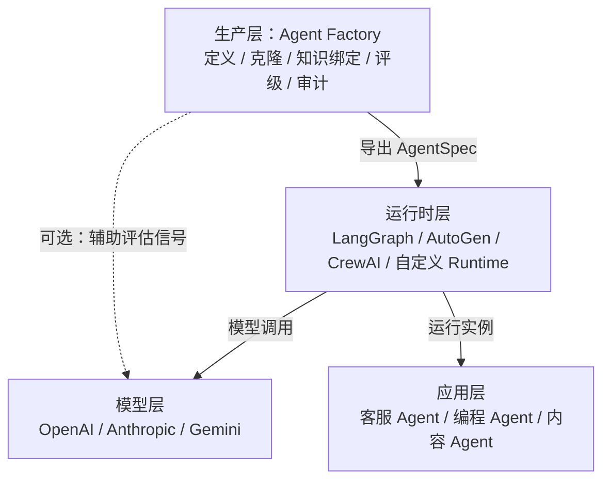
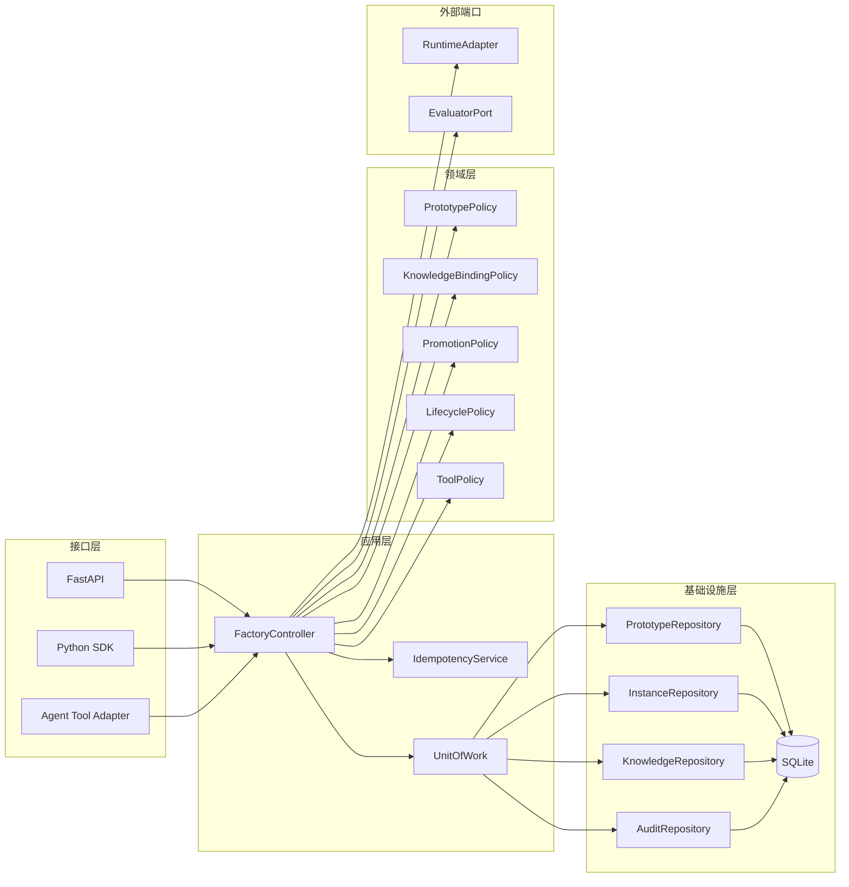
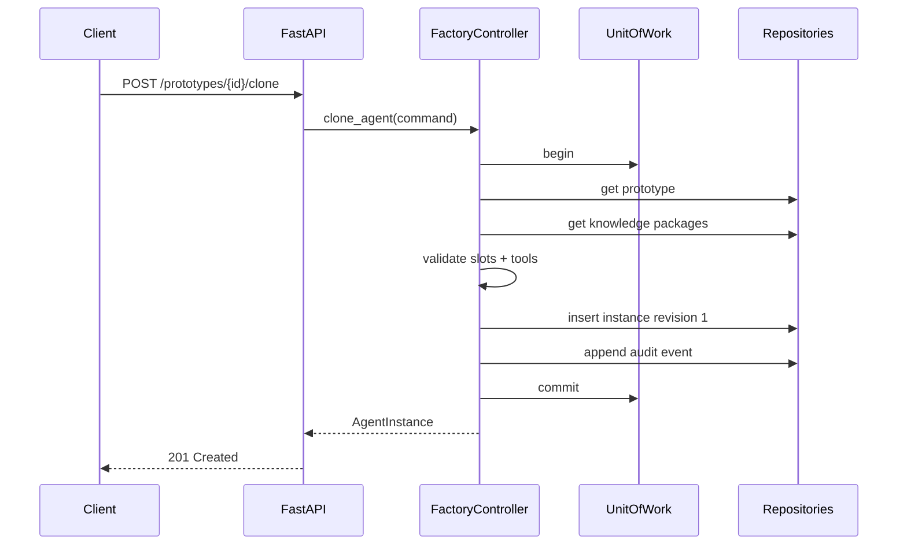

# Agent工厂（Agent Factory）架构设计文档 V1.0

**项目名称**：Agent工厂 —— Agent 工程化生产与治理框架<br>
**核心定位**：向运行时交付标准化 `AgentSpec`，负责 Agent 的定义、复制、知识绑定、能力评级与审计追溯<br>
**核心组件**：`FactoryController`，一个不依赖 LLM 做内部决策的确定性应用服务<br>
**当前阶段**：Alpha，验证单机条件下的最小生产闭环

本文是编码规格，不是概念说明。字段、方法、状态、错误码和路由均作为 Alpha 实现基线；实现发生偏离时，应先修改本文再修改代码。

配套工程文档：[项目路线图](project/PROJECT_ROADMAP.md)、[M0 阶段文档](milestones/m0-foundation.md)、[M1 阶段文档](milestones/m1-core-production-chain.md)、[领域契约设计说明](design/domain-contracts.md)、[SQLite 持久化设计说明](design/sqlite-persistence.md)、[应用服务设计说明](design/application-services.md)、[学习日志](../LEARNING_LOG.md)、[设计纠偏记录](../DECISION_CORRECTIONS.md)。

---

## 目录

- [第一章 项目概述与生态定位](#第一章-项目概述与生态定位)
  - [1.1 交付目标](#11-交付目标)
  - [1.2 技术栈位置](#12-技术栈位置)
  - [1.3 术语与身份规则](#13-术语与身份规则)
  - [1.4 强制业务不变量](#14-强制业务不变量)
- [第二章 核心设计理念与范围边界](#第二章-核心设计理念与范围边界)
  - [2.1 确定性控制边界](#21-确定性控制边界)
  - [2.2 约束等级](#22-约束等级)
  - [2.3 不可变快照](#23-不可变快照)
  - [2.4 版本与兼容性](#24-版本与兼容性)
  - [2.5 非功能约束](#25-非功能约束)
  - [2.6 风险边界](#26-风险边界)
- [第三章 系统总体架构](#第三章-系统总体架构)
  - [3.1 组件关系](#31-组件关系)
  - [3.2 推荐目录](#32-推荐目录)
  - [3.3 核心生产序列](#33-核心生产序列)
  - [3.4 应用服务签名](#34-应用服务签名)
  - [3.5 端口与工作单元](#35-端口与工作单元)
  - [3.6 配置](#36-配置)
- [第四章 Agent 定义模型：类、协议与规格](#第四章-agent-定义模型类协议与规格)
  - [4.1 公共类型](#41-公共类型)
  - [4.2 Agent 定义](#42-agent-定义)
  - [4.3 BaseAgent 与运行对象](#43-baseagent-与运行对象)
  - [4.4 原型与规格](#44-原型与规格)
  - [4.5 能力协议注册](#45-能力协议注册)
  - [4.6 YAML/JSON DSL](#46-yamljson-dsl)
- [第五章 知识包与知识槽](#第五章-知识包与知识槽)
  - [5.1 数据模型](#51-数据模型)
  - [5.2 命令模型](#52-命令模型)
  - [5.3 绑定策略](#53-绑定策略)
  - [5.4 注入物化](#54-注入物化)
- [第六章 原型注册表](#第六章-原型注册表)
  - [6.1 命令与实例模型](#61-命令与实例模型)
  - [6.2 查询与分页](#62-查询与分页)
  - [6.3 仓储接口](#63-仓储接口)
  - [6.4 注册与克隆实现](#64-注册与克隆实现)
  - [6.5 SQLite 表结构](#65-sqlite-表结构)
  - [6.6 乐观并发](#66-乐观并发)
  - [6.7 AgentSpec 构建与持久化](#67-agentspec-构建与持久化)
- [第七章 技能树引擎](#第七章-技能树引擎)
  - [7.1 技能、评估与观察模型](#71-技能评估与观察模型)
  - [7.2 技能树模型与 DAG 校验](#72-技能树模型与-dag-校验)
  - [7.3 晋升命令与决策](#73-晋升命令与决策)
  - [7.4 纯函数式配置重建](#74-纯函数式配置重建)
  - [7.5 观察期与降级](#75-观察期与降级)
- [第八章 工具绑定与安全执行](#第八章-工具绑定与安全执行)
  - [8.1 工具模型](#81-工具模型)
  - [8.2 元数据目录与权限解析](#82-元数据目录与权限解析)
  - [8.3 安全执行器](#83-安全执行器)
  - [8.4 工具安全规则](#84-工具安全规则)
  - [8.5 工具表](#85-工具表)
- [第九章 Agent 生命周期管理](#第九章-agent-生命周期管理)
  - [9.1 状态迁移表](#91-状态迁移表)
  - [9.2 状态命令](#92-状态命令)
  - [9.3 上下文边界](#93-上下文边界)
  - [9.4 并发规则](#94-并发规则)
  - [9.5 事件钩子](#95-事件钩子)
- [第十章 双模接口](#第十章-双模接口)
  - [10.1 API DTO](#101-api-dto)
  - [10.2 FastAPI 应用与依赖](#102-fastapi-应用与依赖)
  - [10.3 原型、实例和知识路由](#103-原型实例和知识路由)
  - [10.4 评估、晋升与状态路由](#104-评估晋升与状态路由)
  - [10.5 异常模型与稳定错误码](#105-异常模型与稳定错误码)
  - [10.6 FastAPI 异常处理](#106-fastapi-异常处理)
  - [10.7 路由装配](#107-路由装配)
  - [10.8 Python SDK](#108-python-sdk)
  - [10.9 面向 Agent 的工具映射](#109-面向-agent-的工具映射)
- [第十一章 可观测性、审计与追溯](#第十一章-可观测性审计与追溯)
  - [11.1 审计事件模型](#111-审计事件模型)
  - [11.2 审计仓储与路由](#112-审计仓储与路由)
  - [11.3 事件载荷](#113-事件载荷)
  - [11.4 请求关联](#114-请求关联)
  - [11.5 指标](#115-指标)
  - [11.6 结构化日志](#116-结构化日志)
- [第十二章 工程测试与质量保障](#第十二章-工程测试与质量保障)
  - [12.1 测试分层与门槛](#121-测试分层与门槛)
  - [12.2 固定 fixture](#122-固定-fixture)
  - [12.3 单元测试](#123-单元测试)
  - [12.4 SQLite 集成 fixture](#124-sqlite-集成-fixture)
  - [12.5 完整生产链集成测试](#125-完整生产链集成测试)
  - [12.6 并发与事务测试](#126-并发与事务测试)
  - [12.7 API 与错误契约测试](#127-api-与错误契约测试)
  - [12.8 安全测试清单](#128-安全测试清单)
  - [12.9 测试命令](#129-测试命令)
- [第十三章 验证实验设计](#第十三章-验证实验设计)
  - [13.1 待验证假设](#131-待验证假设)
  - [13.2 实验模型](#132-实验模型)
  - [13.3 实验规模与分组](#133-实验规模与分组)
  - [13.4 随机化](#134-随机化)
  - [13.5 指标计算](#135-指标计算)
  - [13.6 构建时间](#136-构建时间)
  - [13.7 统计分析](#137-统计分析)
- [第十四章 开发路线图与未来展望](#第十四章-开发路线图与未来展望)
  - [14.1 里程碑与退出条件](#141-里程碑与退出条件)
  - [14.2 M0 规格](#142-m0-规格)
  - [14.3 M1 规格](#143-m1-规格)
  - [14.4 M2 规格](#144-m2-规格)
  - [14.5 M3 规格](#145-m3-规格)
  - [14.6 Alpha 演示脚本](#146-alpha-演示脚本)
  - [14.7 M4-M6 规格](#147-m4-m6-规格)
  - [14.8 Alpha Definition of Done](#148-alpha-definition-of-done)
  - [14.9 未来方向的进入条件](#149-未来方向的进入条件)
- [附录](#附录)
  - [A. 项目目录结构](#a-项目目录结构)
  - [B. 相关框架边界](#b-相关框架边界)
  - [C. 实现依赖与参考规范](#c-实现依赖与参考规范)
  - [D. 术语索引](#d-术语索引)

---

## 第一章 项目概述与生态定位

### 1.1 交付目标

Alpha 必须交付以下可执行能力：

| 编号 | 能力 | 输入 | 输出 | 完成条件 |
| --- | --- | --- | --- | --- |
| AF-01 | 注册原型 | `AgentPrototypeCreate` | `AgentPrototype` | 同一 `prototype_id + version` 不可重复 |
| AF-02 | 克隆实例 | `CloneAgentCommand` | `AgentInstance` | 实例保留不可变的原型来源 |
| AF-03 | 绑定知识 | `BindKnowledgeCommand` | 新 `AgentInstance` 快照 | 必填槽、类型、版本全部校验 |
| AF-04 | 导出规格 | `instance_id` | `AgentSpec` | 缺知识或越权工具时拒绝导出 |
| AF-05 | 技能晋升 | `PromotionCommand` | 新配置快照 | 依赖满足且硬规则通过 |
| AF-06 | 技能降级 | 运行评估窗口 | 新配置快照 | 达到降级阈值后回退并审计 |
| AF-07 | 审计追溯 | 实体 ID 与筛选条件 | `AuditEvent` 列表 | 每次写操作至少产生一条事件 |
| AF-08 | 多入口调用 | REST / Python SDK / Tool | 同构结果 | 三种入口复用同一应用服务 |

Alpha 明确不交付：多 Agent 编排、模型路由、长期记忆、任务市场、分布式调度、自动修改原型、任意代码执行。

### 1.2 技术栈位置



工厂不直接承诺 Agent 任务执行质量。工厂承诺的是：交付的 `AgentSpec` 结构合法、来源可追溯、知识版本明确、工具权限不越界、技能变更有证据。

### 1.3 术语与身份规则

| 术语 | 代码类型 | 身份格式 | 可变性 |
| --- | --- | --- | --- |
| Agent 定义 | `AgentDefinition` | 无独立 ID | 冻结值对象 |
| Agent 原型 | `AgentPrototype` | `prototype_id@semver` | 发布后不可变 |
| Agent 实例 | `AgentInstance` | UUID v4 | 通过新快照演进 |
| 知识包 | `DomainKnowledge` | `knowledge_id@semver` | 发布后不可变 |
| 技能节点 | `SkillNode` | slug | 节点定义不可变 |
| 运行规格 | `AgentSpec` | 与 instance ID 一致 | 每个 revision 不可变 |
| 工厂控制器 | `FactoryController` | 单应用服务 | 无业务状态 |

`FactoryController` 不是 Agent，不实现 `think()` 或 `act()`，也不调用 LLM 决定是否注册、绑定、晋升或授权。LLM 只允许通过 `EvaluatorPort` 产生非阻断性辅助评分。

### 1.4 强制业务不变量

1. 原型键 `(prototype_id, version)` 全局唯一，发布后不得原地修改。
2. 实例必须记录 `prototype_id`、`prototype_version` 与原型内容校验和。
3. 导出 `AgentSpec` 前，所有必填知识槽必须完成合法绑定。
4. 实例有效工具集必须是全局工具白名单的子集。
5. 技能图必须是 DAG，晋升目标的全部前置节点必须已激活。
6. 每次实例变更必须生成新 `revision`，旧快照不可覆盖。
7. 业务写入与对应审计事件必须处于同一数据库事务。
8. 所有时间使用 UTC，序列化格式为 RFC 3339。


---

## 第二章 核心设计理念与范围边界

### 2.1 确定性控制边界

下列决策只能由代码规则产生：

| 决策 | 决策函数 | 禁止的替代方式 |
| --- | --- | --- |
| 能否注册原型 | `PrototypePolicy.validate_definition` | 让 LLM 阅读定义后判断 |
| 能否绑定知识 | `KnowledgeBindingPolicy.validate_and_build` | 按语义相似度自动绑定 |
| 能否授权工具 | `ToolPolicy.resolve` | 运行时动态请求未知工具 |
| 能否晋升 | `PromotionPolicy.decide` | 仅凭 LLM-as-Judge 分数 |
| 是否降级 | `DegradationPolicy.should_degrade` | 模型自行声明能力下降 |
| 状态能否迁移 | `LifecyclePolicy.transition` | 直接修改 status 字段 |

### 2.2 约束等级

```python
from enum import StrEnum


class ConstraintLevel(StrEnum):
    HARD = "hard"      # 不满足即拒绝操作
    SOFT = "soft"      # 记录警告，不阻断
    SIGNAL = "signal"  # 仅作为观测或人工参考
```

- HARD：Pydantic 字段、知识槽、工具白名单、DAG、版本唯一性、状态迁移、评估硬规则。
- SOFT：建议的 Prompt 长度、非必填知识槽、延迟预算。
- SIGNAL：LLM 评分、语义风格分、用户满意度。
- `PromotionPolicy` 只可使用 HARD 结果和明确的人工复核结果做最终判决；SIGNAL 不得单独触发晋升。

### 2.3 不可变快照

领域模型统一使用：

```python
from pydantic import BaseModel, ConfigDict


class FrozenModel(BaseModel):
    model_config = ConfigDict(
        frozen=True,
        extra="forbid",
        str_strip_whitespace=True,
        validate_default=True,
    )
```

`frozen=True` 只禁止字段重新赋值，不会递归冻结嵌套 `dict` 和 `list`。因此领域字段不得直接保存可变 JSON 容器；`JsonObject` 使用 `FrozenJsonObject`，在校验时将 object 递归转为只读 mapping、将 array 转为 tuple，并在 Pydantic 序列化时还原为标准 JSON object/array。非有限浮点数和非 JSON 类型必须在边界处拒绝。

更新操作必须使用 `model_copy(update={...})` 生成新对象，并由仓储执行乐观并发写入。禁止在 controller 内修改 Pydantic 对象内部容器。

### 2.4 版本与兼容性

- 原型和知识包使用严格语义化版本 `MAJOR.MINOR.PATCH`。
- `AgentSpec.schema_version` 独立版本化，Alpha 固定为 `1.0`。
- MAJOR：删除字段、改变字段语义或收紧已有输入。
- MINOR：新增可选字段或新增兼容能力。
- PATCH：文档、默认值或不改变契约的实现修复。
- REST API 固定前缀 `/api/v1`；Alpha 内允许新增端点，不允许无迁移说明地改变已有响应字段。

### 2.5 非功能约束

| 项目 | Alpha 目标 |
| --- | --- |
| 单请求体 | 默认不超过 1 MiB |
| 列表分页 | `1 <= page_size <= 100`，默认 20 |
| 写请求幂等 | 接受 `Idempotency-Key`，保留 24 小时 |
| 并发一致性 | 实例 revision 乐观锁 |
| 本地性能 | 不含 LLM 的 P95 API 延迟低于 200 ms |
| 数据库 | SQLite WAL 模式，外键开启 |
| 审计保留 | Alpha 不自动删除 |
| 密钥 | 只从环境变量读取，不进入模型和日志 |

### 2.6 风险边界

- “知识已绑定”不等于“模型正确使用了知识”。
- “技能已晋升”只代表指定评估套件、模型版本与时间点下通过。
- 跨运行时可复用的是 `AgentSpec`，不是运行时内部状态或记忆。
- 一次性 Prompt 或单工具脚本不需要引入本框架。
- Alpha 不允许控制器根据运行反馈自动改写原型；只能生成待人工确认的建议。


---

## 第三章 系统总体架构

### 3.1 组件关系



接口层不得直接访问仓储。领域策略不得导入 FastAPI、SQLite 或任何模型 SDK。

### 3.2 推荐目录

```text
src/agent_factory/
├── domain/
│   ├── models.py
│   ├── enums.py
│   ├── errors.py
│   ├── policies/
│   │   ├── knowledge.py
│   │   ├── lifecycle.py
│   │   ├── promotion.py
│   │   ├── prototype.py
│   │   └── tools.py
│   └── services/
│       └── spec_builder.py
├── application/
│   ├── commands.py
│   ├── controller.py
│   ├── dto.py
│   ├── ports.py
│   └── unit_of_work.py
├── infrastructure/
│   ├── sqlite/
│   │   ├── repositories.py
│   │   └── unit_of_work.py
│   ├── evaluators/
│   └── runtime_adapters/
├── interfaces/
│   ├── api/
│   │   ├── dependencies.py
│   │   ├── errors.py
│   │   ├── main.py
│   │   └── routers/
│   ├── sdk/
│   └── tools/
└── settings.py
tests/
├── unit/
├── integration/
├── contract/
├── security/
└── fixtures/
```

### 3.3 核心生产序列



任何验证或仓储失败都必须发生在事务提交前；`UnitOfWork.__aexit__()` 回滚未提交事务，不得留下没有审计记录的实例。

### 3.4 应用服务签名

```python
from collections.abc import Sequence
from uuid import UUID


class FactoryController:
    def __init__(
        self,
        *,
        uow_factory: "UnitOfWorkFactory",
        clock: "Clock",
        id_generator: "IdGenerator",
        correlation_context: "CorrelationContext",
        prototype_policy: "PrototypePolicy",
        knowledge_policy: "KnowledgeBindingPolicy",
        tool_policy: "ToolPolicy",
        spec_builder: "AgentSpecBuilder",
        idempotency: "IdempotencyService",
        audit_factory: "AuditEventFactory",
        max_inline_knowledge_bytes: int,
    ) -> None: ...

    async def register_prototype(
        self, command: "RegisterPrototypeCommand"
    ) -> "AgentPrototype": ...

    async def list_prototypes(
        self, query: "PrototypeListQuery"
    ) -> "Page[AgentPrototype]": ...

    async def publish_prototype(
        self, command: "PublishPrototypeCommand"
    ) -> "AgentPrototype": ...

    async def deprecate_prototype(
        self, command: "DeprecatePrototypeCommand"
    ) -> "AgentPrototype": ...

    async def register_knowledge(
        self, command: "RegisterKnowledgeCommand"
    ) -> "DomainKnowledge": ...

    async def clone_agent(
        self, command: "CloneAgentCommand"
    ) -> "AgentInstance": ...

    async def bind_knowledge(
        self, command: "BindKnowledgeCommand"
    ) -> "AgentInstance": ...

    async def export_spec(
        self,
        instance_id: UUID,
        *,
        revision: int | None = None,
        actor: str,
    ) -> "AgentSpec": ...

    async def query_audit(
        self, query: "AuditQuery"
    ) -> "Page[AuditEvent]": ...

    # 以下操作在 M2 扩展，不属于 M1 Controller。
    async def transition_instance(
        self, command: "TransitionInstanceCommand"
    ) -> "AgentInstance": ...

    async def evaluate(
        self, command: "EvaluateInstanceCommand"
    ) -> "EvaluationReport": ...

    async def promote(
        self, command: "PromotionCommand"
    ) -> "AgentInstance": ...

    async def record_task_outcome(
        self, command: "RecordTaskOutcomeCommand"
    ) -> "DegradationCheckResult": ...

```

M1 Controller 只注入当前生产闭环实际使用的端口和策略。`EvaluatorPort`、技能树仓储和任务结果仓储在 M2 引入；它们不得作为未使用参数提前进入构造函数。

### 3.5 端口与工作单元

```python
from types import TracebackType
from typing import Protocol, Self


class RuntimeAdapter(Protocol):
    name: str

    async def run(
        self, spec: "AgentSpec", request: "RunRequest"
    ) -> "RunResult": ...


class EvaluatorPort(Protocol):
    async def evaluate(
        self,
        spec: "AgentSpec",
        suite: "EvaluationSuite",
        cases: tuple["EvaluationCase", ...],
    ) -> "EvaluationReport": ...


class UnitOfWork(Protocol):
    prototypes: "PrototypeRepository"
    instances: "InstanceRepository"
    specs: "AgentSpecRepository"
    knowledge: "KnowledgeRepository"
    audit: "AuditRepository"
    idempotency: "IdempotencyRepository"

    async def __aenter__(self) -> Self: ...

    async def __aexit__(
        self,
        exc_type: type[BaseException] | None,
        exc: BaseException | None,
        traceback: TracebackType | None,
    ) -> None: ...

    async def commit(self) -> None: ...

    async def rollback(self) -> None: ...


class UnitOfWorkFactory(Protocol):
    def __call__(
        self,
        *,
        read_only: bool = False,
    ) -> UnitOfWork: ...
```

M1 的 UoW 只暴露核心生产链需要的六类仓储；技能、评估和任务结果仓储在 M2 实现时再扩展。每次调用 factory 创建独立连接和事务：写事务使用 `BEGIN IMMEDIATE`，只读事务使用 `BEGIN` 与 `PRAGMA query_only = ON`。Repository、审计与幂等记录共享同一连接；未显式 `commit()` 或上下文抛出异常时统一回滚。

### 3.6 配置

需要额外依赖 `pydantic-settings>=2`。

```python
from pathlib import Path
from pydantic import Field, SecretStr
from pydantic_settings import BaseSettings, SettingsConfigDict


class Settings(BaseSettings):
    model_config = SettingsConfigDict(
        env_prefix="AGENT_FACTORY_",
        env_file=".env",
        extra="ignore",
    )

    environment: str = "development"
    database_url: str = "sqlite+aiosqlite:///./agent_factory.db"
    api_prefix: str = "/api/v1"
    max_request_bytes: int = 1_048_576
    max_inline_knowledge_bytes: int = 262_144
    default_page_size: int = 20
    max_page_size: int = 100
    idempotency_ttl_seconds: int = 86_400
    sqlite_busy_timeout_ms: int = 5_000
    audit_log_level: str = "INFO"
    openai_api_key: SecretStr | None = None
    anthropic_api_key: SecretStr | None = None
    data_dir: Path = Field(default=Path("./data"))
    migrations_dir: Path = Field(
        default=Path(__file__).resolve().parent
        / "infrastructure"
        / "sqlite"
        / "sql"
    )
```


---

## 第四章 Agent 定义模型：类、协议与规格

### 4.1 公共类型

```python
from __future__ import annotations

from collections.abc import Mapping
from datetime import datetime
from typing import Annotated, Literal
from uuid import UUID

from pydantic import AfterValidator, Field, PlainSerializer


Slug = Annotated[
    str,
    Field(
        min_length=3,
        max_length=64,
        pattern=r"^[a-z][a-z0-9]*(?:-[a-z0-9]+)*$",
    ),
]
SemVer = Annotated[
    str,
    Field(pattern=r"^(0|[1-9]\d*)\.(0|[1-9]\d*)\.(0|[1-9]\d*)$"),
]
JsonObject = Annotated[
    Mapping[str, object],
    AfterValidator(freeze_json_object),
    PlainSerializer(serialize_json_object, when_used="always"),
]
```

`JsonObject` 的对外静态类型是只读 `Mapping[str, object]`，validator 的运行时结果是 `FrozenJsonObject`。这样 Python 调用方可传入普通字典，而消费方的类型契约不暴露可变操作。`model_dump(mode="json")` 必须输出普通 `dict`/`list`，canonical JSON 必须固定使用 UTF-8、字典键排序和紧凑分隔符。

Alpha 不接受 `v1.2.3`、预发布版本或构建元数据。版本比较必须先拆成三个整数，禁止按字符串比较。

```python
def semver_tuple(version: str) -> tuple[int, int, int]:
    major, minor, patch = version.split(".")
    return int(major), int(minor), int(patch)
```

### 4.2 Agent 定义

```python
from enum import StrEnum
from pydantic import Field, field_validator, model_validator


class Capability(StrEnum):
    CODE = "can-code"
    WRITE = "can-write"


class AgentDefinition(FrozenModel):
    agent_type: Slug
    role: str = Field(min_length=1, max_length=128)
    system_prompt: str = Field(min_length=1, max_length=32_000)
    tools: tuple[Slug, ...] = ()
    capabilities: frozenset[Capability] = frozenset()
    output_schema: JsonObject = Field(default_factory=dict)
    knowledge_slots: tuple["KnowledgeSlot", ...] = ()
    metadata: dict[str, str] = Field(default_factory=dict)

    @field_validator("tools")
    @classmethod
    def tools_must_be_unique(cls, value: tuple[str, ...]) -> tuple[str, ...]:
        if len(value) != len(set(value)):
            raise ValueError("tools contains duplicate names")
        return value

    @model_validator(mode="after")
    def slot_names_must_be_unique(self) -> "AgentDefinition":
        names = [slot.name for slot in self.knowledge_slots]
        if len(names) != len(set(names)):
            raise ValueError("knowledge slot names must be unique")
        return self
```

`output_schema` 必须通过 JSON Schema Draft 2020-12 校验。注册原型时执行：

```python
from jsonschema import Draft202012Validator
from jsonschema.exceptions import SchemaError


def validate_output_schema(schema: JsonObject) -> None:
    try:
        Draft202012Validator.check_schema(schema)
    except SchemaError as exc:
        raise InvalidOutputSchemaError(
            details={"path": list(exc.path), "reason": exc.message}
        ) from exc
```

### 4.3 BaseAgent 与运行对象

`BaseAgent` 只存在于运行时适配层。数据库持久化 `AgentInstance`，跨运行时交付 `AgentSpec`，不序列化具体 Python Agent 对象。

```python
from abc import ABC, abstractmethod


class ThinkRequest(FrozenModel):
    task_id: UUID
    user_input: str = Field(min_length=1, max_length=64_000)
    context: tuple[dict[str, Any], ...] = ()


class Thought(FrozenModel):
    summary: str = Field(min_length=1, max_length=8_000)
    proposed_tool: Slug | None = None
    proposed_arguments: JsonObject = Field(default_factory=dict)


class ActionResult(FrozenModel):
    task_id: UUID
    content: str
    structured_output: JsonObject | None = None
    tool_calls: tuple["ToolCallRecord", ...] = ()


class BaseAgent(FrozenModel, ABC):
    id: UUID
    role: str
    system_prompt: str
    tools: tuple["ResolvedToolSpec", ...]
    output_schema: JsonObject
    knowledge_slots: tuple["KnowledgeSlot", ...]

    @abstractmethod
    async def think(
        self,
        request: ThinkRequest,
        runtime: "RuntimeAdapter",
    ) -> Thought:
        raise NotImplementedError

    @abstractmethod
    async def act(
        self,
        thought: Thought,
        runtime: "RuntimeAdapter",
    ) -> ActionResult:
        raise NotImplementedError
```

`WriterAgent` 和 `EngineerAgent` 只负责把 `AgentSpec` 适配为运行对象。它们不得自行扩充工具或绕过 `ToolExecutor`。

### 4.4 原型与规格

```python
from enum import StrEnum
from pydantic import PositiveInt


class PrototypeStatus(StrEnum):
    DRAFT = "draft"
    PUBLISHED = "published"
    DEPRECATED = "deprecated"


class PrototypeRef(FrozenModel):
    prototype_id: Slug
    version: SemVer
    checksum: Annotated[str, Field(pattern=r"^[a-f0-9]{64}$")]


class AgentPrototype(FrozenModel):
    prototype_id: Slug
    version: SemVer
    status: PrototypeStatus = PrototypeStatus.DRAFT
    definition: AgentDefinition
    checksum: Annotated[str, Field(pattern=r"^[a-f0-9]{64}$")]
    created_at: datetime
    created_by: str = Field(min_length=1, max_length=128)
    published_at: datetime | None = None
    deprecation_reason: str | None = Field(default=None, max_length=1_000)


class KnowledgeRef(FrozenModel):
    slot_name: Slug
    knowledge_id: Slug
    version: SemVer
    checksum: Annotated[str, Field(pattern=r"^[a-f0-9]{64}$")]
    injection_mode: "InjectionMode"


class AgentSpec(FrozenModel):
    schema_version: Literal["1.0"] = "1.0"
    instance_id: UUID
    revision: PositiveInt
    prototype: PrototypeRef
    agent_type: Slug
    role: str
    system_prompt: str
    tools: tuple["ResolvedToolSpec", ...]
    knowledge: tuple[KnowledgeRef, ...]
    output_schema: JsonObject
    active_skill_nodes: frozenset[Slug] = frozenset()
    runtime_target: Slug | None = None
    generated_at: datetime
    spec_checksum: Annotated[str, Field(pattern=r"^[a-f0-9]{64}$")]
    metadata: dict[str, str] = Field(default_factory=dict)
```

校验和统一使用 canonical JSON：

```python
import hashlib
import json
from pydantic import BaseModel


def sha256_model(model: BaseModel, *, exclude: set[str] | None = None) -> str:
    payload = model.model_dump(
        mode="json",
        exclude=exclude or set(),
        exclude_none=False,
    )
    encoded = json.dumps(
        payload,
        ensure_ascii=False,
        sort_keys=True,
        separators=(",", ":"),
    ).encode("utf-8")
    return hashlib.sha256(encoded).hexdigest()
```

生成 `AgentSpec` 时，`spec_checksum` 的计算排除自身字段，但不排除 `generated_at`；同一 revision 的规格必须从持久化快照返回，禁止每次请求重新生成时间戳。

### 4.5 能力协议注册

Python `Protocol` 只用于静态检查，运行时注册使用显式 capability registry：

```python
from typing import Protocol, runtime_checkable


@runtime_checkable
class CanWrite(Protocol):
    async def draft(self, brief: str) -> str: ...


@runtime_checkable
class CanCode(Protocol):
    async def generate_patch(self, request: str) -> str: ...


CAPABILITY_METHODS: dict[Capability, frozenset[str]] = {
    Capability.WRITE: frozenset({"draft"}),
    Capability.CODE: frozenset({"generate_patch"}),
}


def validate_capability_class(
    implementation: type[BaseAgent],
    capabilities: frozenset[Capability],
) -> None:
    missing: dict[str, list[str]] = {}
    for capability in capabilities:
        methods = CAPABILITY_METHODS[capability]
        absent = sorted(name for name in methods if not hasattr(implementation, name))
        if absent:
            missing[capability.value] = absent
    if missing:
        raise CapabilityContractError(details={"missing_methods": missing})
```

### 4.6 YAML/JSON DSL

```yaml
agent_type: writer-agent
role: Technical Writer
system_prompt: |
  Produce concise technical documentation using bound domain knowledge.
tools:
  - document-search
capabilities:
  - can-write
output_schema:
  type: object
  required: [title, body]
  properties:
    title: {type: string}
    body: {type: string}
knowledge_slots:
  - name: product-docs
    required: true
    accepted_kinds: [document]
    min_version: 1.0.0
    injection_mode: retrieval
metadata:
  owner: demo
```

```python
from pathlib import Path
import json
import yaml


def load_agent_definition(path: Path) -> AgentDefinition:
    if path.suffix not in {".yaml", ".yml", ".json"}:
        raise DefinitionParseError(
            details={"path": str(path), "reason": "unsupported file extension"}
        )
    try:
        raw = (
            yaml.safe_load(path.read_text(encoding="utf-8"))
            if path.suffix in {".yaml", ".yml"}
            else json.loads(path.read_text(encoding="utf-8"))
        )
        if not isinstance(raw, dict):
            raise TypeError("document root must be an object")
        return AgentDefinition.model_validate(raw)
    except (OSError, ValueError, TypeError) as exc:
        raise DefinitionParseError(
            details={"path": str(path), "reason": str(exc)}
        ) from exc
```

DSL 中禁止出现 Python 模块路径、回调函数、模板表达式和任意可执行代码。`agent_type` 必须映射到启动时注册的实现类。


---

## 第五章 知识包与知识槽

### 5.1 数据模型

```python
from enum import StrEnum
from typing import Any
from pydantic import AnyHttpUrl, Field, model_validator


class KnowledgeKind(StrEnum):
    DOCUMENT = "document"
    POLICY = "policy"
    DATASET = "dataset"
    GLOSSARY = "glossary"


class InjectionMode(StrEnum):
    INLINE = "inline"
    RETRIEVAL = "retrieval"


class KnowledgeSlot(FrozenModel):
    name: Slug
    required: bool = True
    accepted_kinds: Annotated[
        frozenset[KnowledgeKind],
        Field(min_length=1),
    ]
    min_version: SemVer = "0.0.0"
    max_version_exclusive: SemVer | None = None
    injection_mode: InjectionMode
    multiple: bool = False
    max_items: int = Field(default=1, ge=1, le=32)

    @model_validator(mode="after")
    def validate_cardinality_and_version(self) -> "KnowledgeSlot":
        if not self.multiple and self.max_items != 1:
            raise ValueError("max_items must be 1 when multiple is false")
        if (
            self.max_version_exclusive is not None
            and semver_tuple(self.min_version)
            >= semver_tuple(self.max_version_exclusive)
        ):
            raise ValueError("min_version must be lower than max_version_exclusive")
        return self


class DomainKnowledgeDraft(FrozenModel):
    knowledge_id: Slug
    version: SemVer
    name: str = Field(min_length=1, max_length=256)
    kind: KnowledgeKind
    content: str | dict[str, Any] | None = None
    source_uri: AnyHttpUrl | None = None
    mime_type: str = Field(default="text/plain", max_length=128)
    checksum: Annotated[str, Field(pattern=r"^[a-f0-9]{64}$")]
    tags: frozenset[Slug] = frozenset()

    @model_validator(mode="after")
    def require_exactly_one_source(self) -> "DomainKnowledgeDraft":
        if (self.content is None) == (self.source_uri is None):
            raise ValueError("exactly one of content or source_uri is required")
        return self


class DomainKnowledge(DomainKnowledgeDraft):
    created_at: datetime
    created_by: str = Field(min_length=1, max_length=128)


class KnowledgeBinding(FrozenModel):
    slot_name: Slug
    knowledge_id: Slug
    knowledge_version: SemVer
    knowledge_checksum: Annotated[str, Field(pattern=r"^[a-f0-9]{64}$")]
    injection_mode: InjectionMode
    bound_at: datetime
    bound_by: str = Field(min_length=1, max_length=128)
```

`source_uri` 只保存引用；抓取、鉴权和内容同步不属于 Alpha。调用方提交 `checksum`，controller 对 INLINE 内容重新计算并比对。字符串按 UTF-8 原字节计算，JSON 对象按 canonical JSON 计算；不一致返回 `KNOWLEDGE_CHECKSUM_MISMATCH`。INLINE 内容序列化后默认不得超过 256 KiB，超过时返回 `KNOWLEDGE_PAYLOAD_TOO_LARGE`。

```python
def checksum_knowledge_content(content: str | dict[str, Any]) -> str:
    if isinstance(content, str):
        encoded = content.encode("utf-8")
    else:
        encoded = json.dumps(
            content,
            ensure_ascii=False,
            sort_keys=True,
            separators=(",", ":"),
        ).encode("utf-8")
    return hashlib.sha256(encoded).hexdigest()
```

### 5.2 命令模型

```python
class RegisterKnowledgeCommand(FrozenModel):
    knowledge: DomainKnowledgeDraft
    idempotency_key: str | None = Field(default=None, min_length=8, max_length=128)
    actor: str = Field(min_length=1, max_length=128)


class KnowledgeSelection(FrozenModel):
    slot_name: Slug
    knowledge_id: Slug
    version: SemVer


class BindKnowledgeCommand(FrozenModel):
    instance_id: UUID
    expected_revision: int = Field(ge=1)
    selections: tuple[KnowledgeSelection, ...]
    replace_existing: bool = False
    actor: str = Field(min_length=1, max_length=128)
    idempotency_key: str | None = Field(default=None, min_length=8, max_length=128)
```

`FactoryController.register_knowledge` 负责注入时间与 actor：

```python
async def register_knowledge(
    self,
    command: RegisterKnowledgeCommand,
) -> DomainKnowledge:
    draft = command.knowledge
    if draft.content is not None:
        actual_checksum = checksum_knowledge_content(draft.content)
        if actual_checksum != draft.checksum:
            raise KnowledgeChecksumMismatchError(
                details={
                    "expected": draft.checksum,
                    "actual": actual_checksum,
                }
            )
    knowledge = DomainKnowledge(
        **draft.model_dump(),
        created_at=self.clock.now(),
        created_by=command.actor,
    )
    async with self.uow_factory() as uow:
        if await uow.knowledge.get(
            knowledge.knowledge_id,
            knowledge.version,
        ):
            raise KnowledgeAlreadyExistsError(
                details={
                    "knowledge_id": knowledge.knowledge_id,
                    "version": knowledge.version,
                }
            )
        await uow.knowledge.add(knowledge)
        await uow.audit.append(
            AuditEvent.for_knowledge_registered(knowledge, command.actor)
        )
        await uow.commit()
    return knowledge
```

### 5.3 绑定策略

绑定只允许实例处于 `CREATED`、`WAITING` 或 `DEGRADED`。`RUNNING` 返回 `INSTANCE_BUSY`，`FAILED`、`COMPLETED` 或 `TERMINATED` 返回 `INVALID_STATE_TRANSITION`；HTTP status 由 M1.4 接口层映射。

```python
class KnowledgeBindingPolicy:
    def validate_and_build(
        self,
        *,
        definition: AgentDefinition,
        selections: Iterable[KnowledgeSelectionLike],
        packages: Iterable[DomainKnowledge],
        bound_at: datetime,
        bound_by: str,
    ) -> tuple[KnowledgeBinding, ...]:
        slots = definition.knowledge_slots
        slot_map = {slot.name: slot for slot in slots}
        package_map = {
            (item.knowledge_id, item.version): item for item in packages
        }
        grouped: dict[str, list[DomainKnowledge]] = {}

        for selection in selections:
            slot = slot_map.get(selection.slot_name)
            if slot is None:
                raise UnknownKnowledgeSlotError(
                    details={"slot_name": selection.slot_name}
                )
            package = package_map.get(
                (selection.knowledge_id, selection.version)
            )
            if package is None:
                raise KnowledgeNotFoundError(
                    details={
                        "knowledge_id": selection.knowledge_id,
                        "version": selection.version,
                    }
                )
            if package.kind not in slot.accepted_kinds:
                raise KnowledgeKindMismatchError(
                    details={
                        "slot_name": slot.name,
                        "actual": package.kind,
                        "accepted": sorted(slot.accepted_kinds),
                    }
                )
            if not version_in_slot_range(package.version, slot):
                raise KnowledgeVersionMismatchError(
                    details={
                        "slot_name": slot.name,
                        "actual": package.version,
                        "min": slot.min_version,
                        "max_exclusive": slot.max_version_exclusive,
                    }
                )
            grouped.setdefault(slot.name, []).append(package)

        missing = [
            slot.name
            for slot in slots
            if slot.required and not grouped.get(slot.name)
        ]
        if missing:
            raise MissingKnowledgeBindingError(details={"slots": sorted(missing)})

        for slot in slots:
            count = len(grouped.get(slot.name, []))
            if count > slot.max_items:
                raise KnowledgeCardinalityError(
                    details={
                        "slot_name": slot.name,
                        "count": count,
                        "max_items": slot.max_items,
                    }
                )

        return tuple(
            KnowledgeBinding(
                slot_name=selection.slot_name,
                knowledge_id=package.knowledge_id,
                knowledge_version=package.version,
                knowledge_checksum=package.checksum,
                injection_mode=slot_map[selection.slot_name].injection_mode,
                bound_at=bound_at,
                bound_by=bound_by,
            )
            for selection in selections
            for package in [package_map[(selection.knowledge_id, selection.version)]]
        )
```

版本边界为 `min_version <= version < max_version_exclusive`。controller 先把现有绑定转换为 `KnowledgeSelection`，再与本次 selections 合并，将“最终选择集合”传入 policy。`replace_existing=False` 时，对已绑定槽再次绑定返回 `KNOWLEDGE_ALREADY_BOUND`；为 true 时先移除本次涉及槽的旧选择，再加入新选择。最终集合必须满足全部 required slot 与 cardinality 约束。变更成功后生成 `revision + 1` 完整快照；未触碰槽位复用原 binding，保留原始 `bound_at/bound_by`，本次触碰槽位才生成新 binding 和审计事件。

### 5.4 注入物化

```python
class KnowledgeAttachment(FrozenModel):
    ref: KnowledgeRef
    inline_content: str | dict[str, Any] | None = None
    retrieval_namespace: str | None = None


class KnowledgeMaterializer:
    async def materialize(
        self,
        bindings: tuple[KnowledgeBinding, ...],
        repository: "KnowledgeRepository",
    ) -> tuple[KnowledgeAttachment, ...]:
        ...
```

- INLINE：将内容放入 `inline_content`，并在 Runtime Adapter 中以固定分隔符追加到系统上下文。
- RETRIEVAL：只输出 `retrieval_namespace = "{knowledge_id}:{version}"`，运行时负责检索。
- Runtime Adapter 必须校验读取到的内容校验和等于 `KnowledgeRef.checksum`；不一致时返回 `KNOWLEDGE_CHECKSUM_MISMATCH`。
- 审计日志只记录 ID、版本、校验和和命中片段 ID，不记录完整知识内容。


---

## 第六章 原型注册表

### 6.1 命令与实例模型

```python
from enum import StrEnum
from pydantic import Field, PositiveInt


class InstanceStatus(StrEnum):
    CREATED = "created"
    RUNNING = "running"
    WAITING = "waiting"
    COMPLETED = "completed"
    FAILED = "failed"
    DEGRADED = "degraded"
    TERMINATED = "terminated"


class RegisterPrototypeCommand(FrozenModel):
    prototype_id: Slug
    version: SemVer
    definition: AgentDefinition
    publish: bool = False
    actor: str = Field(min_length=1, max_length=128)
    idempotency_key: str | None = Field(default=None, min_length=8, max_length=128)


class PublishPrototypeCommand(FrozenModel):
    prototype_id: Slug
    version: SemVer
    actor: str = Field(min_length=1, max_length=128)
    idempotency_key: str | None = Field(default=None, min_length=8, max_length=128)


class DeprecatePrototypeCommand(FrozenModel):
    prototype_id: Slug
    version: SemVer
    reason: str = Field(min_length=1, max_length=1_000)
    actor: str = Field(min_length=1, max_length=128)
    idempotency_key: str | None = Field(default=None, min_length=8, max_length=128)


class CloneAgentCommand(FrozenModel):
    prototype_id: Slug
    prototype_version: SemVer
    runtime_target: Slug | None = None
    actor: str = Field(min_length=1, max_length=128)
    idempotency_key: str | None = Field(default=None, min_length=8, max_length=128)


class AgentInstance(FrozenModel):
    instance_id: UUID
    prototype: PrototypeRef
    revision: PositiveInt
    status: InstanceStatus
    configuration: AgentDefinition
    knowledge_bindings: tuple[KnowledgeBinding, ...] = ()
    active_skill_nodes: frozenset[Slug] = frozenset()
    runtime_target: Slug | None = None
    created_at: datetime
    updated_at: datetime
    created_by: str = Field(min_length=1, max_length=128)
```

实例表存储完整 `configuration` 快照，而不是只存差异。这样降级、审计和历史重放不依赖旧代码中的 patch 算法。

原型状态只允许 `DRAFT -> PUBLISHED -> DEPRECATED`。发布和废弃只修改状态元数据，不修改 `definition` 或 checksum；其他迁移返回 `INVALID_PROTOTYPE_STATUS`。已废弃原型不能创建新实例，但历史实例仍可读取和导出旧 revision 的 Spec。

### 6.2 查询与分页

```python
from typing import Generic, TypeVar

T = TypeVar("T")


class Page(FrozenModel, Generic[T]):
    items: tuple[T, ...]
    page: int = Field(ge=1)
    page_size: int = Field(ge=1, le=100)
    total: int = Field(ge=0)


class PrototypeListQuery(FrozenModel):
    status: PrototypeStatus | None = None
    agent_type: Slug | None = None
    page: int = Field(default=1, ge=1)
    page_size: int = Field(default=20, ge=1, le=100)
```

列表排序固定为 `created_at DESC, prototype_id ASC, version DESC`，避免分页结果随机漂移。

### 6.3 仓储接口

```python
from typing import Protocol


class PrototypeRepository(Protocol):
    async def add(self, prototype: AgentPrototype) -> None: ...

    async def get(
        self, prototype_id: str, version: str
    ) -> AgentPrototype | None: ...

    async def list(
        self, query: PrototypeListQuery
    ) -> Page[AgentPrototype]: ...

    async def replace(
        self,
        prototype: AgentPrototype,
        expected_status: PrototypeStatus,
    ) -> bool: ...


class InstanceRepository(Protocol):
    async def add(self, instance: AgentInstance) -> None: ...

    async def get(
        self, instance_id: UUID, revision: int | None = None
    ) -> AgentInstance | None: ...

    async def save_snapshot(
        self,
        instance: AgentInstance,
        expected_revision: int,
    ) -> None: ...


class AgentSpecRepository(Protocol):
    async def get(
        self,
        instance_id: UUID,
        revision: int,
    ) -> AgentSpec | None: ...

    async def add_if_absent(self, spec: AgentSpec) -> bool: ...


class KnowledgeRepository(Protocol):
    async def add(self, knowledge: DomainKnowledge) -> None: ...

    async def get(
        self, knowledge_id: str, version: str
    ) -> DomainKnowledge | None: ...

    async def get_many(
        self, refs: tuple[tuple[str, str], ...]
    ) -> tuple[DomainKnowledge, ...]: ...
```

仓储的 `get` 不存在时返回 `None`；由 controller 转换为领域异常。原型状态转换由应用层构造新的完整 `AgentPrototype` 快照，`replace()` 只按 `expected_status` 执行 compare-and-swap，避免仓储层猜测 `published_at` 或 `deprecation_reason`。仓储不抛 HTTP 异常。

### 6.4 注册与克隆实现

```python
async def register_prototype(
    self,
    command: RegisterPrototypeCommand,
) -> AgentPrototype:
    validate_output_schema(command.definition.output_schema)
    self.prototype_policy.validate_registration(command.definition)
    self.tool_policy.validate_declared_tools(command.definition.tools)

    now = self.clock.now()
    status = (
        PrototypeStatus.PUBLISHED
        if command.publish
        else PrototypeStatus.DRAFT
    )
    prototype = AgentPrototype(
        prototype_id=command.prototype_id,
        version=command.version,
        status=status,
        definition=command.definition,
        checksum=sha256_model(command.definition),
        created_at=now,
        created_by=command.actor,
        published_at=now if command.publish else None,
    )

    async with self.uow_factory() as uow:
        if await uow.prototypes.get(command.prototype_id, command.version):
            raise PrototypeAlreadyExistsError(
                details={
                    "prototype_id": command.prototype_id,
                    "version": command.version,
                }
            )
        await uow.prototypes.add(prototype)
        await uow.audit.append(
            AuditEvent.for_prototype_registered(prototype, command.actor)
        )
        await uow.commit()
    return prototype
```

```python
async def clone_agent(self, command: CloneAgentCommand) -> AgentInstance:
    async with self.uow_factory() as uow:
        prototype = await uow.prototypes.get(
            command.prototype_id,
            command.prototype_version,
        )
        if prototype is None:
            raise PrototypeNotFoundError(
                details={
                    "prototype_id": command.prototype_id,
                    "version": command.prototype_version,
                }
            )
        if prototype.status is not PrototypeStatus.PUBLISHED:
            raise PrototypeNotPublishedError(
                details={"status": prototype.status}
            )

        now = self.clock.now()
        instance = AgentInstance(
            instance_id=self.id_generator.uuid4(),
            prototype=PrototypeRef(
                prototype_id=prototype.prototype_id,
                version=prototype.version,
                checksum=prototype.checksum,
            ),
            revision=1,
            status=InstanceStatus.CREATED,
            configuration=prototype.definition,
            runtime_target=command.runtime_target,
            created_at=now,
            updated_at=now,
            created_by=command.actor,
        )
        await uow.instances.add(instance)
        await uow.audit.append(
            AuditEvent.for_instance_cloned(instance, command.actor)
        )
        await uow.commit()
        return instance
```

若写请求带 `Idempotency-Key`，controller 必须先查询 `idempotency_records`。记录保存 application operation、请求哈希和结构化响应，不保存 HTTP status。相同 key、相同 operation 与请求哈希返回首次响应；相同 key 对应不同 operation 或请求哈希时返回 `IDEMPOTENCY_KEY_REUSED`。HTTP status 由 M1.4 接口层根据端点和结果决定。

注册前查询只用于提供清晰错误；数据库唯一键才是并发下的最终裁决。基础设施层捕获 prototype/knowledge 主键的 `IntegrityError`，分别转换为 `PrototypeAlreadyExistsError` 或 `KnowledgeAlreadyExistsError`。

### 6.5 SQLite 表结构

```sql
PRAGMA journal_mode = WAL;
PRAGMA foreign_keys = ON;

CREATE TABLE prototypes (
    prototype_id TEXT NOT NULL,
    version TEXT NOT NULL,
    status TEXT NOT NULL,
    payload_json TEXT NOT NULL,
    checksum TEXT NOT NULL,
    created_at TEXT NOT NULL,
    PRIMARY KEY (prototype_id, version)
);

CREATE TABLE knowledge_packages (
    knowledge_id TEXT NOT NULL,
    version TEXT NOT NULL,
    kind TEXT NOT NULL,
    payload_json TEXT NOT NULL,
    checksum TEXT NOT NULL,
    created_at TEXT NOT NULL,
    PRIMARY KEY (knowledge_id, version)
);

CREATE TABLE instance_snapshots (
    instance_id TEXT NOT NULL,
    revision INTEGER NOT NULL CHECK (revision >= 1),
    status TEXT NOT NULL,
    prototype_id TEXT NOT NULL,
    prototype_version TEXT NOT NULL,
    payload_json TEXT NOT NULL,
    created_at TEXT NOT NULL,
    PRIMARY KEY (instance_id, revision),
    FOREIGN KEY (prototype_id, prototype_version)
        REFERENCES prototypes(prototype_id, version)
);

CREATE TABLE instance_heads (
    instance_id TEXT PRIMARY KEY,
    current_revision INTEGER NOT NULL,
    updated_at TEXT NOT NULL,
    FOREIGN KEY (instance_id, current_revision)
        REFERENCES instance_snapshots(instance_id, revision)
);

CREATE TABLE agent_specs (
    instance_id TEXT NOT NULL,
    revision INTEGER NOT NULL,
    payload_json TEXT NOT NULL,
    checksum TEXT NOT NULL,
    created_at TEXT NOT NULL,
    PRIMARY KEY (instance_id, revision),
    FOREIGN KEY (instance_id, revision)
        REFERENCES instance_snapshots(instance_id, revision)
);

CREATE TABLE audit_events (
    event_id TEXT PRIMARY KEY,
    event_type TEXT NOT NULL,
    entity_type TEXT NOT NULL,
    entity_id TEXT NOT NULL,
    entity_revision INTEGER,
    actor TEXT NOT NULL,
    correlation_id TEXT NOT NULL,
    causation_id TEXT,
    payload_json TEXT NOT NULL,
    created_at TEXT NOT NULL
);

CREATE INDEX idx_audit_entity
    ON audit_events(entity_type, entity_id, created_at);

CREATE TABLE idempotency_records (
    idempotency_key TEXT PRIMARY KEY,
    operation TEXT NOT NULL,
    request_hash TEXT NOT NULL,
    response_json TEXT NOT NULL,
    created_at TEXT NOT NULL,
    expires_at TEXT NOT NULL
);

CREATE INDEX idx_idempotency_expires_at
    ON idempotency_records(expires_at);
```

上表表示应用 `001_initial.sql` 与 `002_persistence_contracts.sql` 后的最终结构。已执行 migration 不允许修改；`002` 在重建旧幂等表前断言其为空，若检测到未知旧记录则中止并回滚，不静默丢数据。

技能树、评估报告和工具定义使用独立表，结构在对应章节定义。模型入库前先执行 `model_dump(mode="json")`，再使用项目 canonical JSON 编码；读取后调用对应模型的 `model_validate_json()`，并校验结构化投影列与 payload 中的 ID、版本、状态和 checksum 一致。解析失败或投影不一致统一转换为 `REPOSITORY_UNAVAILABLE`，对外不暴露 SQL、驱动错误和本地路径。

### 6.6 乐观并发

保存 revision `N+1` 的事务顺序：

```sql
INSERT INTO instance_snapshots (
    instance_id, revision, status, prototype_id,
    prototype_version, payload_json, created_at
) VALUES (?, ?, ?, ?, ?, ?, ?);

UPDATE instance_heads
SET current_revision = ?, updated_at = ?
WHERE instance_id = ? AND current_revision = ?;
```

第二条语句 `rowcount != 1` 时抛出 `RevisionConflictError` 并回滚整个事务，因此第一条 INSERT 不会残留。两个并发写入生成相同 `N+1` 快照时，后执行者也可能先命中快照主键冲突；基础设施层同样转换为 `RevisionConflictError`。客户端收到冲突后重新读取并决定是否重试；服务端不自动合并两个技能或知识变更。

### 6.7 AgentSpec 构建与持久化

```python
class AgentSpecBuilder:
    def build(
        self,
        *,
        instance: AgentInstance,
        tools: tuple[ResolvedToolSpec, ...],
        generated_at: datetime,
    ) -> AgentSpec:
        slot_map = {
            slot.name: slot
            for slot in instance.configuration.knowledge_slots
        }
        bound_names = {
            binding.slot_name
            for binding in instance.knowledge_bindings
        }
        unknown = sorted(bound_names - set(slot_map))
        if unknown:
            raise UnknownKnowledgeSlotError(details={"slots": unknown})
        missing = sorted(
            slot.name
            for slot in slot_map.values()
            if slot.required and slot.name not in bound_names
        )
        if missing:
            raise MissingKnowledgeBindingError(details={"slots": missing})

        knowledge_refs = tuple(
            KnowledgeRef(
                slot_name=binding.slot_name,
                knowledge_id=binding.knowledge_id,
                version=binding.knowledge_version,
                checksum=binding.knowledge_checksum,
                injection_mode=binding.injection_mode,
            )
            for binding in sorted(
                instance.knowledge_bindings,
                key=lambda item: (
                    item.slot_name,
                    item.knowledge_id,
                    semver_tuple(item.knowledge_version),
                ),
            )
        )
        unsigned = AgentSpec(
            instance_id=instance.instance_id,
            revision=instance.revision,
            prototype=instance.prototype,
            agent_type=instance.configuration.agent_type,
            role=instance.configuration.role,
            system_prompt=instance.configuration.system_prompt,
            tools=tools,
            knowledge=knowledge_refs,
            output_schema=instance.configuration.output_schema,
            active_skill_nodes=instance.active_skill_nodes,
            runtime_target=instance.runtime_target,
            generated_at=generated_at,
            spec_checksum="0" * 64,
            metadata=instance.configuration.metadata,
        )
        return AgentSpec.model_validate(
            {
                **unsigned.model_dump(mode="python"),
                "spec_checksum": sha256_model(
                    unsigned,
                    exclude={"spec_checksum"},
                ),
            }
        )
```

`FactoryController.export_spec` 先在只读 UoW 按 `instance_id + revision` 查询 `agent_specs`。存在则原样返回；不存在则进入写 UoW 后二次检查，重新校验知识绑定和工具权限，调用 builder，并通过 `add_if_absent()` 持久化 spec。只有当前事务首次插入成功时才追加 `spec.exported` 审计并提交；若发现已有记录则返回已保存规格并让当前事务退出回滚。这样同一 revision 的 `generated_at` 和 `spec_checksum` 稳定，重复导出不重复写审计。


---

## 第七章 技能树引擎

### 7.1 技能、评估与观察模型

```python
from enum import StrEnum
from pydantic import Field, model_validator


class RuleKind(StrEnum):
    JSON_SCHEMA = "json-schema"
    REQUIRED_TERMS = "required-terms"
    FORBIDDEN_TERMS = "forbidden-terms"
    REGEX = "regex"
    MAX_LENGTH = "max-length"
    TOOL_CALLED = "tool-called"


class EvaluationRule(FrozenModel):
    rule_id: Slug
    kind: RuleKind
    hard: bool = True
    parameters: JsonObject
    weight: float = Field(default=1.0, gt=0, le=100)


class EvaluationCase(FrozenModel):
    case_id: Slug
    input: str = Field(min_length=1, max_length=64_000)
    expected_facts: tuple[str, ...] = ()
    metadata: dict[str, str] = Field(default_factory=dict)


class EvaluationSuite(FrozenModel):
    suite_id: Slug
    version: SemVer
    rules: Annotated[tuple[EvaluationRule, ...], Field(min_length=1)]
    cases: Annotated[tuple[EvaluationCase, ...], Field(min_length=1)]
    minimum_soft_score: float = Field(default=0.8, ge=0, le=1)
    require_manual_review: bool = False

    @model_validator(mode="after")
    def require_unique_ids(self) -> "EvaluationSuite":
        rule_ids = [item.rule_id for item in self.rules]
        case_ids = [item.case_id for item in self.cases]
        if len(rule_ids) != len(set(rule_ids)):
            raise ValueError("evaluation rule ids must be unique")
        if len(case_ids) != len(set(case_ids)):
            raise ValueError("evaluation case ids must be unique")
        return self


class RuleResult(FrozenModel):
    rule_id: Slug
    case_id: Slug
    passed: bool
    score: float = Field(ge=0, le=1)
    evidence: JsonObject = Field(default_factory=dict)


class JudgeSignal(FrozenModel):
    provider: str
    model: str
    rubric_version: SemVer
    score: float = Field(ge=0, le=1)
    confidence: float = Field(ge=0, le=1)
    rationale: str = Field(max_length=4_000)


class ManualReviewDecision(StrEnum):
    APPROVED = "approved"
    REJECTED = "rejected"


class ManualReview(FrozenModel):
    reviewer: str = Field(min_length=1, max_length=128)
    decision: ManualReviewDecision
    comment: str = Field(max_length=2_000)
    reviewed_at: datetime


class EvaluationDecision(StrEnum):
    PASS = "pass"
    FAIL = "fail"
    REVIEW_REQUIRED = "review-required"


class EvaluationReport(FrozenModel):
    report_id: UUID
    instance_id: UUID
    instance_revision: int = Field(ge=1)
    suite_id: Slug
    suite_version: SemVer
    runtime_model: str = Field(min_length=1, max_length=128)
    rule_results: Annotated[tuple[RuleResult, ...], Field(min_length=1)]
    judge_signals: tuple[JudgeSignal, ...] = ()
    manual_review: ManualReview | None = None
    hard_rules_passed: bool
    soft_score: float = Field(ge=0, le=1)
    decision: EvaluationDecision
    started_at: datetime
    completed_at: datetime

    @model_validator(mode="after")
    def validate_timing(self) -> "EvaluationReport":
        if self.completed_at < self.started_at:
            raise ValueError("completed_at cannot precede started_at")
        if (
            self.decision is EvaluationDecision.PASS
            and not self.hard_rules_passed
        ):
            raise ValueError("PASS requires all hard rules to pass")
        return self
```

`hard_rules_passed` 必须由规则执行器计算，不接受 API 调用方直接提交。`decision` 的计算规则固定为：

1. 任一 hard rule 失败：`FAIL`。
2. hard rules 全过但 soft score 未达阈值：`FAIL`。
3. 套件要求人工复核且尚无复核：`REVIEW_REQUIRED`。
4. 人工复核拒绝：`FAIL`。
5. 其余情况：`PASS`。

### 7.2 技能树模型与 DAG 校验

```python
class ObservationPolicy(FrozenModel):
    window_size: int = Field(default=10, ge=3, le=100)
    minimum_samples: int = Field(default=5, ge=1, le=100)
    consecutive_failures: int = Field(default=3, ge=1, le=20)
    failure_rate_threshold: float = Field(default=0.5, gt=0, le=1)

    @model_validator(mode="after")
    def validate_window(self) -> "ObservationPolicy":
        if self.minimum_samples > self.window_size:
            raise ValueError("minimum_samples cannot exceed window_size")
        if self.consecutive_failures > self.window_size:
            raise ValueError("consecutive_failures cannot exceed window_size")
        return self


class SkillNode(FrozenModel):
    node_id: Slug
    display_name: str = Field(min_length=1, max_length=128)
    parents: frozenset[Slug] = frozenset()
    prompt_appendix: str = Field(default="", max_length=8_000)
    granted_tools: frozenset[Slug] = frozenset()
    added_knowledge_slots: tuple[KnowledgeSlot, ...] = ()
    output_schema_override: JsonObject | None = None
    evaluation_suite_id: Slug
    evaluation_suite_version: SemVer
    observation_policy: ObservationPolicy = Field(
        default_factory=ObservationPolicy
    )


class SkillTree(FrozenModel):
    tree_id: Slug
    version: SemVer
    nodes: dict[Slug, SkillNode]

    @model_validator(mode="after")
    def validate_dag(self) -> "SkillTree":
        ids = set(self.nodes)
        for key, node in self.nodes.items():
            if key != node.node_id:
                raise ValueError(f"node key {key} does not match node_id")
            missing = set(node.parents) - ids
            if missing:
                raise ValueError(
                    f"node {key} has missing parents: {sorted(missing)}"
                )
            if key in node.parents:
                raise ValueError(f"node {key} cannot depend on itself")

        indegree = {node_id: 0 for node_id in ids}
        children = {node_id: set() for node_id in ids}
        for node in self.nodes.values():
            indegree[node.node_id] = len(node.parents)
            for parent in node.parents:
                children[parent].add(node.node_id)

        queue = sorted(
            node_id for node_id, degree in indegree.items() if degree == 0
        )
        visited = 0
        while queue:
            current = queue.pop(0)
            visited += 1
            for child in sorted(children[current]):
                indegree[child] -= 1
                if indegree[child] == 0:
                    queue.append(child)
                    queue.sort()
        if visited != len(ids):
            raise ValueError("skill tree contains a cycle")
        return self
```

### 7.3 晋升命令与决策

```python
class PromotionCommand(FrozenModel):
    instance_id: UUID
    expected_revision: int = Field(ge=1)
    target_node_id: Slug
    evaluation_report_id: UUID
    actor: str = Field(min_length=1, max_length=128)
    idempotency_key: str | None = Field(default=None, min_length=8, max_length=128)


class PromotionPolicy:
    def validate(
        self,
        instance: AgentInstance,
        target: SkillNode,
        report: EvaluationReport,
    ) -> None:
        if instance.status not in {
            InstanceStatus.CREATED,
            InstanceStatus.WAITING,
            InstanceStatus.DEGRADED,
        }:
            raise InstanceBusyError(
                details={"status": instance.status}
            )
        if target.node_id in instance.active_skill_nodes:
            raise SkillAlreadyActiveError(
                details={"node_id": target.node_id}
            )
        missing = set(target.parents) - set(instance.active_skill_nodes)
        if missing:
            raise SkillDependencyError(
                details={"node_id": target.node_id, "missing": sorted(missing)}
            )
        if (
            report.instance_id != instance.instance_id
            or report.instance_revision != instance.revision
        ):
            raise StaleEvaluationReportError(
                details={
                    "report_revision": report.instance_revision,
                    "instance_revision": instance.revision,
                }
            )
        if report.suite_id != target.evaluation_suite_id:
            raise EvaluationSuiteMismatchError(
                details={
                    "expected": target.evaluation_suite_id,
                    "actual": report.suite_id,
                }
            )
        if report.suite_version != target.evaluation_suite_version:
            raise EvaluationSuiteMismatchError(
                details={
                    "expected_version": target.evaluation_suite_version,
                    "actual_version": report.suite_version,
                }
            )
        if report.decision is not EvaluationDecision.PASS:
            raise PromotionRejectedError(
                details={
                    "report_id": str(report.report_id),
                    "decision": report.decision,
                }
            )
```

应用技能节点前，`ToolPolicy` 校验新增工具，`KnowledgeBindingPolicy` 校验新增必填知识槽是否已绑定，`validate_output_schema` 校验覆盖 Schema。

### 7.4 纯函数式配置重建

```python
def topological_order(
    tree: SkillTree,
    active_node_ids: frozenset[str],
) -> tuple[SkillNode, ...]:
    unknown = set(active_node_ids) - set(tree.nodes)
    if unknown:
        raise SkillNodeNotFoundError(details={"nodes": sorted(unknown)})

    for node_id in active_node_ids:
        missing = set(tree.nodes[node_id].parents) - set(active_node_ids)
        if missing:
            raise SkillDependencyError(
                details={"node_id": node_id, "missing": sorted(missing)}
            )

    remaining = set(active_node_ids)
    ordered: list[SkillNode] = []
    while remaining:
        ready = sorted(
            node_id
            for node_id in remaining
            if set(tree.nodes[node_id].parents).isdisjoint(remaining)
        )
        if not ready:
            raise SkillTreeCycleError()
        for node_id in ready:
            ordered.append(tree.nodes[node_id])
            remaining.remove(node_id)
    return tuple(ordered)


def apply_skill_nodes(
    base: AgentDefinition,
    tree: SkillTree,
    active_node_ids: frozenset[str],
) -> AgentDefinition:
    ordered = topological_order(tree, active_node_ids)
    prompt_parts = [base.system_prompt]
    tools = set(base.tools)
    slots = {slot.name: slot for slot in base.knowledge_slots}
    output_schema = base.output_schema

    for node in ordered:
        if node.prompt_appendix:
            prompt_parts.append(
                f"[skill:{node.node_id}]\n{node.prompt_appendix}"
            )
        tools.update(node.granted_tools)
        for slot in node.added_knowledge_slots:
            existing = slots.get(slot.name)
            if existing is not None and existing != slot:
                raise SkillConfigurationConflictError(
                    details={"slot_name": slot.name, "node_id": node.node_id}
                )
            slots[slot.name] = slot
        if node.output_schema_override is not None:
            output_schema = node.output_schema_override

    return base.model_copy(
        update={
            "system_prompt": "\n\n".join(prompt_parts),
            "tools": tuple(sorted(tools)),
            "knowledge_slots": tuple(slots[name] for name in sorted(slots)),
            "output_schema": output_schema,
        }
    )
```

晋升时从原型 `definition` 和完整 active node 集合重新构建配置，不在当前 Prompt 上继续拼接。这保证重复计算幂等，也使降级不需要猜测如何反向撤销字段。

Alpha 中 `output_schema_override` 是整份 Schema 替换，不做深度 merge。若 active node 集合中超过一个节点声明 override，`PromotionPolicy` 返回 `SKILL_CONFIGURATION_CONFLICT`；Prompt appendix 按拓扑顺序、同层按 `node_id` 排序。

### 7.5 观察期与降级

```python
class TaskOutcome(FrozenModel):
    task_id: UUID
    skill_node_id: Slug
    passed: bool
    evaluation_report_id: UUID
    recorded_at: datetime


class RecordTaskOutcomeCommand(FrozenModel):
    instance_id: UUID
    expected_revision: int = Field(ge=1)
    outcome: TaskOutcome
    actor: str = Field(min_length=1, max_length=128)


class DegradationCheckResult(FrozenModel):
    instance_id: UUID
    checked_revision: int = Field(ge=1)
    degraded: bool
    resulting_revision: int = Field(ge=1)
    removed_nodes: frozenset[Slug] = frozenset()


class TaskOutcomeRepository(Protocol):
    async def append(
        self,
        instance_id: UUID,
        instance_revision: int,
        outcome: TaskOutcome,
    ) -> None: ...

    async def list_for_node(
        self,
        instance_id: UUID,
        skill_node_id: str,
        limit: int,
    ) -> tuple[TaskOutcome, ...]: ...


class DegradationPolicy:
    def should_degrade(
        self,
        outcomes: tuple[TaskOutcome, ...],
        policy: ObservationPolicy,
    ) -> bool:
        window = outcomes[-policy.window_size :]
        if len(window) < policy.minimum_samples:
            return False
        trailing_failures = 0
        for item in reversed(window):
            if item.passed:
                break
            trailing_failures += 1
        failure_rate = sum(not item.passed for item in window) / len(window)
        return (
            trailing_failures >= policy.consecutive_failures
            or failure_rate >= policy.failure_rate_threshold
        )
```

任务结果写入独立 `task_outcomes` 表，不因每次观察而增加实例 revision。controller 保存结果后加载该节点窗口并运行 `should_degrade`；未触发时返回 `degraded=False` 和原 revision。触发降级时才创建新实例快照。

降级目标为触发观察期的技能节点。系统移除该节点及所有依赖它的后代节点，保留无依赖关系的其他分支，然后调用 `apply_skill_nodes` 从原型重建配置。新实例状态设为 `DEGRADED`，revision 加一，并写入：

- `SKILL_DEGRADED`：触发节点、窗口、失败率、连续失败数。
- `SKILL_DESCENDANTS_REMOVED`：因依赖失效移除的节点。
- `INSTANCE_SNAPSHOT_CREATED`：新 revision 与配置校验和。

自动降级属于确定性规则，可执行；自动晋升始终禁止。

```sql
CREATE TABLE skill_trees (
    tree_id TEXT NOT NULL,
    version TEXT NOT NULL,
    payload_json TEXT NOT NULL,
    created_at TEXT NOT NULL,
    PRIMARY KEY (tree_id, version)
);

CREATE TABLE evaluation_suites (
    suite_id TEXT NOT NULL,
    version TEXT NOT NULL,
    payload_json TEXT NOT NULL,
    created_at TEXT NOT NULL,
    PRIMARY KEY (suite_id, version)
);

CREATE TABLE evaluation_reports (
    report_id TEXT PRIMARY KEY,
    instance_id TEXT NOT NULL,
    instance_revision INTEGER NOT NULL,
    suite_id TEXT NOT NULL,
    suite_version TEXT NOT NULL,
    decision TEXT NOT NULL,
    payload_json TEXT NOT NULL,
    created_at TEXT NOT NULL
);

CREATE TABLE task_outcomes (
    task_id TEXT NOT NULL,
    instance_id TEXT NOT NULL,
    instance_revision INTEGER NOT NULL,
    skill_node_id TEXT NOT NULL,
    passed INTEGER NOT NULL CHECK (passed IN (0, 1)),
    evaluation_report_id TEXT NOT NULL,
    payload_json TEXT NOT NULL,
    recorded_at TEXT NOT NULL,
    PRIMARY KEY (task_id, instance_id, skill_node_id)
);

CREATE INDEX idx_outcomes_window
    ON task_outcomes(instance_id, skill_node_id, recorded_at DESC);
```


---

## 第八章 工具绑定与安全执行

本章分为两个边界：M1 生产层只实现工具元数据白名单和权限解析；工具 handler、参数执行、超时和沙箱属于 M3 运行接口，当前 Alpha 不实现。

### 8.1 工具模型

```python
from dataclasses import dataclass
from enum import StrEnum
from typing import Awaitable, Callable
from pydantic import BaseModel, Field


class ToolPermission(StrEnum):
    READ_ONLY = "read-only"
    NETWORK = "network"
    FILESYSTEM = "filesystem"
    WRITE_EXTERNAL = "write-external"


class ToolDefinition(FrozenModel):
    name: Slug
    version: SemVer
    description: str = Field(min_length=1, max_length=1_000)
    input_schema: JsonObject
    output_schema: JsonObject
    permission_tags: frozenset[ToolPermission]
    timeout_seconds: float = Field(default=10.0, gt=0, le=120)
    enabled: bool = True


class ResolvedToolSpec(FrozenModel):
    name: Slug
    version: SemVer
    description: str
    input_schema: JsonObject
    output_schema: JsonObject
    permission_tags: frozenset[ToolPermission]


class ToolCallRequest(FrozenModel):
    call_id: UUID
    instance_id: UUID
    instance_revision: int = Field(ge=1)
    tool_name: Slug
    arguments: JsonObject


class ToolCallStatus(StrEnum):
    SUCCEEDED = "succeeded"
    REJECTED = "rejected"
    FAILED = "failed"
    TIMED_OUT = "timed-out"


class ToolCallRecord(FrozenModel):
    call_id: UUID
    tool_name: Slug
    tool_version: SemVer
    status: ToolCallStatus
    arguments_hash: Annotated[str, Field(pattern=r"^[a-f0-9]{64}$")]
    result_hash: str | None = Field(default=None, pattern=r"^[a-f0-9]{64}$")
    error_code: str | None = None
    duration_ms: int = Field(ge=0)
    started_at: datetime
    completed_at: datetime


ToolHandler = Callable[[BaseModel], Awaitable[BaseModel]]


@dataclass(frozen=True, slots=True)
class RegisteredTool:
    definition: ToolDefinition
    input_model: type[BaseModel]
    output_model: type[BaseModel]
    handler: ToolHandler
```

`ResolvedToolSpec` 已在 M1 实现并进入 `AgentSpec`。`ToolDefinition`、`ToolCallRequest`、`RegisteredTool` 和 handler 执行是 M3 规格，当前 Alpha 不实现。

### 8.2 元数据目录与权限解析

```python
class ToolCatalog(Protocol):
    def get(self, name: str) -> ResolvedToolSpec | None: ...

    def names(self) -> frozenset[str]: ...


class ToolPolicy:
    def __init__(
        self,
        catalog: ToolCatalog,
        *,
        allowed_permissions: frozenset[ToolPermission],
    ) -> None:
        self._catalog = catalog
        self._allowed_permissions = allowed_permissions

    def resolve(
        self,
        names: Iterable[str],
    ) -> tuple[ResolvedToolSpec, ...]:
        resolved: list[ResolvedToolSpec] = []
        for name in names:
            tool = self._catalog.get(name)
            if tool is None:
                raise UnknownToolError(details={"tool_name": name})
            denied = tool.permission_tags - self._allowed_permissions
            if denied:
                raise ToolPermissionDeniedError(
                    details={
                        "tool_name": name,
                        "denied_permissions": sorted(
                            permission.value for permission in denied
                        ),
                    }
                )
            resolved.append(tool)
        return tuple(sorted(resolved, key=lambda item: item.name))
```

M1 默认 `InMemoryToolCatalog` 只注册 metadata-only 的 `document-search@1.0.0`，权限为 `read-only`；它没有 handler，不能据此宣称工具已可执行。原型注册、克隆和规格导出都会调用 `resolve()`，因此未知工具或超出权限上限的工具不能进入已导出的 `AgentSpec`。M2 技能节点引入后，再对原型工具和 active skill 授权工具取并集。

### 8.3 安全执行器

**当前 Alpha 版本不实现。** 以下是 M3 的接口规格，不属于 M1 `ToolCatalog`。

```python
import asyncio
from time import monotonic
from pydantic import ValidationError


class ToolExecutor:
    def __init__(
        self,
        registry: ToolRegistry,
        audit: "AuditSink",
        clock: "Clock",
    ) -> None:
        self.registry = registry
        self.audit = audit
        self.clock = clock

    async def execute(
        self,
        request: ToolCallRequest,
        spec: AgentSpec,
        actor: str,
    ) -> tuple[BaseModel, ToolCallRecord]:
        allowed = {tool.name: tool for tool in spec.tools}
        granted = allowed.get(request.tool_name)
        if granted is None:
            raise ToolNotGrantedError(
                details={
                    "instance_id": str(spec.instance_id),
                    "tool_name": request.tool_name,
                }
            )
        registered = self.registry.get(request.tool_name)
        if registered is None or not registered.definition.enabled:
            raise ToolUnavailableError(
                details={"tool_name": request.tool_name}
            )

        try:
            clean_input = registered.input_model.model_validate(
                request.arguments
            )
        except ValidationError as exc:
            raise ToolInputValidationError(
                details={"errors": exc.errors(include_url=False)}
            ) from exc

        started_at = self.clock.now()
        started = monotonic()
        try:
            async with asyncio.timeout(
                registered.definition.timeout_seconds
            ):
                raw_result = await registered.handler(clean_input)
                clean_output = registered.output_model.model_validate(
                    raw_result
                )
            status = ToolCallStatus.SUCCEEDED
            error_code = None
        except TimeoutError as exc:
            status = ToolCallStatus.TIMED_OUT
            error_code = "TOOL_TIMEOUT"
            await self.audit_tool_failure(request, actor, status, error_code)
            raise ToolTimeoutError(
                details={"tool_name": request.tool_name}
            ) from exc
        except FactoryError as exc:
            status = ToolCallStatus.FAILED
            error_code = exc.code
            await self.audit_tool_failure(
                request,
                actor,
                status,
                error_code,
            )
            raise
        except Exception as exc:
            status = ToolCallStatus.FAILED
            error_code = "TOOL_EXECUTION_FAILED"
            await self.audit_tool_failure(request, actor, status, error_code)
            raise ToolExecutionError(
                details={"tool_name": request.tool_name}
            ) from exc

        completed_at = self.clock.now()
        record = ToolCallRecord(
            call_id=request.call_id,
            tool_name=registered.definition.name,
            tool_version=registered.definition.version,
            status=status,
            arguments_hash=sha256_model(clean_input),
            result_hash=sha256_model(clean_output),
            duration_ms=int((monotonic() - started) * 1_000),
            started_at=started_at,
            completed_at=completed_at,
            error_code=error_code,
        )
        await self.audit.append(AuditEvent.for_tool_call(record, actor))
        return clean_output, record
```

`TOOL_NOT_GRANTED`、`TOOL_INPUT_VALIDATION_FAILED` 等执行前拒绝也必须写入 `ToolCallRecord(status=REJECTED)`。异常日志只记录异常类型和错误码，不把原始参数、结果、API key 或知识正文写入日志。`audit_tool_failure` 必须在独立短事务中落库，因为工具调用不处于工厂业务写事务中。

### 8.4 工具安全规则

- 禁止 `eval`、`exec`、动态 `import_module` 和由模型生成的 shell 命令。
- 文件工具必须以 `Path.resolve()` 后检查目标位于配置的工作目录中；符号链接逃逸返回 `PATH_OUTSIDE_WORKSPACE`。
- 网络工具必须使用主机 allowlist；解析 DNS 后拒绝 loopback、link-local、private 和 metadata IP，并将连接固定到已校验 IP，禁止重定向到未校验主机。
- 写外部系统的工具必须标记 `WRITE_EXTERNAL`，Alpha 默认不加入 `allowed_permissions`。
- 工具输入模型统一 `extra="forbid"`，字符串字段必须设置长度上限。
- Docker 沙箱不是 Alpha 安全承诺；未实现前不得暴露任意代码执行工具。

### 8.5 工具表

```sql
CREATE TABLE tool_definitions (
    name TEXT NOT NULL,
    version TEXT NOT NULL,
    enabled INTEGER NOT NULL CHECK (enabled IN (0, 1)),
    payload_json TEXT NOT NULL,
    created_at TEXT NOT NULL,
    PRIMARY KEY (name, version)
);

CREATE TABLE tool_call_records (
    call_id TEXT PRIMARY KEY,
    instance_id TEXT NOT NULL,
    instance_revision INTEGER NOT NULL,
    tool_name TEXT NOT NULL,
    status TEXT NOT NULL,
    record_json TEXT NOT NULL,
    created_at TEXT NOT NULL
);
```


---

## 第九章 Agent 生命周期管理

### 9.1 状态迁移表

| 当前状态 | 允许目标 | 前置条件 |
| --- | --- | --- |
| `CREATED` | `RUNNING`, `TERMINATED` | RUNNING 前必须可成功导出 AgentSpec |
| `RUNNING` | `WAITING`, `COMPLETED`, `FAILED`, `DEGRADED`, `TERMINATED` | 状态原因必填 |
| `WAITING` | `RUNNING`, `FAILED`, `TERMINATED` | 恢复时重新校验 revision |
| `FAILED` | `RUNNING`, `TERMINATED` | RUNNING 需要显式 retry 标记 |
| `DEGRADED` | `RUNNING`, `WAITING`, `FAILED`, `TERMINATED` | 配置已完成回退 |
| `COMPLETED` | `TERMINATED` | 不允许重新运行 |
| `TERMINATED` | 无 | 终态 |

```python
ALLOWED_TRANSITIONS: dict[InstanceStatus, frozenset[InstanceStatus]] = {
    InstanceStatus.CREATED: frozenset({
        InstanceStatus.RUNNING,
        InstanceStatus.TERMINATED,
    }),
    InstanceStatus.RUNNING: frozenset({
        InstanceStatus.WAITING,
        InstanceStatus.COMPLETED,
        InstanceStatus.FAILED,
        InstanceStatus.DEGRADED,
        InstanceStatus.TERMINATED,
    }),
    InstanceStatus.WAITING: frozenset({
        InstanceStatus.RUNNING,
        InstanceStatus.FAILED,
        InstanceStatus.TERMINATED,
    }),
    InstanceStatus.FAILED: frozenset({
        InstanceStatus.RUNNING,
        InstanceStatus.TERMINATED,
    }),
    InstanceStatus.DEGRADED: frozenset({
        InstanceStatus.RUNNING,
        InstanceStatus.WAITING,
        InstanceStatus.FAILED,
        InstanceStatus.TERMINATED,
    }),
    InstanceStatus.COMPLETED: frozenset({
        InstanceStatus.TERMINATED,
    }),
    InstanceStatus.TERMINATED: frozenset(),
}


class LifecyclePolicy:
    def transition(
        self,
        instance: AgentInstance,
        target: InstanceStatus,
        *,
        reason: str,
        can_export_spec: bool,
        retry: bool,
        now: datetime,
    ) -> AgentInstance:
        if target not in ALLOWED_TRANSITIONS[instance.status]:
            raise InvalidStateTransitionError(
                details={
                    "from": instance.status,
                    "to": target,
                }
            )
        if target is InstanceStatus.RUNNING and not can_export_spec:
            raise InstanceNotReadyError(
                details={"instance_id": str(instance.instance_id)}
            )
        if (
            instance.status is InstanceStatus.FAILED
            and target is InstanceStatus.RUNNING
            and not retry
        ):
            raise RetryFlagRequiredError()
        if not reason.strip():
            raise StateTransitionReasonRequiredError()
        return instance.model_copy(
            update={
                "status": target,
                "revision": instance.revision + 1,
                "updated_at": now,
            }
        )
```

### 9.2 状态命令

```python
class TransitionInstanceCommand(FrozenModel):
    instance_id: UUID
    expected_revision: int = Field(ge=1)
    target_status: InstanceStatus
    reason: str = Field(min_length=1, max_length=1_000)
    retry: bool = False
    actor: str = Field(min_length=1, max_length=128)
    idempotency_key: str | None = Field(default=None, min_length=8, max_length=128)
```

`FAILED -> RUNNING` 时 `retry` 必须为 true。`TERMINATED` 不做物理删除；实例及审计记录继续可查。

### 9.3 上下文边界

工厂只保存与生产治理有关的上下文，不保存完整对话记忆：

```python
class RuntimeContextRef(FrozenModel):
    instance_id: UUID
    instance_revision: int = Field(ge=1)
    runtime_name: Slug
    external_thread_id: str | None = Field(default=None, max_length=256)
    knowledge_namespaces: tuple[str, ...] = ()
    created_at: datetime


class RunRequest(FrozenModel):
    task_id: UUID
    input: str = Field(min_length=1, max_length=64_000)
    context_ref: RuntimeContextRef | None = None
    metadata: dict[str, str] = Field(default_factory=dict)


class RunResult(FrozenModel):
    task_id: UUID
    status: Literal["completed", "failed"]
    content: str
    structured_output: JsonObject | None = None
    tool_calls: tuple[ToolCallRecord, ...] = ()
    model_name: str
    prompt_tokens: int | None = Field(default=None, ge=0)
    completion_tokens: int | None = Field(default=None, ge=0)
    completed_at: datetime
```

对话历史、长期记忆与 checkpoint 由运行时持有。审计中只记录 `external_thread_id` 的散列，避免把用户内容复制进工厂数据库。

### 9.4 并发规则

- 所有实例写命令必须携带 `expected_revision`。
- 同一 revision 上的两个并发写入只有一个能更新 `instance_heads`。
- API 返回 `409 REVISION_CONFLICT` 时包含 `expected_revision` 和 `current_revision`。
- 进程内 `asyncio.Lock` 只用于降低重复工作，不作为正确性保证。
- 评估执行可在事务外进行；保存报告时再次检查实例 revision。实例已变化则报告标记为 stale，禁止晋升。

### 9.5 事件钩子

```python
class DomainEventHandler(Protocol):
    async def on_create(self, event: "InstanceCreated") -> None: ...
    async def before_action(self, event: "BeforeAction") -> None: ...
    async def after_action(self, event: "AfterAction") -> None: ...
    async def on_promote(self, event: "SkillPromoted") -> None: ...
    async def on_degrade(self, event: "SkillDegraded") -> None: ...
    async def on_knowledge_update(
        self, event: "KnowledgeUpdated"
    ) -> None: ...
```

写事务将领域事件写入 `outbox_events`，提交后由 dispatcher 调用 hook。hook 失败不回滚已提交业务数据，最多指数退避重试 3 次，之后进入 dead-letter 状态并触发指标 `agent_factory_outbox_dead_total`。

```sql
CREATE TABLE outbox_events (
    event_id TEXT PRIMARY KEY,
    event_type TEXT NOT NULL,
    payload_json TEXT NOT NULL,
    status TEXT NOT NULL,
    attempts INTEGER NOT NULL DEFAULT 0,
    next_attempt_at TEXT NOT NULL,
    created_at TEXT NOT NULL,
    processed_at TEXT
);
```


---

## 第十章 双模接口

### 10.1 API DTO

```python
from typing import Annotated
from pydantic import Field


class Principal(FrozenModel):
    subject: str = Field(min_length=1, max_length=128)
    roles: frozenset[str] = frozenset()


class RegisterPrototypeRequest(FrozenModel):
    prototype_id: Slug
    version: SemVer
    definition: AgentDefinition
    publish: bool = False


class CloneAgentRequest(FrozenModel):
    runtime_target: Slug | None = None


class DeprecatePrototypeRequest(FrozenModel):
    reason: str = Field(min_length=1, max_length=1_000)


class BindKnowledgeRequest(FrozenModel):
    expected_revision: int = Field(ge=1)
    selections: tuple[KnowledgeSelection, ...]
    replace_existing: bool = False


class EvaluateInstanceRequest(FrozenModel):
    expected_revision: int = Field(ge=1)
    suite_id: Slug
    suite_version: SemVer
    runtime_model: str = Field(min_length=1, max_length=128)


class PromoteInstanceRequest(FrozenModel):
    expected_revision: int = Field(ge=1)
    target_node_id: Slug
    evaluation_report_id: UUID


class TransitionInstanceRequest(FrozenModel):
    expected_revision: int = Field(ge=1)
    target_status: InstanceStatus
    reason: str = Field(min_length=1, max_length=1_000)
    retry: bool = False


class EvaluateInstanceCommand(FrozenModel):
    instance_id: UUID
    expected_revision: int = Field(ge=1)
    suite_id: Slug
    suite_version: SemVer
    runtime_model: str
    actor: str
```

所有请求模型 `extra="forbid"`。客户端提交未知字段时返回 422，避免拼写错误被静默忽略。

### 10.2 FastAPI 应用与依赖

```python
from contextlib import asynccontextmanager
from typing import Annotated, AsyncIterator

from fastapi import Depends, FastAPI, Header, Request
from fastapi.security import HTTPAuthorizationCredentials, HTTPBearer


bearer_scheme = HTTPBearer(auto_error=False)


def get_controller(request: Request) -> FactoryController:
    return request.app.state.container.controller


async def get_principal(
    request: Request,
    credentials: Annotated[
        HTTPAuthorizationCredentials | None,
        Depends(bearer_scheme),
    ],
) -> Principal:
    if credentials is None:
        raise AuthenticationRequiredError()
    return await request.app.state.authenticator.authenticate(
        credentials.credentials
    )


ControllerDep = Annotated[FactoryController, Depends(get_controller)]
PrincipalDep = Annotated[Principal, Depends(get_principal)]
IdempotencyKey = Annotated[
    str | None,
    Header(alias="Idempotency-Key", min_length=8, max_length=128),
]


@asynccontextmanager
async def lifespan(app: FastAPI) -> AsyncIterator[None]:
    settings = Settings()
    container = build_container(settings)
    app.state.container = container
    await container.start()
    try:
        yield
    finally:
        await container.close()


app = FastAPI(
    title="Agent Factory",
    version="1.0.0-alpha",
    lifespan=lifespan,
)
```

Alpha 可用固定本地 API key 实现认证，但 `Principal.subject` 必须来自认证结果，不能信任请求体中的 actor。

### 10.3 原型、实例和知识路由

```python
from fastapi import APIRouter, Query, Response, status

prototype_router = APIRouter(prefix="/prototypes", tags=["prototypes"])
instance_router = APIRouter(prefix="/instances", tags=["instances"])
knowledge_router = APIRouter(prefix="/knowledge", tags=["knowledge"])


@prototype_router.post(
    "",
    response_model=AgentPrototype,
    status_code=status.HTTP_201_CREATED,
)
async def register_prototype(
    body: RegisterPrototypeRequest,
    response: Response,
    controller: ControllerDep,
    principal: PrincipalDep,
    idempotency_key: IdempotencyKey = None,
) -> AgentPrototype:
    result = await controller.register_prototype(
        RegisterPrototypeCommand(
            **body.model_dump(),
            actor=principal.subject,
            idempotency_key=idempotency_key,
        )
    )
    response.headers["Location"] = (
        f"/api/v1/prototypes/{result.prototype_id}/versions/{result.version}"
    )
    return result


@prototype_router.get("", response_model=Page[AgentPrototype])
async def list_prototypes(
    controller: ControllerDep,
    status_filter: Annotated[
        PrototypeStatus | None, Query(alias="status")
    ] = None,
    agent_type: Slug | None = None,
    page: Annotated[int, Query(ge=1)] = 1,
    page_size: Annotated[int, Query(ge=1, le=100)] = 20,
) -> Page[AgentPrototype]:
    return await controller.list_prototypes(
        PrototypeListQuery(
            status=status_filter,
            agent_type=agent_type,
            page=page,
            page_size=page_size,
        )
    )


@prototype_router.post(
    "/{prototype_id}/versions/{version}/publish",
    response_model=AgentPrototype,
)
async def publish_prototype(
    prototype_id: Slug,
    version: SemVer,
    controller: ControllerDep,
    principal: PrincipalDep,
    idempotency_key: IdempotencyKey = None,
) -> AgentPrototype:
    return await controller.publish_prototype(
        PublishPrototypeCommand(
            prototype_id=prototype_id,
            version=version,
            actor=principal.subject,
            idempotency_key=idempotency_key,
        )
    )


@prototype_router.post(
    "/{prototype_id}/versions/{version}/deprecate",
    response_model=AgentPrototype,
)
async def deprecate_prototype(
    prototype_id: Slug,
    version: SemVer,
    body: DeprecatePrototypeRequest,
    controller: ControllerDep,
    principal: PrincipalDep,
    idempotency_key: IdempotencyKey = None,
) -> AgentPrototype:
    return await controller.deprecate_prototype(
        DeprecatePrototypeCommand(
            prototype_id=prototype_id,
            version=version,
            reason=body.reason,
            actor=principal.subject,
            idempotency_key=idempotency_key,
        )
    )


@prototype_router.post(
    "/{prototype_id}/versions/{version}/instances",
    response_model=AgentInstance,
    status_code=status.HTTP_201_CREATED,
)
async def clone_agent(
    prototype_id: Slug,
    version: SemVer,
    body: CloneAgentRequest,
    controller: ControllerDep,
    principal: PrincipalDep,
    idempotency_key: IdempotencyKey = None,
) -> AgentInstance:
    return await controller.clone_agent(
        CloneAgentCommand(
            prototype_id=prototype_id,
            prototype_version=version,
            runtime_target=body.runtime_target,
            actor=principal.subject,
            idempotency_key=idempotency_key,
        )
    )


@instance_router.post(
    "/{instance_id}/knowledge-bindings",
    response_model=AgentInstance,
)
async def bind_knowledge(
    instance_id: UUID,
    body: BindKnowledgeRequest,
    controller: ControllerDep,
    principal: PrincipalDep,
    idempotency_key: IdempotencyKey = None,
) -> AgentInstance:
    return await controller.bind_knowledge(
        BindKnowledgeCommand(
            instance_id=instance_id,
            expected_revision=body.expected_revision,
            selections=body.selections,
            replace_existing=body.replace_existing,
            actor=principal.subject,
            idempotency_key=idempotency_key,
        )
    )


@instance_router.get(
    "/{instance_id}/spec",
    response_model=AgentSpec,
)
async def export_spec(
    instance_id: UUID,
    controller: ControllerDep,
    revision: Annotated[int | None, Query(ge=1)] = None,
) -> AgentSpec:
    return await controller.export_spec(instance_id, revision=revision)
```

知识注册端点：

```python
class RegisterKnowledgeRequest(DomainKnowledgeDraft):
    pass


@knowledge_router.post(
    "",
    response_model=DomainKnowledge,
    status_code=status.HTTP_201_CREATED,
)
async def register_knowledge(
    body: RegisterKnowledgeRequest,
    controller: ControllerDep,
    principal: PrincipalDep,
    idempotency_key: IdempotencyKey = None,
) -> DomainKnowledge:
    return await controller.register_knowledge(
        RegisterKnowledgeCommand(
            knowledge=DomainKnowledgeDraft.model_validate(
                body.model_dump()
            ),
            actor=principal.subject,
            idempotency_key=idempotency_key,
        )
    )
```

路由不访问 controller 的 clock 或 repository；创建时间和 `created_by` 只由 controller 注入。

### 10.4 评估、晋升与状态路由

```python
@instance_router.post(
    "/{instance_id}/evaluations",
    response_model=EvaluationReport,
    status_code=status.HTTP_201_CREATED,
)
async def evaluate_instance(
    instance_id: UUID,
    body: EvaluateInstanceRequest,
    controller: ControllerDep,
    principal: PrincipalDep,
) -> EvaluationReport:
    return await controller.evaluate(
        EvaluateInstanceCommand(
            instance_id=instance_id,
            expected_revision=body.expected_revision,
            suite_id=body.suite_id,
            suite_version=body.suite_version,
            runtime_model=body.runtime_model,
            actor=principal.subject,
        )
    )


@instance_router.post(
    "/{instance_id}/promotions",
    response_model=AgentInstance,
)
async def promote_instance(
    instance_id: UUID,
    body: PromoteInstanceRequest,
    controller: ControllerDep,
    principal: PrincipalDep,
    idempotency_key: IdempotencyKey = None,
) -> AgentInstance:
    return await controller.promote(
        PromotionCommand(
            instance_id=instance_id,
            expected_revision=body.expected_revision,
            target_node_id=body.target_node_id,
            evaluation_report_id=body.evaluation_report_id,
            actor=principal.subject,
            idempotency_key=idempotency_key,
        )
    )


@instance_router.post(
    "/{instance_id}/transitions",
    response_model=AgentInstance,
)
async def transition_instance(
    instance_id: UUID,
    body: TransitionInstanceRequest,
    controller: ControllerDep,
    principal: PrincipalDep,
    idempotency_key: IdempotencyKey = None,
) -> AgentInstance:
    return await controller.transition_instance(
        TransitionInstanceCommand(
            instance_id=instance_id,
            **body.model_dump(),
            actor=principal.subject,
            idempotency_key=idempotency_key,
        )
    )
```

### 10.5 异常模型与稳定错误码

```python
from typing import ClassVar


class FactoryError(Exception):
    code: ClassVar[str] = "FACTORY_ERROR"
    default_message: ClassVar[str] = "Agent Factory operation failed"

    def __init__(
        self,
        message: str | None = None,
        *,
        details: JsonObject | None = None,
    ) -> None:
        super().__init__(message or self.default_message)
        self.message = message or self.default_message
        self.details = details or {}


class PrototypeNotFoundError(FactoryError):
    code = "PROTOTYPE_NOT_FOUND"
    default_message = "Prototype was not found"


class PrototypeAlreadyExistsError(FactoryError):
    code = "PROTOTYPE_ALREADY_EXISTS"
    default_message = "Prototype version already exists"


class RevisionConflictError(FactoryError):
    code = "REVISION_CONFLICT"
    default_message = "Instance revision no longer matches"


class ToolNotGrantedError(FactoryError):
    code = "TOOL_NOT_GRANTED"
    default_message = "Tool is not granted to this instance"


class PromotionRejectedError(FactoryError):
    code = "PROMOTION_REJECTED"
    default_message = "Promotion requirements were not satisfied"
```

领域异常只携带稳定业务码、消息和结构化详情，不携带 HTTP status。接口层必须按下表显式映射，不允许临时返回自由文本错误；未登记的错误码按 500 处理并记录日志，不将异常字符串返回客户端。

| HTTP | 错误码 |
| --- | --- |
| 400 | `DEFINITION_PARSE_FAILED`, `INVALID_OUTPUT_SCHEMA`, `CAPABILITY_CONTRACT_VIOLATION`, `STATE_TRANSITION_REASON_REQUIRED`, `RETRY_FLAG_REQUIRED` |
| 401 | `AUTHENTICATION_REQUIRED`, `INVALID_CREDENTIALS` |
| 403 | `TOOL_NOT_GRANTED`, `TOOL_PERMISSION_DENIED`, `PATH_OUTSIDE_WORKSPACE`, `NETWORK_TARGET_DENIED`, `AUDIT_ACCESS_DENIED` |
| 404 | `PROTOTYPE_NOT_FOUND`, `INSTANCE_NOT_FOUND`, `KNOWLEDGE_NOT_FOUND`, `SKILL_NODE_NOT_FOUND`, `EVALUATION_REPORT_NOT_FOUND` |
| 409 | `PROTOTYPE_ALREADY_EXISTS`, `PROTOTYPE_NOT_PUBLISHED`, `INVALID_PROTOTYPE_STATUS`, `KNOWLEDGE_ALREADY_EXISTS`, `KNOWLEDGE_ALREADY_BOUND`, `REVISION_CONFLICT`, `INVALID_STATE_TRANSITION`, `INSTANCE_BUSY`, `SKILL_ALREADY_ACTIVE`, `SKILL_CONFIGURATION_CONFLICT`, `IDEMPOTENCY_KEY_REUSED` |
| 413 | `KNOWLEDGE_PAYLOAD_TOO_LARGE`, `REQUEST_TOO_LARGE` |
| 422 | `REQUEST_VALIDATION_FAILED`, `INSTANCE_NOT_READY`, `UNKNOWN_KNOWLEDGE_SLOT`, `MISSING_KNOWLEDGE_BINDING`, `KNOWLEDGE_KIND_MISMATCH`, `KNOWLEDGE_VERSION_MISMATCH`, `KNOWLEDGE_INJECTION_MODE_MISMATCH`, `KNOWLEDGE_CARDINALITY_INVALID`, `KNOWLEDGE_CHECKSUM_MISMATCH`, `UNKNOWN_TOOL`, `TOOL_INPUT_VALIDATION_FAILED`, `SKILL_DEPENDENCY_MISSING`, `SKILL_TREE_CYCLE`, `EVALUATION_SUITE_MISMATCH`, `STALE_EVALUATION_REPORT`, `PROMOTION_REJECTED` |
| 502 | `TOOL_EXECUTION_FAILED` |
| 503 | `REPOSITORY_UNAVAILABLE`, `EVALUATOR_UNAVAILABLE`, `TOOL_UNAVAILABLE` |
| 504 | `TOOL_TIMEOUT` |

### 10.6 FastAPI 异常处理

```python
from uuid import uuid4
from fastapi import Request
from fastapi.exceptions import RequestValidationError
from fastapi.responses import JSONResponse
from pydantic import BaseModel

from agent_factory.interfaces.api.errors import ERROR_STATUS_BY_CODE


class ErrorBody(BaseModel):
    code: str
    message: str
    details: JsonObject
    trace_id: str


class ErrorResponse(BaseModel):
    error: ErrorBody


def trace_id_for(request: Request) -> str:
    return getattr(request.state, "trace_id", str(uuid4()))


@app.exception_handler(FactoryError)
async def handle_factory_error(
    request: Request,
    exc: FactoryError,
) -> JSONResponse:
    body = ErrorResponse(
        error=ErrorBody(
            code=exc.code,
            message=exc.message,
            details=exc.details,
            trace_id=trace_id_for(request),
        )
    )
    return JSONResponse(
        status_code=ERROR_STATUS_BY_CODE.get(exc.code, 500),
        content=body.model_dump(mode="json"),
    )


@app.exception_handler(RequestValidationError)
async def handle_validation_error(
    request: Request,
    exc: RequestValidationError,
) -> JSONResponse:
    details = {
        "errors": [
            {
                "location": list(item["loc"]),
                "message": item["msg"],
                "type": item["type"],
            }
            for item in exc.errors()
        ]
    }
    body = ErrorResponse(
        error=ErrorBody(
            code="REQUEST_VALIDATION_FAILED",
            message="Request validation failed",
            details=details,
            trace_id=trace_id_for(request),
        )
    )
    return JSONResponse(
        status_code=422,
        content=body.model_dump(mode="json"),
    )


@app.exception_handler(Exception)
async def handle_unexpected_error(
    request: Request,
    exc: Exception,
) -> JSONResponse:
    trace_id = trace_id_for(request)
    request.app.state.logger.exception(
        "unhandled_error",
        extra={"trace_id": trace_id},
    )
    body = ErrorResponse(
        error=ErrorBody(
            code="INTERNAL_ERROR",
            message="Internal server error",
            details={},
            trace_id=trace_id,
        )
    )
    return JSONResponse(
        status_code=500,
        content=body.model_dump(mode="json"),
    )
```

500 响应不得包含异常字符串、堆栈、SQL、文件路径或密钥。`RepositoryError` 在基础设施层记录原始异常后转换为 `REPOSITORY_UNAVAILABLE`。

### 10.7 路由装配

```python
api_router = APIRouter(prefix="/api/v1")
api_router.include_router(prototype_router)
api_router.include_router(instance_router)
api_router.include_router(knowledge_router)
api_router.include_router(audit_router)
app.include_router(api_router)
```

### 10.8 Python SDK

```python
import httpx


class AgentFactoryClient:
    def __init__(
        self,
        base_url: str,
        api_key: str,
        *,
        timeout: float = 30.0,
    ) -> None:
        self._client = httpx.AsyncClient(
            base_url=base_url.rstrip("/"),
            headers={"Authorization": f"Bearer {api_key}"},
            timeout=timeout,
        )

    async def register_prototype(
        self,
        request: RegisterPrototypeRequest,
        *,
        idempotency_key: str,
    ) -> AgentPrototype: ...

    async def clone_agent(
        self,
        prototype_id: str,
        version: str,
        request: CloneAgentRequest,
        *,
        idempotency_key: str,
    ) -> AgentInstance: ...

    async def bind_knowledge(
        self,
        instance_id: UUID,
        request: BindKnowledgeRequest,
        *,
        idempotency_key: str,
    ) -> AgentInstance: ...

    async def export_spec(
        self,
        instance_id: UUID,
        *,
        revision: int | None = None,
    ) -> AgentSpec: ...

    async def close(self) -> None:
        await self._client.aclose()
```

SDK 收到非 2xx 响应时解析 `ErrorResponse` 并抛出 `AgentFactoryApiError(code, status_code, details, trace_id)`，不得只调用 `raise_for_status()` 丢失业务错误码。

### 10.9 面向 Agent 的工具映射

```python
class CloneAgentToolInput(FrozenModel):
    request_id: UUID
    prototype_id: Slug
    version: SemVer
    runtime_target: Slug | None = None


class CloneAgentTool:
    name = "clone_agent"
    description = "Clone a published Agent Factory prototype."
    input_model = CloneAgentToolInput
    output_model = AgentInstance

    def __init__(
        self,
        controller: FactoryController,
        principal: Principal,
    ) -> None:
        self.controller = controller
        self.principal = principal

    async def __call__(
        self,
        payload: CloneAgentToolInput,
    ) -> AgentInstance:
        return await self.controller.clone_agent(
            CloneAgentCommand(
                prototype_id=payload.prototype_id,
                prototype_version=payload.version,
                runtime_target=payload.runtime_target,
                actor=self.principal.subject,
                idempotency_key=str(payload.request_id),
            )
        )
```

`list_prototypes`、`clone_agent`、`bind_knowledge`、`apply_promotion`、`query_audit_log` 只做 DTO 转换，不复制业务校验。Alpha 中工具调用者仍需拥有与 REST API 相同的认证主体和权限。


---

## 第十一章 可观测性、审计与追溯

### 11.1 审计事件模型

```python
from enum import StrEnum


class AuditEntityType(StrEnum):
    PROTOTYPE = "prototype"
    INSTANCE = "instance"
    KNOWLEDGE = "knowledge"
    SKILL = "skill"
    TOOL_CALL = "tool-call"
    EVALUATION = "evaluation"


class AuditEventType(StrEnum):
    PROTOTYPE_REGISTERED = "prototype.registered"
    PROTOTYPE_PUBLISHED = "prototype.published"
    PROTOTYPE_DEPRECATED = "prototype.deprecated"
    KNOWLEDGE_REGISTERED = "knowledge.registered"
    INSTANCE_CLONED = "instance.cloned"
    KNOWLEDGE_BOUND = "knowledge.bound"
    SPEC_EXPORTED = "spec.exported"
    INSTANCE_TRANSITIONED = "instance.transitioned"
    EVALUATION_COMPLETED = "evaluation.completed"
    SKILL_PROMOTED = "skill.promoted"
    SKILL_DEGRADED = "skill.degraded"
    TOOL_CALLED = "tool.called"


class AuditEvent(FrozenModel):
    event_id: UUID
    event_type: AuditEventType
    entity_type: AuditEntityType
    entity_id: str = Field(min_length=1, max_length=128)
    entity_revision: int | None = Field(default=None, ge=1)
    actor: str = Field(min_length=1, max_length=128)
    correlation_id: UUID
    causation_id: UUID | None = None
    payload: JsonObject
    created_at: datetime


class AuditQuery(FrozenModel):
    entity_type: AuditEntityType | None = None
    entity_id: str | None = Field(default=None, max_length=128)
    event_types: frozenset[AuditEventType] = frozenset()
    actor: str | None = Field(default=None, max_length=128)
    created_from: datetime | None = None
    created_to: datetime | None = None
    page: int = Field(default=1, ge=1)
    page_size: int = Field(default=20, ge=1, le=100)

    @model_validator(mode="after")
    def validate_time_range(self) -> "AuditQuery":
        if (
            self.created_from is not None
            and self.created_to is not None
            and self.created_from > self.created_to
        ):
            raise ValueError("created_from must not exceed created_to")
        return self
```

### 11.2 审计仓储与路由

```python
class AuditRepository(Protocol):
    async def append(self, event: AuditEvent) -> None: ...

    async def query(
        self, query: AuditQuery
    ) -> Page[AuditEvent]: ...


def require_role(*allowed_roles: str):
    async def dependency(principal: PrincipalDep) -> Principal:
        if set(principal.roles).isdisjoint(allowed_roles):
            raise AuditAccessDeniedError(
                details={"required_roles": sorted(allowed_roles)}
            )
        return principal

    return dependency


audit_router = APIRouter(prefix="/audit-events", tags=["audit"])
AuditorDep = Annotated[
    Principal,
    Depends(require_role("auditor", "admin")),
]


@audit_router.get("", response_model=Page[AuditEvent])
async def query_audit_events(
    controller: ControllerDep,
    principal: AuditorDep,
    entity_type: AuditEntityType | None = None,
    entity_id: str | None = Query(default=None, max_length=128),
    event_type: Annotated[
        list[AuditEventType] | None,
        Query(),
    ] = None,
    actor: str | None = Query(default=None, max_length=128),
    created_from: datetime | None = None,
    created_to: datetime | None = None,
    page: int = Query(default=1, ge=1),
    page_size: int = Query(default=20, ge=1, le=100),
) -> Page[AuditEvent]:
    return await controller.query_audit(
        AuditQuery(
            entity_type=entity_type,
            entity_id=entity_id,
            event_types=frozenset(event_type or ()),
            actor=actor,
            created_from=created_from,
            created_to=created_to,
            page=page,
            page_size=page_size,
        )
    )
```

审计查询至少要求 `principal.roles` 包含 `auditor` 或 `admin`。无权限返回 `403 AUDIT_ACCESS_DENIED`。
查询排序固定为 `created_at DESC, event_id DESC`；分页期间新增事件可能进入前页，导出完整审计链时应改用基于 `created_at + event_id` 的游标接口。

### 11.3 事件载荷

事件 `payload` 只允许以下字段：

| 事件 | 必填 payload |
| --- | --- |
| `prototype.registered` | `prototype_id`, `version`, `checksum`, `status` |
| `instance.cloned` | `instance_id`, `revision`, `prototype_id`, `prototype_version` |
| `knowledge.bound` | `slot_name`, `knowledge_id`, `version`, `checksum`, `replaced` |
| `spec.exported` | `instance_id`, `revision`, `spec_checksum`, `runtime_target` |
| `evaluation.completed` | `report_id`, `suite_id`, `decision`, `hard_rules_passed`, `soft_score` |
| `skill.promoted` | `from_revision`, `to_revision`, `node_id`, `report_id` |
| `skill.degraded` | `from_revision`, `to_revision`, `node_id`, `failure_rate`, `removed_descendants` |
| `tool.called` | `call_id`, `tool_name`, `status`, `duration_ms`, `arguments_hash`, `result_hash` |

禁止记录 Prompt 全文、知识正文、工具原始参数、模型原始响应、Authorization header 和 API key。

### 11.4 请求关联

```python
from uuid import UUID, uuid4
from fastapi import Request, Response


@app.middleware("http")
async def correlation_middleware(
    request: Request,
    call_next,
) -> Response:
    incoming = request.headers.get("X-Correlation-Id")
    try:
        correlation_id = UUID(incoming) if incoming else uuid4()
    except ValueError:
        correlation_id = uuid4()
    request.state.trace_id = str(correlation_id)
    request.state.correlation_id = correlation_id
    response = await call_next(request)
    response.headers["X-Correlation-Id"] = str(correlation_id)
    return response
```

controller 从 request-scoped context 获取 `correlation_id`，同一写命令产生的审计事件和 outbox 事件必须使用同一值。

### 11.5 指标

| 指标名 | 类型 | 标签 |
| --- | --- | --- |
| `agent_factory_prototypes_total` | Counter | `status`, `agent_type` |
| `agent_factory_instances_total` | Counter | `status`, `prototype_id` |
| `agent_factory_operation_duration_seconds` | Histogram | `operation`, `outcome` |
| `agent_factory_knowledge_binding_total` | Counter | `slot_name`, `outcome` |
| `agent_factory_promotion_total` | Counter | `node_id`, `decision` |
| `agent_factory_degradation_total` | Counter | `node_id` |
| `agent_factory_tool_call_total` | Counter | `tool_name`, `status` |
| `agent_factory_revision_conflict_total` | Counter | `operation` |
| `agent_factory_outbox_dead_total` | Counter | `event_type` |

禁止使用 `instance_id`、`user_id`、`knowledge_id` 作为指标标签，避免高基数。

### 11.6 结构化日志

```json
{
  "timestamp": "2026-07-15T02:30:00Z",
  "level": "INFO",
  "event": "skill.promoted",
  "trace_id": "b20b1c6d-c2b1-4fd0-914e-766e94798227",
  "entity_type": "instance",
  "entity_id": "8f8af6cc-d9f1-464b-97b2-f57a7fa388fa",
  "revision": 4,
  "node_id": "mid-writer",
  "duration_ms": 18
}
```

日志、审计和指标职责分离：日志用于排错，审计用于业务追溯，指标用于聚合监控。OpenTelemetry 插槽包装 controller 与 repository 调用；Alpha 可先实现结构化日志，但 span 名称预先固定为 `agent_factory.{operation}`。


---

## 第十二章 工程测试与质量保障

### 12.1 测试分层与门槛

| 测试层 | 目录 | 外部依赖 | 必测内容 | 合并门槛 |
| --- | --- | --- | --- | --- |
| 单元 | `tests/unit` | 无 | Pydantic、policy、DAG、纯函数 | 全通过 |
| 集成 | `tests/integration` | 临时 SQLite | UoW、仓储、完整生产链 | 全通过 |
| API | `tests/contract` | ASGI app | 路由、错误响应、OpenAPI | 全通过 |
| 安全 | `tests/security` | 假工具 | 越权、路径、SSRF、敏感日志 | 全通过 |
| 回归 | `tests/regression` | 固定 fixture | AgentSpec 与审计快照 | 显式审批后才可更新 |

覆盖率门槛：`domain >= 90%`、`application >= 85%`、项目总分支覆盖率 `>= 80%`。基础设施中的错误转换和事务回滚必须覆盖，不能用 `pragma: no cover` 跳过。

### 12.2 固定 fixture

```python
import pytest
import pytest_asyncio
from datetime import UTC, datetime
from uuid import UUID


@pytest.fixture
def fixed_now() -> datetime:
    return datetime(2026, 7, 15, 0, 0, tzinfo=UTC)


@pytest.fixture
def product_slot() -> KnowledgeSlot:
    return KnowledgeSlot(
        name="product-docs",
        required=True,
        accepted_kinds=frozenset({KnowledgeKind.DOCUMENT}),
        min_version="1.0.0",
        injection_mode=InjectionMode.RETRIEVAL,
    )


@pytest.fixture
def writer_definition(product_slot: KnowledgeSlot) -> AgentDefinition:
    return AgentDefinition(
        agent_type="writer-agent",
        role="Technical Writer",
        system_prompt="Write using the bound product documentation.",
        tools=("document-search",),
        capabilities=frozenset({Capability.WRITE}),
        output_schema={
            "type": "object",
            "required": ["title", "body"],
            "properties": {
                "title": {"type": "string"},
                "body": {"type": "string"},
            },
            "additionalProperties": False,
        },
        knowledge_slots=(product_slot,),
    )


@pytest.fixture
def product_knowledge_draft() -> DomainKnowledgeDraft:
    content = "# Agent Factory\nProduction governance."
    return DomainKnowledgeDraft(
        knowledge_id="agent-factory-docs",
        version="1.0.0",
        name="Agent Factory Product Docs",
        kind=KnowledgeKind.DOCUMENT,
        content=content,
        checksum=checksum_knowledge_content(content),
    )
```

时间、UUID 和 evaluator 都必须注入 fake；测试不得读取系统时间或生成不可预测 ID。

### 12.3 单元测试

```python
def test_agent_definition_rejects_duplicate_tools(
    product_slot: KnowledgeSlot,
) -> None:
    with pytest.raises(ValidationError) as exc_info:
        AgentDefinition(
            agent_type="writer-agent",
            role="Writer",
            system_prompt="Write.",
            tools=("document-search", "document-search"),
            knowledge_slots=(product_slot,),
        )
    assert "tools contains duplicate names" in str(exc_info.value)


def test_skill_tree_rejects_cycle() -> None:
    with pytest.raises(ValidationError, match="contains a cycle"):
        SkillTree(
            tree_id="writer-skills",
            version="1.0.0",
            nodes={
                "mid-writer": SkillNode(
                    node_id="mid-writer",
                    display_name="Mid Writer",
                    parents=frozenset({"senior-writer"}),
                    evaluation_suite_id="mid-writer-suite",
                    evaluation_suite_version="1.0.0",
                ),
                "senior-writer": SkillNode(
                    node_id="senior-writer",
                    display_name="Senior Writer",
                    parents=frozenset({"mid-writer"}),
                    evaluation_suite_id="senior-writer-suite",
                    evaluation_suite_version="1.0.0",
                ),
            },
        )


def test_promotion_rejects_stale_report(
    promotion_policy: PromotionPolicy,
    instance: AgentInstance,
    target_node: SkillNode,
    passing_report: EvaluationReport,
) -> None:
    stale = passing_report.model_copy(
        update={"instance_revision": instance.revision - 1}
    )
    with pytest.raises(StaleEvaluationReportError):
        promotion_policy.validate(instance, target_node, stale)


def test_degradation_uses_consecutive_failure_threshold() -> None:
    policy = ObservationPolicy(
        window_size=5,
        minimum_samples=3,
        consecutive_failures=3,
        failure_rate_threshold=0.9,
    )
    outcomes = tuple(
        make_outcome(passed=value)
        for value in [True, False, False, False]
    )
    assert DegradationPolicy().should_degrade(outcomes, policy) is True
```

### 12.4 SQLite 集成 fixture

```python
@pytest_asyncio.fixture
async def app_container(tmp_path):
    settings = Settings(
        environment="test",
        database_url=(
            "sqlite+aiosqlite:///"
            + str(tmp_path / "agent_factory_test.db")
        ),
        data_dir=tmp_path / "data",
    )
    container = await build_container(
        settings,
        clock=FrozenClock(datetime(2026, 7, 15, tzinfo=UTC)),
        id_generator=SequenceIdGenerator(),
        evaluator=FakeEvaluator(),
    )
    await container.database.migrate()
    yield container
    await container.close()


@pytest_asyncio.fixture
async def app(app_container):
    return app_container.app


@pytest_asyncio.fixture
async def unbound_instance(
    app_container,
    writer_definition: AgentDefinition,
) -> AgentInstance:
    controller = app_container.controller
    await controller.register_prototype(
        RegisterPrototypeCommand(
            prototype_id="unbound-writer",
            version="1.0.0",
            definition=writer_definition,
            publish=True,
            actor="test-suite",
        )
    )
    return await controller.clone_agent(
        CloneAgentCommand(
            prototype_id="unbound-writer",
            prototype_version="1.0.0",
            actor="test-suite",
        )
    )
```

每个测试使用独立数据库文件，避免 SQLite 内存数据库因多连接产生不同 database。migration 必须使用生产同一套脚本。

### 12.5 完整生产链集成测试

```python
@pytest.mark.asyncio
async def test_register_clone_bind_export(
    app_container,
    writer_definition: AgentDefinition,
    product_knowledge_draft: DomainKnowledgeDraft,
) -> None:
    controller = app_container.controller
    prototype = await controller.register_prototype(
        RegisterPrototypeCommand(
            prototype_id="technical-writer",
            version="1.0.0",
            definition=writer_definition,
            publish=True,
            actor="tester",
        )
    )
    product_knowledge = await controller.register_knowledge(
        RegisterKnowledgeCommand(
            knowledge=product_knowledge_draft,
            actor="tester",
        )
    )
    instance = await controller.clone_agent(
        CloneAgentCommand(
            prototype_id=prototype.prototype_id,
            prototype_version=prototype.version,
            actor="tester",
        )
    )

    with pytest.raises(MissingKnowledgeBindingError):
        await controller.export_spec(instance.instance_id)

    bound = await controller.bind_knowledge(
        BindKnowledgeCommand(
            instance_id=instance.instance_id,
            expected_revision=1,
            selections=(
                KnowledgeSelection(
                    slot_name="product-docs",
                    knowledge_id=product_knowledge.knowledge_id,
                    version=product_knowledge.version,
                ),
            ),
            actor="tester",
        )
    )
    spec = await controller.export_spec(bound.instance_id)

    assert bound.revision == 2
    assert spec.instance_id == bound.instance_id
    assert spec.revision == 2
    assert spec.prototype.checksum == prototype.checksum
    assert spec.knowledge[0].checksum == product_knowledge.checksum

    events = await controller.query_audit(
        AuditQuery(entity_id=str(bound.instance_id), page_size=100)
    )
    assert [event.event_type for event in reversed(events.items)] == [
        AuditEventType.INSTANCE_CLONED,
        AuditEventType.KNOWLEDGE_BOUND,
        AuditEventType.SPEC_EXPORTED,
    ]
```

### 12.6 并发与事务测试

```python
@pytest.mark.asyncio
async def test_only_one_write_wins_for_same_revision(
    controller: FactoryController,
    ready_instance: AgentInstance,
) -> None:
    first = TransitionInstanceCommand(
        instance_id=ready_instance.instance_id,
        expected_revision=ready_instance.revision,
        target_status=InstanceStatus.RUNNING,
        reason="start-a",
        actor="tester-a",
    )
    second = first.model_copy(
        update={"reason": "start-b", "actor": "tester-b"}
    )
    results = await asyncio.gather(
        controller.transition_instance(first),
        controller.transition_instance(second),
        return_exceptions=True,
    )
    assert sum(isinstance(item, AgentInstance) for item in results) == 1
    assert sum(isinstance(item, RevisionConflictError) for item in results) == 1
```

另需故障注入测试：在写入实例快照后、写入审计前让仓储抛错，断言事务回滚后新 revision 和 audit event 都不存在。

### 12.7 API 与错误契约测试

```python
import json
from pathlib import Path

from httpx import ASGITransport, AsyncClient


@pytest.mark.asyncio
async def test_missing_knowledge_returns_stable_error(
    app,
    unbound_instance: AgentInstance,
) -> None:
    transport = ASGITransport(app=app)
    async with AsyncClient(
        transport=transport,
        base_url="http://test",
        headers={"Authorization": "Bearer test-key"},
    ) as client:
        response = await client.get(
            f"/api/v1/instances/{unbound_instance.instance_id}/spec"
        )

    assert response.status_code == 422
    payload = response.json()
    assert payload["error"]["code"] == "MISSING_KNOWLEDGE_BINDING"
    assert "trace_id" in payload["error"]
    assert "Traceback" not in response.text


def test_openapi_contract(app) -> None:
    schema = app.openapi()
    expected = json.loads(
        Path("docs/generated/openapi-v1.json").read_text(
            encoding="utf-8"
        )
    )
    assert schema == expected
```

OpenAPI 快照发生变化时，PR 必须说明属于 PATCH、MINOR 还是 MAJOR 契约变更。

### 12.8 安全测试清单

- 未在 `AgentSpec.tools` 中的工具返回 403，不调用 handler。
- 输入附带未知字段返回 422。
- 文件路径 `..`、绝对路径、符号链接逃逸均被拒绝。
- 网络工具拒绝 `127.0.0.1`、`169.254.169.254`、RFC1918 地址和 DNS rebinding。
- handler 超时后返回 `TOOL_TIMEOUT`，审计状态为 `timed-out`。
- 日志捕获中不得出现测试 API key、Prompt 全文或知识正文。
- 同一 `Idempotency-Key` 重放只产生一个实例和一组审计事件。

### 12.9 测试命令

```bash
pytest -q --cov=agent_factory --cov-branch --cov-report=term-missing --cov-fail-under=80
```

默认测试使用 `FakeEvaluator` 和假 Runtime Adapter，不访问互联网。真实模型冒烟测试使用单独标记 `@pytest.mark.live_model`，CI 默认排除。


---

## 第十三章 验证实验设计

### 13.1 待验证假设

| 假设 | 指标 | 支持条件 | 反证条件 |
| --- | --- | --- | --- |
| H1 工厂提高结构一致性 | Schema 通过率 | 实验组高至少 10 个百分点 | 差值小于 5 个百分点 |
| H2 工厂减少知识遗漏 | 知识遗漏率 | 实验组相对降低至少 20% | 无下降或反向增加 |
| H3 原型复用降低构建成本 | 第 2 个及以后领域的构建时间 | 中位数降低至少 25% | 中位数不降 |
| H4 约束未显著损害灵活性 | 个性化适应度 | 实验组劣化不超过 0.05 | 劣化超过 0.05 |
| H5 工厂提高可追溯性 | 审计完整率 | 实验组达到 100% | 任一生产步骤无法追溯 |

这些阈值在首次正式运行前写入实验配置并冻结，不能看到结果后修改。

### 13.2 实验模型

```python
from enum import StrEnum
from pydantic import Field


class ExperimentCondition(StrEnum):
    MANUAL = "manual-agent"
    FACTORY = "factory-agent"


class ExperimentScenario(StrEnum):
    CONSISTENCY = "consistency"
    ADAPTATION = "adaptation"


class GenerationConfig(FrozenModel):
    provider: str
    model: str
    temperature: float = Field(ge=0, le=2)
    max_output_tokens: int = Field(gt=0, le=16_384)
    seed: int | None = None


class ExperimentTask(FrozenModel):
    task_id: Slug
    scenario: ExperimentScenario
    instruction: str
    reader_profile: str
    required_facts: tuple[str, ...]
    personalization_constraints: tuple[str, ...]
    output_schema: JsonObject
    knowledge_id: Slug
    knowledge_version: SemVer


class ExperimentRun(FrozenModel):
    run_id: UUID
    experiment_id: Slug
    condition: ExperimentCondition
    task_id: Slug
    repetition: int = Field(ge=1)
    execution_order: int = Field(ge=1)
    generation: GenerationConfig
    prompt_hash: str = Field(pattern=r"^[a-f0-9]{64}$")
    knowledge_checksum: str = Field(pattern=r"^[a-f0-9]{64}$")
    agent_spec_checksum: str | None = Field(
        default=None, pattern=r"^[a-f0-9]{64}$"
    )
    output_text: str
    structured_output: JsonObject | None = None
    latency_ms: int = Field(ge=0)
    prompt_tokens: int | None = Field(default=None, ge=0)
    completion_tokens: int | None = Field(default=None, ge=0)
    started_at: datetime
    completed_at: datetime


class MetricRecord(FrozenModel):
    run_id: UUID
    schema_passed: bool
    required_facts_total: int = Field(ge=0)
    required_facts_covered: int = Field(ge=0)
    personalization_total: int = Field(ge=0)
    personalization_satisfied: int = Field(ge=0)
    deterministic_quality_score: float = Field(ge=0, le=1)
    human_quality_score: float | None = Field(default=None, ge=1, le=5)
    audit_steps_expected: int = Field(ge=0)
    audit_steps_present: int = Field(ge=0)
```

原始输出、评估结果和审计快照写入 `experiments/runs/{experiment_id}/`，每个 run 使用独立 JSON 文件；汇总表使用 CSV，字段名与 `MetricRecord` 一致。

### 13.3 实验规模与分组

- 任务：一致性场景 12 个、适应性场景 12 个，共 24 个。
- 每个任务在每个条件下重复 5 次，共 `24 x 2 x 5 = 240` 次生成。
- 两组使用同一模型、模型版本、temperature、token 上限、知识正文和任务输入。
- MANUAL 组由开发者手写 system prompt 并手动拼接知识。
- FACTORY 组从同一个 Writer 原型克隆、绑定同版本知识、导出 `AgentSpec`。
- 两组的可见知识内容必须字节级一致；差别只允许是生产方式和结构化约束。
- 执行顺序使用固定随机种子打乱并交替两组，减少模型服务时间漂移。
- 若供应商不支持 seed，记录为 null，不声称输出可复现，只保证实验配置可追溯。

### 13.4 随机化

```python
import random


def build_execution_plan(
    tasks: tuple[ExperimentTask, ...],
    repetitions: int,
    seed: int,
) -> list[tuple[ExperimentCondition, str, int]]:
    plan = [
        (condition, task.task_id, repetition)
        for task in tasks
        for repetition in range(1, repetitions + 1)
        for condition in ExperimentCondition
    ]
    random.Random(seed).shuffle(plan)
    return plan
```

实验计划生成后保存 `execution-plan.json` 并计算 SHA-256；运行中不得增删任务。失败请求按原位置最多重试 2 次，保留失败记录和供应商 request ID。

### 13.5 指标计算

```python
def knowledge_omission_rate(metric: MetricRecord) -> float:
    if metric.required_facts_total == 0:
        return 0.0
    return 1 - (
        metric.required_facts_covered / metric.required_facts_total
    )


def personalization_adaptation(metric: MetricRecord) -> float:
    if metric.personalization_total == 0:
        return 1.0
    return (
        metric.personalization_satisfied
        / metric.personalization_total
    )


def audit_completeness(metric: MetricRecord) -> float:
    if metric.audit_steps_expected == 0:
        return 1.0
    return metric.audit_steps_present / metric.audit_steps_expected


def deterministic_quality(
    *,
    schema_passed: bool,
    fact_coverage: float,
    personalization: float,
) -> float:
    return (
        0.4 * float(schema_passed)
        + 0.4 * fact_coverage
        + 0.2 * personalization
    )
```

- Schema 通过率：通过 JSON Schema 校验的 run 数 / 总 run 数。
- 一致性方差：同一任务 5 次 `deterministic_quality_score` 的样本方差，再对任务取中位数。
- 知识事实覆盖采用预注册关键词、正则和允许同义词表；规则表在实验前冻结。
- 人工评分采用 1-5 分，评分者看不到分组信息；至少 20% 样本由两人复评，并报告加权 Cohen's kappa。
- LLM-as-Judge 只作为探索性指标，不进入 H1-H5 的主要结论。

### 13.6 构建时间

构建时间由操作日志计算：

- MANUAL：开始编写 Agent 配置到首次成功完成测试任务。
- FACTORY：开始选择原型到首次成功完成测试任务。
- 第一个领域单独报告学习/初始化成本。
- H3 只比较第 2 个及以后领域，防止用已有原型掩盖首次搭建成本。
- 暂停、网络故障和等待模型服务的时间单独记录，不计入 active build time。

```python
class BuildSession(FrozenModel):
    session_id: UUID
    condition: ExperimentCondition
    domain_id: Slug
    sequence_number: int = Field(ge=1)
    active_seconds: int = Field(ge=0)
    wall_clock_seconds: int = Field(ge=0)
    excluded_wait_seconds: int = Field(ge=0)
    successful: bool
```

### 13.7 统计分析

1. 先按 `task_id + condition` 聚合 5 次重复，避免把同一任务的重复输出当成独立样本。
2. 对均值或比例差使用按 task 分层的 bootstrap，10,000 次重采样，报告 95% 置信区间。
3. H1、H2、H4 使用配对任务差；同时报告绝对差和相对差。
4. 方差比较使用 Brown-Forsythe 检验，并报告两组任务内方差比。
5. 构建时间报告中位数、IQR 和配对差，不只报告平均值。
6. 同时报告全部失败请求，禁止只分析成功输出。
7. 结果表必须包含模型名、执行日期、Prompt hash、知识校验和和代码 commit hash。

结论分为“支持”“不支持”“证据不足”，不使用“证明框架更优”这类超出实验范围的表述。


---

## 第十四章 开发路线图与未来展望

### 14.1 里程碑与退出条件

| 里程碑 | 交付物 | 退出条件 |
| --- | --- | --- |
| M0 文档与工程骨架 | `pyproject.toml`、目录、配置、migration runner | 应用可启动，空库 migration 成功 |
| M1 核心生产链 | 原型、知识、实例、Spec、SQLite 仓储 | 注册→克隆→绑定→导出集成测试通过 |
| M2 技能治理 | DAG、评估规则、晋升、观察期、降级 | 晋升/降级/并发冲突测试通过 |
| M3 接口与 Demo | REST、SDK、Tool adapter、Gradio | 同一用例从三种入口得到同构对象 |
| M4 质量保障 | 单元、集成、契约、安全测试 | CI 全绿，覆盖率达到第十二章门槛 |
| M5 验证实验 | 240 次运行、分析脚本、结果报告 | 原始数据、执行计划、统计结果可复算 |
| M6 开源准备 | README、许可证、贡献指南、版本说明 | 新环境按 README 30 分钟内跑通 Demo |

### 14.2 M0 规格

- 初始化 `src` layout 与 `tests` 目录。
- 建立 Ruff、mypy、pytest 配置。
- 实现 `Settings`、依赖容器、SQLite migration runner。
- 建立 `Clock`、`IdGenerator`、`CorrelationContext` 三个可替换端口。
- CI 执行：格式检查、静态检查、单元测试。

退出命令：

```bash
uvicorn agent_factory.interfaces.api.main:app --reload
pytest -q tests/unit
```

### 14.3 M1 规格

必须实现：

- `AgentDefinition`、`AgentPrototype`、`DomainKnowledge`、`AgentInstance`、`AgentSpec`。
- `FactoryController.register_prototype`、`register_knowledge`、`clone_agent`、`bind_knowledge`、`export_spec`。
- Prototype、Knowledge、Instance、Audit、Idempotency 仓储。
- 原型注册/发布/废弃、知识注册、克隆、绑定、Spec 路由。
- 第十二章 `test_register_clone_bind_export`。

禁止在 M1 接入真实 LLM；`export_spec` 是 M1 的最终交付。

### 14.4 M2 规格

必须实现：

- `SkillTree` DAG 校验和拓扑排序。
- 确定性规则执行器。
- `EvaluationReport` 持久化。
- `PromotionPolicy` 与 `DegradationPolicy`。
- 从原型和 active node 全量重建配置。
- 评估、晋升、状态迁移 API。
- 乐观并发与 stale report 测试。

LLM evaluator 只实现 `EvaluatorPort` 适配器，不进入默认测试。

### 14.5 M3 规格

- SDK 覆盖所有公开 REST 路由。
- Tool adapter 只做 DTO 转换，生成的 input schema 与 REST 请求模型共享。
- Gradio 只承担演示，不导入 domain 或 repository。
- Gradio 调用 SDK 完成生产操作；运行任务时调用 `DemoRuntimeAdapter`。
- Demo 页面显示实例 revision、原型来源、知识版本、active skill 和审计时间线。

### 14.6 Alpha 演示脚本

固定演示数据：

| 对象 | 值 |
| --- | --- |
| 原型 | `technical-writer@1.0.0` |
| 知识 | `agent-factory-docs@1.0.0` |
| 知识槽 | `product-docs` |
| 技能树 | `writer-skills@1.0.0` |
| 晋升节点 | `mid-writer` |
| 评估套件 | `mid-writer-suite@1.0.0` |

执行顺序与预期状态：

1. 注册并发布原型，得到 prototype checksum。
2. 注册知识包，得到 knowledge checksum。
3. 克隆实例，断言 `revision=1`、`status=created`。
4. 尝试导出 Spec，断言返回 `422 MISSING_KNOWLEDGE_BINDING`。
5. 绑定 `product-docs`，断言 `revision=2`。
6. 导出 `AgentSpec`，断言工具、知识版本和两个 checksum 正确。
7. 将实例迁移到 `RUNNING`，断言 `revision=3`。
8. 重新导出 revision 3 的 Spec，Gradio 将其交给 `DemoRuntimeAdapter` 执行固定写作任务。
9. 任务结束后迁移到 `WAITING`，断言 `revision=4`。
10. 执行 `mid-writer-suite`，生成绑定 revision 4 的 `EvaluationReport`。
11. 使用报告晋升，断言 `revision=5` 且 active node 包含 `mid-writer`。
12. 查询审计接口，按时间展示 cloned、knowledge.bound、spec.exported、instance.transitioned、evaluation.completed、skill.promoted。

演示失败时页面显示稳定错误码和 trace ID，不显示 Python traceback。

### 14.7 M4-M6 规格

- M4：补齐安全测试、事务故障注入、OpenAPI 快照、覆盖率门槛。
- M5：冻结 `experiment.yaml`，执行 240 次生成，生成 `analysis.ipynb` 或等价 Python 报告。
- M6：删除未使用抽象，固定 `1.0.0-alpha.1`，生成架构图和 API 文档。

### 14.8 Alpha Definition of Done

- [ ] 新数据库可以从 migration 0 升级到最新版本。
- [ ] 所有写操作有幂等和审计测试。
- [ ] 所有实例写操作有 revision 冲突测试。
- [ ] 所有公开模型可生成 JSON Schema。
- [ ] OpenAPI 快照已提交。
- [ ] 默认测试不依赖网络或模型供应商。
- [ ] Demo 从注册原型到晋升完整跑通。
- [ ] 实验原始数据和分析代码可复算。
- [ ] README 明确能力边界，不宣称语义级质量保证。

### 14.9 未来方向的进入条件

| 方向 | 进入条件 |
| --- | --- |
| 运行时适配器扩展 | 至少两个运行时能消费同一 AgentSpec |
| 分布式部署 | SQLite 成为明确瓶颈且出现多进程写需求 |
| 自动原型建议 | 审计数据达到可训练/分析规模，且保留人工审批 |
| MCP/A2A | 核心 API 稳定后，仅做协议适配 |
| 知识市场 | 知识许可、来源和版本追溯模型先完成 |
| 物理世界 Agent | 工具权限、安全隔离和责任边界先单独评审 |

未来功能不得提前污染 Alpha 的领域模型；通过新 adapter、repository 或 application service 扩展。


---

## 附录

### A. 项目目录结构

```text
agent-factory/
├── docs/
│   ├── architecture.md
│   └── generated/
│       └── openapi-v1.json
├── src/agent_factory/
│   ├── domain/
│   ├── application/
│   ├── infrastructure/sqlite/sql/
│   │   ├── 001_initial.sql
│   │   ├── 002_skills.sql
│   │   └── 003_outbox.sql
│   ├── interfaces/
│   └── settings.py
├── tests/
│   ├── unit/
│   ├── integration/
│   ├── contract/
│   ├── security/
│   ├── regression/
│   └── fixtures/
├── experiments/
│   ├── experiment.yaml
│   ├── tasks/
│   ├── runs/
│   └── analysis/
├── pyproject.toml
├── README.md
└── .env.example
```

### B. 相关框架边界

| 系统 | 本项目使用方式 | 不承担的职责 |
| --- | --- | --- |
| LangGraph | 可选 Runtime Adapter | 工厂不保存 graph checkpoint |
| AutoGen/CrewAI | 可选 AgentSpec 消费者 | 工厂不负责多 Agent 对话调度 |
| Letta/记忆系统 | 可作为 RuntimeContext 外部引用 | 工厂不复制长期记忆 |
| MCP | 可将工厂 API 暴露为工具 | MCP 不替代业务校验 |
| OpenAI/Anthropic SDK | Runtime/Evaluator adapter 内调用 | domain 和 controller 不导入 SDK |
| Chroma/Qdrant | RETRIEVAL 知识的可选后端 | 原型注册表不依赖向量库 |

### C. 实现依赖与参考规范

```toml
[project]
name = "agent-factory"
version = "1.0.0a1"
requires-python = ">=3.11"
dependencies = [
  "pydantic>=2,<3",
  "pydantic-settings>=2,<3",
  "fastapi>=0.110,<1",
  "uvicorn[standard]>=0.30,<1",
  "sqlalchemy>=2,<3",
  "aiosqlite>=0.20,<1",
  "jsonschema>=4,<5",
  "PyYAML>=6,<7",
  "httpx>=0.27,<1",
]

[project.optional-dependencies]
demo = ["gradio"]
llm = ["openai", "anthropic"]
dev = ["ruff", "mypy"]
test = [
  "pytest>=8,<9",
  "pytest-asyncio>=0.23,<2",
  "pytest-cov>=5,<8",
]

[tool.pytest.ini_options]
asyncio_mode = "strict"
testpaths = ["tests"]

[tool.ruff]
target-version = "py311"
line-length = 88

[tool.mypy]
python_version = "3.11"
strict = true
```

实现遵循：JSON Schema Draft 2020-12、Semantic Versioning 2.0.0、RFC 3339 时间格式、OpenAPI 3.1。依赖具体补丁版本由锁文件固定，架构文档只约束兼容主版本。

### D. 术语索引

| 术语 | 精确定义 |
| --- | --- |
| 工厂控制器 | 执行生产治理规则的确定性 application service |
| 原型 | 发布后不可变、可克隆的 AgentDefinition 版本 |
| 实例 | 指向固定原型版本、以 revision 演进的配置快照 |
| 知识槽 | 原型对知识种类、版本和基数的声明 |
| 知识绑定 | 实例 revision 到知识包版本和 checksum 的关系 |
| 技能节点 | 对 Prompt、工具、知识槽和输出 Schema 的受评估配置增量 |
| 晋升 | 在评估和依赖满足后激活技能节点并重建配置 |
| 降级 | 观察期失败达到阈值后移除节点及其依赖后代 |
| AgentSpec | 工厂交付给运行时的冻结、可校验规格 |
| 审计事件 | 与业务写操作同事务保存的不可变追溯记录 |

---

**结语**：V1.0 Alpha 的成功标准不是产出一个“更聪明”的 Agent，而是把 Agent 的定义、来源、知识、权限、评级和变更记录变成可验证的工程对象。实现应优先遵守本文的不变量、错误契约和测试门槛；任何无法被测试或审计的自动化能力，都不进入 Alpha 核心闭环。
